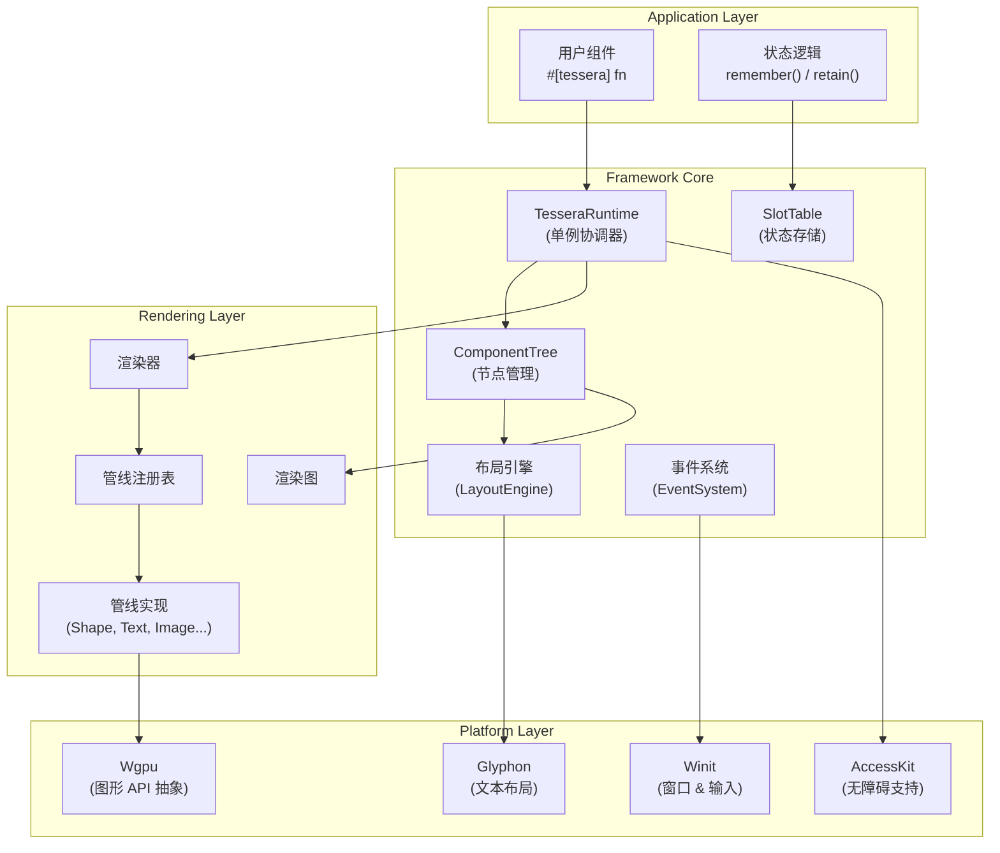
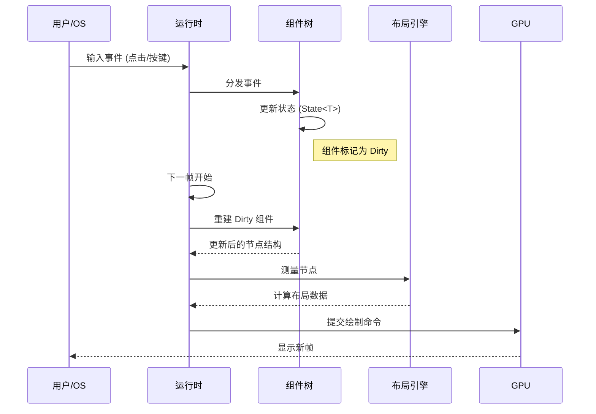

# 架构设计

<details>
<summary><strong>相关源文件</strong></summary>

* [AGENTS.md](https://github.com/tessera-ui/tessera/blob/821ebad7/AGENTS.md)
* [Cargo.lock](https://github.com/tessera-ui/tessera/blob/821ebad7/Cargo.lock)
* [docs/RELEASE_RULE.md](https://github.com/tessera-ui/tessera/blob/821ebad7/docs/RELEASE_RULE.md)
* [docs/RELEASE_RULE_zh-CN.md](https://github.com/tessera-ui/tessera/blob/821ebad7/docs/RELEASE_RULE_zh-CN.md)
* [tessera-macros/CHANGELOG.md](https://github.com/tessera-ui/tessera/blob/821ebad7/tessera-macros/CHANGELOG.md)
* [tessera-macros/Cargo.toml](https://github.com/tessera-ui/tessera/blob/821ebad7/tessera-macros/Cargo.toml)
* [tessera-macros/README.md](https://github.com/tessera-ui/tessera/blob/821ebad7/tessera-macros/README.md)
* [tessera-macros/docs/README_zh-CN.md](https://github.com/tessera-ui/tessera/blob/821ebad7/tessera-macros/docs/README_zh-CN.md)
* [tessera-ui/CHANGELOG.md](https://github.com/tessera-ui/tessera/blob/821ebad7/tessera-ui/CHANGELOG.md)
* [tessera-ui/Cargo.toml](https://github.com/tessera-ui/tessera/blob/821ebad7/tessera-ui/Cargo.toml)
* [tessera-ui/src/component_tree.rs](https://github.com/tessera-ui/tessera/blob/821ebad7/tessera-ui/src/component_tree.rs)
* [tessera-ui/src/component_tree/node.rs](https://github.com/tessera-ui/tessera/blob/821ebad7/tessera-ui/src/component_tree/node.rs)
* [tessera-ui/src/lib.rs](https://github.com/tessera-ui/tessera/blob/821ebad7/tessera-ui/src/lib.rs)
* [tessera-ui/src/renderer.rs](https://github.com/tessera-ui/tessera/blob/821ebad7/tessera-ui/src/renderer.rs)
* [tessera-ui/src/runtime.rs](https://github.com/tessera-ui/tessera/blob/821ebad7/tessera-ui/src/runtime.rs)
</details>

本文档全面概述了 Tessera 的架构设计，涵盖了主要子系统及其交互方式。它解释了核心框架如何协调组件生命周期、渲染、布局、状态管理和事件处理，从而交付一个跨平台的声明式 UI 系统。

**来源：** [AGENTS.md L1-L216](https://github.com/tessera-ui/tessera/blob/821ebad7/AGENTS.md#L1-L216)

 [README.md L1-L126](https://github.com/tessera-ui/tessera/blob/821ebad7/README.md#L1-L126)

---

## 顶层系统视图

Tessera 的架构可以分为四层：应用层、框架核心层、渲染层和平台抽象层。



### 1. 应用层

这是开发者构建 UI 的地方。组件通过 `#[tessera]` 宏定义，该宏将其转换为框架可执行的结构。状态通过钩子（hooks）如 `remember` 进行管理。

### 2. 框架核心层

*   **`TesseraRuntime`**: 协调整个系统的核心单例。它持有组件树、状态存储和资源缓存。
*   **`ComponentTree`**: UI 的内存表示。它不是简单的 DOM，而是包含布局规范、事件处理器和绘制命令的节点树。
*   **`SlotTable`**: 受到 Jetpack Compose 启发的线性存储结构，用于高效保存组件状态。它使用“间隙缓冲”策略来优化状态的插入和读取。

### 3. 渲染层

*   **`Renderer`**: 负责执行渲染循环。它构建 `RenderGraph`，对绘制命令进行排序和批处理，并将其提交给 GPU。
*   **`PipelineRegistry`**: 一个动态注册表，允许组件使用任何实现了 `DrawCommand` 或 `ComputeCommand` 的结构体进行渲染。这使得系统高度可扩展。

### 4. 平台层

Tessera 并不重新发明轮子，而是利用 Rust 生态系统中的成熟库：
*   **`winit`**: 处理窗口创建和原始输入事件。
*   **`wgpu`**: 提供跨平台的 GPU 访问。
*   **`glyphon`**: 基于 `cosmic-text` 的高性能文本布局和光栅化。

**来源：** [Diagram 1 in high-level architecture](https://github.com/tessera-ui/tessera/blob/821ebad7/Diagram 1 in high-level architecture)

 [AGENTS.md L20-L55](https://github.com/tessera-ui/tessera/blob/821ebad7/AGENTS.md#L20-L55)

---

## 核心数据流

Tessera 中的数据流是单向且循环的：

1.  **输入/事件** 触发状态变更。
2.  **状态变更** 标记组件树为脏。
3.  **重建** 根据新状态重新执行组件函数。
4.  **布局** 重新计算尺寸和位置。
5.  **渲染** 生成新的像素。



**来源：** [AGENTS.md L55-L79](https://github.com/tessera-ui/tessera/blob/821ebad7/AGENTS.md#L55-L79)

---

## 子系统深度解析

### 1. 组件模型与宏系统

`#[tessera]` 宏不仅是语法糖，它从根本上转换了 Rust 函数。

**转换前：**
```rust
#[tessera]
fn my_widget() {
    // ...
}
```

**转换后（概念性）：**
```rust
fn my_widget(cx: &mut ComponentContext) {
    cx.start_group(TypeId::of::<my_widget>(), location!());
    // ... 用户代码 ...
    cx.end_group();
}
```

这种结构允许运行时跟踪组件在树中的位置，即使它们在循环或条件语句中被调用。

*   查看更多：[组件模型](Component-Model.md)
*   查看更多：[tessera-macros](tessera-macros.md)

### 2. 状态管理

`SlotTable` 是 Tessera 响应式系统的核心。它是一个类似数组的结构，存储了整个应用程序的状态值。

*   **读取模式**：当组件执行时，它从当前槽位读取状态。
*   **写入模式**：当 `remember` 第一次被调用时，它将初始值写入槽位。
*   **组**：组件调用会在表中创建“组”，作为状态的边界。

这种设计避免了为每个组件分配堆内存对象的开销，大大提高了缓存局部性。

*   查看更多：[状态管理](State-Management.md)

### 3. 并行布局系统

Tessera 的布局并不在主线程上顺序运行。相反，它利用 `rayon` 来并行测量组件。

如果一个容器（如 `Row`）有多个子节点，它们的 `measure` 方法会被分发到线程池中。这对于复杂的 UI 树来说是一个巨大的性能提升。

布局协议基于两个 trait：
*   **`LayoutSpec`**: 定义组件如何测量自己及其子节点。
*   **`Modifier`**: 允许用户调整布局参数（如 `padding`, `fill_max_size`）。

*   查看更多：[布局系统](Layout-System.md)

### 4. 渲染管线与 GPU 互操作

Tessera 的渲染器被设计为对 GPU 友好的。它不像传统的 2D 库那样仅仅光栅化位图，而是提交结构化的几何数据和计算着色器任务。

关键特性：
*   **SDF 渲染**：基本形状（圆角矩形、圆形）使用有向距离场 渲染，以此获得无限的分辨率和完美的抗锯齿。
*   **计算着色器效果**：模糊和毛玻璃效果是通过双通道计算着色器实现的，利用了 GPU 的并行处理能力。

*   查看更多：[渲染管线](Rendering-Pipeline.md)
*   查看更多：[毛玻璃效果](Glass-Effects.md)

**来源：** [tessera-ui/src/renderer.rs](https://github.com/tessera-ui/tessera/blob/821ebad7/tessera-ui/src/renderer.rs)

 [tessera-ui/src/component_tree/node.rs](https://github.com/tessera-ui/tessera/blob/821ebad7/tessera-ui/src/component_tree/node.rs)

---

## 代码库概览

为了帮助你浏览源码，以下是 `tessera-ui` 核心 crate 的文件结构映射：

| 文件/目录 | 描述 |
| --- | --- |
| `src/lib.rs` | 库入口，导出公共 API 和宏。 |
| `src/runtime.rs` | `TesseraRuntime` 实现，应用生命周期管理。 |
| `src/renderer.rs` | `Renderer`, `RenderGraph` 以及 wgpu 资源管理。 |
| `src/component_tree.rs` | `ComponentTree` 结构定义和树操作逻辑。 |
| `src/component_tree/node.rs` | `ComponentNode` 及其元数据、计算布局数据。 |
| `src/layout.rs` | 布局算法，`measure_nodes` 并行执行器。 |
| `src/event.rs` | 事件分发逻辑，命中测试。 |
| `src/pipeline/` | 内置渲染管线实现 (`shape.rs`, `text.rs`, `glass.rs` 等)。 |
| `src/slot_table.rs` | 状态存储引擎实现。 |

**来源：** [tessera-ui/src/lib.rs](https://github.com/tessera-ui/tessera/blob/821ebad7/tessera-ui/src/lib.rs)

 [tessera-ui/src/runtime.rs](https://github.com/tessera-ui/tessera/blob/821ebad7/tessera-ui/src/runtime.rs)

 [tessera-ui/src/renderer.rs](https://github.com/tessera-ui/tessera/blob/821ebad7/tessera-ui/src/renderer.rs)
