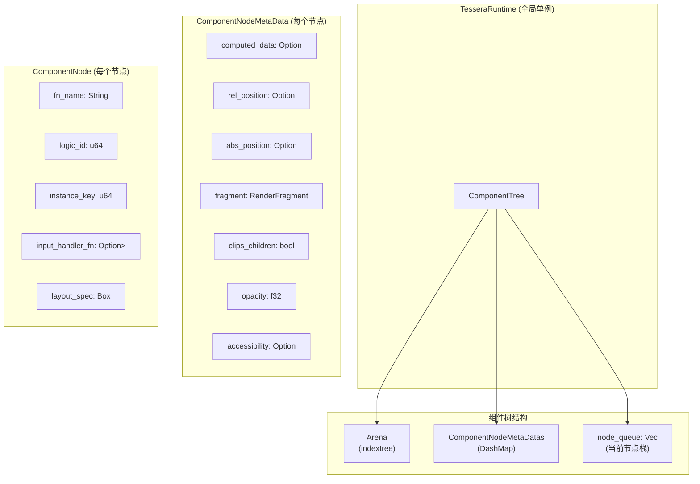
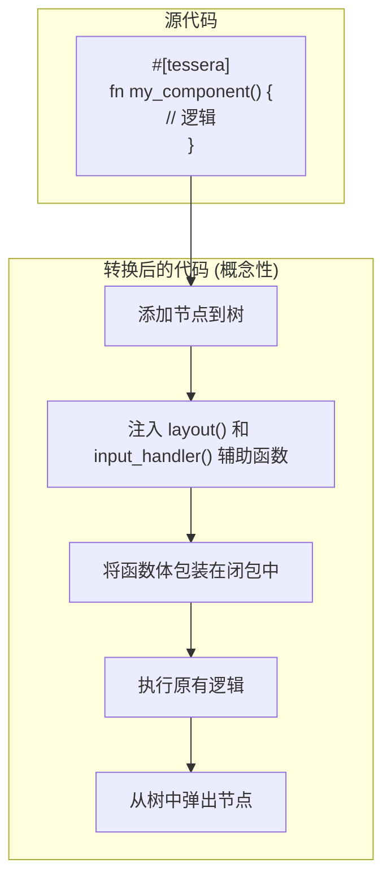
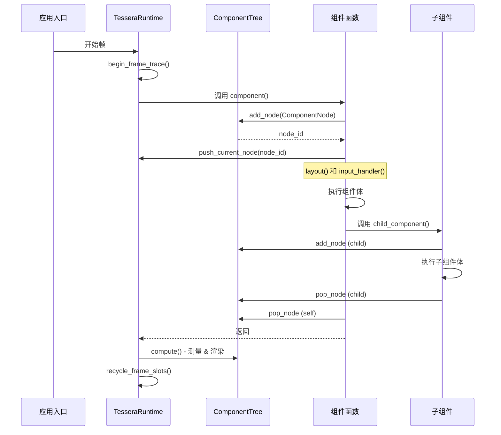
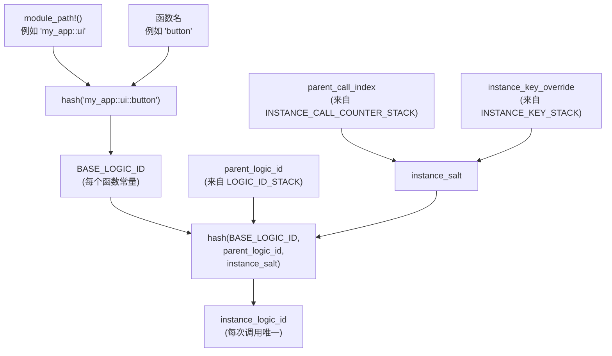
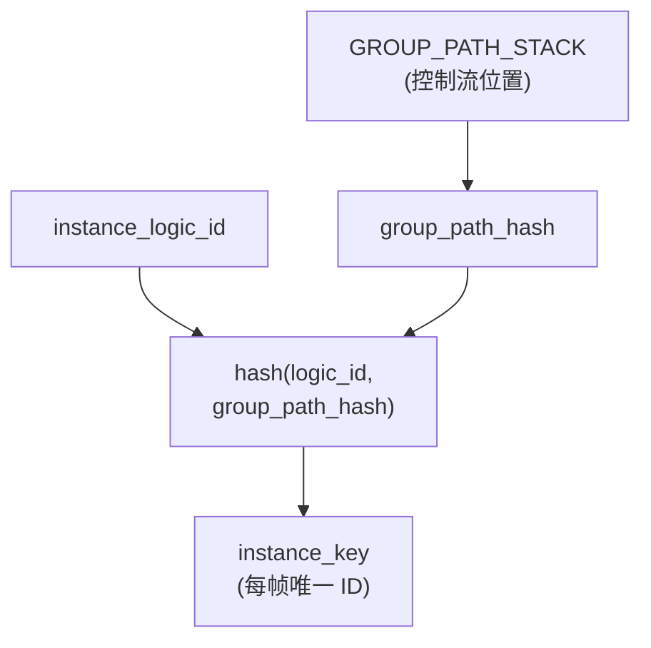
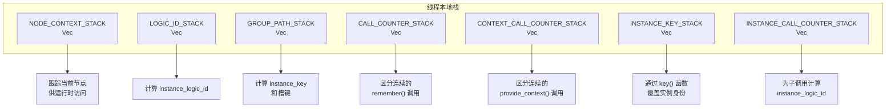

# 组件模型

<details>
<summary><strong>相关源文件</strong></summary>

* [AGENTS.md](https://github.com/tessera-ui/tessera/blob/821ebad7/AGENTS.md)
* [README.md](https://github.com/tessera-ui/tessera/blob/821ebad7/README.md)
* [assets/logo.svg](https://github.com/tessera-ui/tessera/blob/821ebad7/assets/logo.svg)
* [docs/README_zh-CN.md](https://github.com/tessera-ui/tessera/blob/821ebad7/docs/README_zh-CN.md)
* [docs/RELEASE_RULE.md](https://github.com/tessera-ui/tessera/blob/821ebad7/docs/RELEASE_RULE.md)
* [docs/RELEASE_RULE_zh-CN.md](https://github.com/tessera-ui/tessera/blob/821ebad7/docs/RELEASE_RULE_zh-CN.md)
* [tessera-macros/CHANGELOG.md](https://github.com/tessera-ui/tessera/blob/821ebad7/tessera-macros/CHANGELOG.md)
* [tessera-macros/Cargo.toml](https://github.com/tessera-ui/tessera/blob/821ebad7/tessera-macros/Cargo.toml)
* [tessera-macros/README.md](https://github.com/tessera-ui/tessera/blob/821ebad7/tessera-macros/README.md)
* [tessera-macros/docs/README_zh-CN.md](https://github.com/tessera-ui/tessera/blob/821ebad7/tessera-macros/docs/README_zh-CN.md)
* [tessera-ui/src/component_tree.rs](https://github.com/tessera-ui/tessera/blob/821ebad7/tessera-ui/src/component_tree.rs)
* [tessera-ui/src/component_tree/node.rs](https://github.com/tessera-ui/tessera/blob/821ebad7/tessera-ui/src/component_tree/node.rs)
* [tessera-ui/src/lib.rs](https://github.com/tessera-ui/tessera/blob/821ebad7/tessera-ui/src/lib.rs)
* [tessera-ui/src/renderer.rs](https://github.com/tessera-ui/tessera/blob/821ebad7/tessera-ui/src/renderer.rs)
* [tessera-ui/src/runtime.rs](https://github.com/tessera-ui/tessera/blob/821ebad7/tessera-ui/src/runtime.rs)
</details>

本页面阐述了 Tessera 的组件模型，包括 `#[tessera]` 宏如何将函数转换为组件，组件如何在组件树中注册，以及组件的身份（identity）和生命周期是如何管理的。关于组件内的状态管理，请参阅 [状态管理](State-Management.md)。关于布局规范，请参阅 [布局系统](Layout-System.md)。

---

## 组件定义

### 无状态函数范式

在 Tessera 中，组件是被 `#[tessera]` 属性宏标注的 **无状态 Rust 函数**。与面向对象 UI 框架中组件是带有内部状态的类（class）不同，Tessera 组件是声明式地描述 UI 结构的纯函数。

```rust
#[tessera]
fn my_component() {
    // 组件逻辑
}
```

这种无状态设计有几个关键含义：

* **无隐式状态**：组件不能在调用之间存储数据。持久状态必须使用 `remember()` 或 `retain()` 显式创建（参见 [状态管理](State-Management.md)）。
* **重新执行**：组件函数在每一帧的构建阶段都会被调用，以重建 UI 树。
* **可组合性**：组件通过常规函数调用来调用其他组件，形成层次化的树状结构。

**来源：** [README.md L42-L51](https://github.com/tessera-ui/tessera/blob/821ebad7/README.md#L42-L51)

 [tessera-ui/src/lib.rs L17-L45](https://github.com/tessera-ui/tessera/blob/821ebad7/tessera-ui/src/lib.rs#L17-L45)

 [AGENTS.md L29-L36](https://github.com/tessera-ui/tessera/blob/821ebad7/AGENTS.md#L29-L36)

### #[tessera] 宏

`#[tessera]` 过程宏是将普通 Rust 函数转换为框架集成组件的核心机制。它在编译时执行几个关键的转换：

1. **组件注册**：将组件作为节点添加到组件树中。
2. **辅助函数注入**：在组件作用域内提供 `layout()` 和 `input_handler()` 函数。
3. **身份生成**：为组件创建稳定的标识符（`logic_id`, `instance_key`）。
4. **生命周期管理**：包装函数体，确保即使在提前返回时也能正确清理树结构。

**来源：** [tessera-macros/README.md L8-L19](https://github.com/tessera-ui/tessera/blob/821ebad7/tessera-macros/README.md#L8-L19)

 [AGENTS.md L29-L37](https://github.com/tessera-ui/tessera/blob/821ebad7/AGENTS.md#L29-L37)

---

## 组件树结构



**组件树架构**

组件树是表示 UI 层次结构的基础数据结构。它由三个主要部分组成：

**1. ComponentTree 容器** ([tessera-ui/src/component_tree.rs L48-L75](https://github.com/tessera-ui/tessera/blob/821ebad7/tessera-ui/src/component_tree.rs#L48-L75))

`ComponentTree` 结构体管理整个树结构：

* `tree`: 来自 `indextree` crate 的 `Arena<ComponentNode>`，提供高效的层次化节点存储。
* `metadatas`: 一个 `DashMap<NodeId, ComponentNodeMetaData>`，存储每个节点的运行时元数据。
* `node_queue`: 一个跟踪当前正在构建的节点的栈。

**2. ComponentNode** ([tessera-ui/src/component_tree/node.rs L259-L273](https://github.com/tessera-ui/tessera/blob/821ebad7/tessera-ui/src/component_tree/node.rs#L259-L273))

每个节点存储特定于组件的信息：

* `fn_name`: 组件函数名（用于调试/分析）。
* `logic_id`: 稳定的标识符，源自 `module_path!()` + 函数名。
* `instance_key`: 当前帧中该特定实例的唯一标识符。
* `input_handler_fn`: 用于处理用户输入事件的可选闭包。
* `layout_spec`: 用于尺寸计算的布局规范。

**3. ComponentNodeMetaData** ([tessera-ui/src/component_tree/node.rs L275-L339](https://github.com/tessera-ui/tessera/blob/821ebad7/tessera-ui/src/component_tree/node.rs#L275-L339))

元数据跟踪测量/渲染阶段计算出的运行时状态：

* `computed_data`: 组件计算出的大小。
* `rel_position` / `abs_position`: 布局中的相对和绝对位置。
* `fragment`: 用于渲染的累积绘制/计算命令。
* `clips_children`: 该节点是否裁剪子节点渲染。
* `opacity`: 该节点及其后代的不透明度乘数。
* `accessibility`: 辅助技术的无障碍信息。

**来源：** [tessera-ui/src/component_tree.rs L48-L75](https://github.com/tessera-ui/tessera/blob/821ebad7/tessera-ui/src/component_tree.rs#L48-L75)

 [tessera-ui/src/component_tree/node.rs L259-L339](https://github.com/tessera-ui/tessera/blob/821ebad7/tessera-ui/src/component_tree/node.rs#L259-L339)

---

## 宏转换



**宏转换管线**

`#[tessera]` 宏通过以下步骤转换组件函数：

### 步骤 1: 生成 Logic ID

宏通过哈希组件的模块路径和函数名生成一个稳定的 `logic_id`。这个标识符在所有帧中保持不变，即使组件实例出现或消失。

**概念性转换：**

```javascript
// Module path: "my_app::ui::button"
// Function name: "my_button"
const BASE_LOGIC_ID: u64 = hash("my_app::ui::button::my_button");
```

**来源：** [tessera-ui/src/runtime.rs L438-L480](https://github.com/tessera-ui/tessera/blob/821ebad7/tessera-ui/src/runtime.rs#L438-L480)

### 步骤 2: 组件树注册

转换后的函数首先向组件树添加一个新的 `ComponentNode`：

```javascript
// 概念性生成的代码
fn my_component() {
    let node_id = TesseraRuntime::with_mut(|rt| {
        rt.component_tree.add_node(ComponentNode {
            fn_name: "my_component".to_string(),
            logic_id: BASE_LOGIC_ID,
            instance_key: 0, // 稍后设置
            input_handler_fn: None,
            layout_spec: Box::new(DefaultLayoutSpec),
        })
    });
    
    let _guard = push_current_node(node_id, BASE_LOGIC_ID, "my_component");
    // ... 其余转换
}
```

`push_current_node()` 函数还会：

* 将节点推入线程本地栈，用于嵌套上下文跟踪。
* 计算并推入唯一的 `instance_key`（结合 `logic_id`、父级上下文和调用位置）。
* 初始化 `remember()` 和 `provide_context()` 调用的计数器。

**来源：** [tessera-ui/src/runtime.rs L438-L507](https://github.com/tessera-ui/tessera/blob/821ebad7/tessera-ui/src/runtime.rs#L438-L507)

 [tessera-ui/src/component_tree.rs L111-L125](https://github.com/tessera-ui/tessera/blob/821ebad7/tessera-ui/src/component_tree.rs#L111-L125)

### 步骤 3: 辅助函数注入

宏向组件作用域注入两个辅助函数：

**`layout(spec: impl LayoutSpec)`** — 为此组件设置布局规范：

```javascript
let layout = |spec: impl LayoutSpec| {
    TesseraRuntime::with_mut(|rt| {
        if let Some(node) = rt.component_tree.current_node_mut() {
            node.layout_spec = Box::new(spec);
        }
    });
};
```

**`input_handler(fn: impl Fn(InputHandlerInput))`** — 注册输入事件处理器：

```javascript
let input_handler = |handler: impl Fn(InputHandlerInput) + Send + Sync + 'static| {
    TesseraRuntime::with_mut(|rt| {
        if let Some(node) = rt.component_tree.current_node_mut() {
            node.input_handler_fn = Some(Box::new(handler));
        }
    });
};
```

**来源：** [AGENTS.md L29-L37](https://github.com/tessera-ui/tessera/blob/821ebad7/AGENTS.md#L29-L37)

 [tessera-macros/README.md L51-L82](https://github.com/tessera-ui/tessera/blob/821ebad7/tessera-macros/README.md#L51-L82)

### 步骤 4: 函数体包装与执行

原始函数体被包装在一个闭包中，以防止提前返回（`return`）绕过清理步骤：

```javascript
let result = {
    let closure = || {
        // 原始组件逻辑
        // 可以使用 layout()、input_handler() 和调用子组件
    };
    closure()
};
```

这确保了即使组件逻辑使用了 `return`、`?` 或发生 panic（并展开），组件树状态也能保持一致。

**来源：** [tessera-macros/README.md L93-L127](https://github.com/tessera-ui/tessera/blob/821ebad7/tessera-macros/README.md#L93-L127)

### 步骤 5: 清理

组件体执行后，节点将从树的工作栈中弹出：

```sql
// 由 NodeContextGuard 的 Drop 实现处理
// 自动弹出 NODE_CONTEXT_STACK, LOGIC_ID_STACK, CALL_COUNTER_STACK 等
```

`NodeContextGuard` RAII 模式确保即使在提前返回或 panic 时也能自动发生清理。

**来源：** [tessera-ui/src/runtime.rs L406-L435](https://github.com/tessera-ui/tessera/blob/821ebad7/tessera-ui/src/runtime.rs#L406-L435)

 [tessera-ui/src/component_tree.rs L123-L125](https://github.com/tessera-ui/tessera/blob/821ebad7/tessera-ui/src/component_tree.rs#L123-L125)

---

## 组件生命周期



**组件执行生命周期**

### 阶段 1: 帧初始化

每帧开始时，运行时为组件树构建做准备：

1. **槽表准备**：`begin_frame_slots()` 增加 epoch 计数器，用于状态槽生命周期跟踪)。
2. **上下文准备**：`begin_frame_context_slots()` 重置上下文提供者跟踪。
3. **Trace 初始化**：`begin_frame_trace()` 清除上一帧的控制流 trace ([tessera-ui/src/runtime.rs L332-L334](https://github.com/tessera-ui/tessera/blob/821ebad7/tessera-ui/src/runtime.rs#L332-L334))。
4. **阶段标记**：运行时阶段设置为 `RuntimePhase::Build` ([tessera-ui/src/runtime.rs L373-L380](https://github.com/tessera-ui/tessera/blob/821ebad7/tessera-ui/src/runtime.rs#L373-L380))。

**来源：** [tessera-ui/src/renderer.rs L605-L616](https://github.com/tessera-ui/tessera/blob/821ebad7/tessera-ui/src/renderer.rs#L605-L616)

### 阶段 2: 组件调用

当调用组件函数时（作为入口点或从父组件调用）：

1. **节点创建**：`ComponentTree::add_node()` 在 `Arena<ComponentNode>` 中分配一个新节点并初始化其元数据)。
2. **上下文入栈**：`push_current_node()` 创建一个 `NodeContextGuard` 并：
    * 将 `node_id` 推入 `NODE_CONTEXT_STACK`。
    * 计算并将 `instance_logic_id` 推入 `LOGIC_ID_STACK`。
    * 为 `CALL_COUNTER_STACK`, `CONTEXT_CALL_COUNTER_STACK`, 和 `INSTANCE_CALL_COUNTER_STACK` 初始化新的计数器层)。
3. **辅助函数可用**：注入的 `layout()` 和 `input_handler()` 闭包现在可以通过 `current_node_mut()` 访问当前节点。

**来源：** [tessera-ui/src/runtime.rs L438-L507](https://github.com/tessera-ui/tessera/blob/821ebad7/tessera-ui/src/runtime.rs#L438-L507)

 [tessera-ui/src/component_tree.rs L111-L125](https://github.com/tessera-ui/tessera/blob/821ebad7/tessera-ui/src/component_tree.rs#L111-L125)

### 阶段 3: 组件执行

组件体执行时可以访问：

* 注入的辅助函数
* 使用线程本地栈的状态原语
* 递归遵循此生命周期的子组件调用

执行期间：

* 子组件作为子节点添加到树层次结构中的当前节点。
* `node_queue` 栈随着执行在树中下降和上升而增长和收缩。
* 通过 `GroupGuard` RAII 包装器跟踪控制流（参见 [组件身份](#组件身份-component-identity)）。

**来源：** [tessera-ui/src/component_tree.rs L96-L105](https://github.com/tessera-ui/tessera/blob/821ebad7/tessera-ui/src/component_tree.rs#L96-L105)

### 阶段 4: 组件清理

当组件函数返回时，`NodeContextGuard` 析构函数自动：

1. 从 `NODE_CONTEXT_STACK` 弹出节点。
2. 从 `LOGIC_ID_STACK` 弹出 logic ID。
3. 弹出所有计数器栈。
4. 结束分析（Profiling）作用域（如果启用）。

`ComponentTree::pop_node()` 调用将从工作 `node_queue` 中移除节点，但 **节点仍保留在 `Arena` 中** 用于后续的测量和渲染阶段。

**来源：** [tessera-ui/src/runtime.rs L406-L435](https://github.com/tessera-ui/tessera/blob/821ebad7/tessera-ui/src/runtime.rs#L406-L435)

 [tessera-ui/src/component_tree.rs L123-L125](https://github.com/tessera-ui/tessera/blob/821ebad7/tessera-ui/src/component_tree.rs#L123-L125)

### 阶段 5: 构建后处理

所有组件执行完毕后：

1. **测量阶段**：`ComponentTree::compute()` 在根节点上调用 `measure_node()`，递归计算所有节点的大小)。
2. **渲染图生成**：`build_render_graph()` 遍历树并从每个节点的元数据中收集 `RenderFragment` ([tessera-ui/src/component_tree.rs L403-L425](https://github.com/tessera-ui/tessera/blob/821ebad7/tessera-ui/src/component_tree.rs#L403-L425))。
3. **输入处理**：以反向树顺序（子节点在父节点之前）执行输入处理器)。
4. **树清理**：`ComponentTree::clear()` 清空树以为下一帧做准备)。
5. **槽回收**：`recycle_frame_slots()` 释放本帧中未出现的组件的状态槽)。

**来源：** [tessera-ui/src/renderer.rs L739-L968](https://github.com/tessera-ui/tessera/blob/821ebad7/tessera-ui/src/renderer.rs#L739-L968)

 [tessera-ui/src/component_tree.rs L196-L380](https://github.com/tessera-ui/tessera/blob/821ebad7/tessera-ui/src/component_tree.rs#L196-L380)

---

## 组件身份

Tessera 的组件身份系统确保状态、布局缓存和其他每个实例的数据在帧之间保持稳定，即使组件树每帧都是从头开始重建的。

### Logic ID 生成



**Logic ID 计算**

**Base Logic ID**：每个组件函数都有一个编译时稳定的 `BASE_LOGIC_ID`，由其模块路径和函数名计算得出。对于所有帧中的所有组件实例，这都是相同的。

**Instance Logic ID**：当组件被调用时，通过组合以下内容计算特定于实例的 `logic_id`：

* `BASE_LOGIC_ID`: 函数的稳定标识符。
* `parent_logic_id`: 父组件的 logic ID（来自 `LOGIC_ID_STACK`）。
* `instance_salt`: 派生自：
    * `parent_call_index`: 父级内的顺序调用位置（来自 `INSTANCE_CALL_COUNTER_STACK`）。
    * `instance_key_override`: 由 `key()` 函数设置的显式键（来自 `INSTANCE_KEY_STACK`）。

这种分层哈希确保了同一个父组件中两次调用的 `my_component()` 获得不同的 Logic ID，并且在不同父组件中调用的同一组件也获得不同的 Logic ID。

**来源：** [tessera-ui/src/runtime.rs L438-L480](https://github.com/tessera-ui/tessera/blob/821ebad7/tessera-ui/src/runtime.rs#L438-L480)

### Instance Key 生成



**Instance Key 计算**

为每个组件调用计算 `instance_key`，方法是哈希：

* `instance_logic_id`: 特定于实例的 logic ID（见上文）。
* `group_path_hash`: 当前控制流路径的哈希（来自 `GROUP_PATH_STACK`）。

`instance_key` 在单帧内唯一标识特定的组件实例，考虑了条件渲染和循环。它用于：

* 布局缓存键
* 布局规范中的子节点放置
* 调试时跨帧匹配节点

**来源：** [tessera-ui/src/runtime.rs L555-L561](https://github.com/tessera-ui/tessera/blob/821ebad7/tessera-ui/src/runtime.rs#L555-L561)

### 使用 GroupGuard 跟踪控制流

`#[tessera]` 宏自动使用 `GroupGuard` 实例检测控制流构造（`if`, `match`, `for`, `while`）：

```javascript
// 源代码:
if condition {
    child_a();
} else {
    child_b();
}

// 检测后的代码 (概念性):
{
    let _guard = GroupGuard::new(hash("if branch 0"));
    if condition {
        {
            let _guard = GroupGuard::new(hash("if then"));
            child_a();
        }
    } else {
        {
            let _guard = GroupGuard::new(hash("if else"));
            child_b();
        }
    }
}
```

每个 `GroupGuard` 在构造时将一个组 ID 推入 `GROUP_PATH_STACK`，并在析构时弹出。这创建了一个稳定的控制流“路径”，当采用相同的分支时，该路径在帧之间保持一致。

**重要性**：如果没有控制流跟踪，在 `if` 块内调用 `remember()` 将使用不同的槽键，具体取决于早期分支中的 `remember()` 调用是否被执行。`GroupGuard` 确保槽键考虑到控制流位置，从而保持状态稳定。

**来源：** [tessera-ui/src/runtime.rs L626-L646](https://github.com/tessera-ui/tessera/blob/821ebad7/tessera-ui/src/runtime.rs#L626-L646)

 [AGENTS.md L29-L36](https://github.com/tessera-ui/tessera/blob/821ebad7/AGENTS.md#L29-L36)

### 线程本地栈



**线程本地上下文栈**

Tessera 使用七个线程本地栈来跟踪执行上下文。这些栈随着组件的进入而增长，随着退出而收缩，形成类似调用栈的结构：

| 栈 | 用途 | 推入者 | 弹出者 |
| --- | --- | --- | --- |
| `NODE_CONTEXT_STACK` | 当前 `NodeId`，供运行时访问 | `push_current_node()` | `NodeContextGuard::drop()` |
| `LOGIC_ID_STACK` | 当前 `instance_logic_id` | `push_current_node()` | `NodeContextGuard::drop()` |
| `GROUP_PATH_STACK` | 组件内的控制流位置 | `GroupGuard::new()` | `GroupGuard::drop()` |
| `CALL_COUNTER_STACK` | 顺序 `remember()` 调用计数器 | `push_current_node()` | `NodeContextGuard::drop()` |
| `CONTEXT_CALL_COUNTER_STACK` | 顺序 `provide_context()` 调用计数器 | `push_current_node()` | `NodeContextGuard::drop()` |
| `INSTANCE_KEY_STACK` | 来自 `key()` 的显式键覆盖 | `InstanceKeyGuard::new()` | `InstanceKeyGuard::drop()` |
| `INSTANCE_CALL_COUNTER_STACK` | 子组件调用计数器 | `push_current_node()` | `NodeContextGuard::drop()` |

这些栈使得：

* **嵌套组件执行**：子组件访问自己的上下文而不会干扰父组件。
* **稳定的身份计算**：组合栈值产生确定性的 ID。
* **状态槽解析**：`remember()` 使用栈值计算槽键。

**来源：** [tessera-ui/src/runtime.rs L21-L44](https://github.com/tessera-ui/tessera/blob/821ebad7/tessera-ui/src/runtime.rs#L21-L44)

---

## 辅助函数

`#[tessera]` 宏向每个组件的作用域注入两个辅助函数：`layout()` 和 `input_handler()`。这些辅助函数仅在被 `#[tessera]` 标注的函数内可用，并为配置组件行为提供了清晰的 API。

### layout()

**签名**: `fn layout(spec: impl LayoutSpec)`

**用途**: 设置当前组件节点的布局规范。布局规范定义了组件如何测量其大小以及如何定位其子组件。

**机制**:

1. 注入的闭包访问 `TesseraRuntime::with_mut()`。
2. 通过 `component_tree.current_node_mut()` 检索当前节点。
3. 设置 `node.layout_spec = Box::new(spec)`。

**默认行为**: 如果未调用 `layout()`，组件使用 `DefaultLayoutSpec`，其行为是：

* 将所有子组件堆叠在位置。
* 计算自身大小为所有子组件的最小边界矩形。

**使用示例**:

```rust
#[tessera]
fn fixed_size_component() {
    layout(FixedLayout { width: Px(100), height: Px(50) });
    // 子组件...
}
```

**来源：** [AGENTS.md L33-L37](https://github.com/tessera-ui/tessera/blob/821ebad7/AGENTS.md#L33-L37)

 [tessera-ui/src/runtime.rs L317-L329](https://github.com/tessera-ui/tessera/blob/821ebad7/tessera-ui/src/runtime.rs#L317-L329)

### input_handler()

**签名**: `fn input_handler(handler: impl Fn(InputHandlerInput) + Send + Sync + 'static)`

**用途**: 注册一个闭包来处理此组件的用户输入事件（光标、键盘、IME）。

**机制**:

1. 注入的闭包访问 `TesseraRuntime::with_mut()`。
2. 通过 `component_tree.current_node_mut()` 检索当前节点。
3. 设置 `node.input_handler_fn = Some(Box::new(handler))`。

**执行顺序**: 输入处理器在测量后的输入阶段以 **反向树顺序**（子节点先于父节点，新的兄弟节点先于旧的兄弟节点）执行。这允许子组件在事件传播到父组件之前消耗事件。

**使用示例**:

```javascript
#[tessera]
fn interactive_button() {
    let clicked = remember(|| false);
    
    input_handler(move |input| {
        for event in input.cursor_events {
            if matches!(event.content, CursorEventContent::Press { .. }) {
                clicked.set(true);
            }
        }
    });
    
    // 视觉表现...
}
```

**来源：** [tessera-ui/src/component_tree/node.rs L363-L373](https://github.com/tessera-ui/tessera/blob/821ebad7/tessera-ui/src/component_tree/node.rs#L363-L373)

 [tessera-ui/src/component_tree.rs L268-L378](https://github.com/tessera-ui/tessera/blob/821ebad7/tessera-ui/src/component_tree.rs#L268-L378)

 [AGENTS.md L82-L87](https://github.com/tessera-ui/tessera/blob/821ebad7/AGENTS.md#L82-L87)

---

## 关键要点

| 概念 | 摘要 |
| --- | --- |
| **无状态函数** | 组件是纯函数，没有隐式状态；每帧重新执行。 |
| **`#[tessera]` 宏** | 通过注入辅助函数和管理树生命周期将函数转换为组件。 |
| **组件树** | `Arena<ComponentNode>` 层次结构，带有用于运行时元数据的独立 `DashMap`。 |
| **Logic ID** | 每个组件函数 + 调用上下文的稳定标识符，用于状态槽。 |
| **Instance Key** | 考虑控制流的每帧唯一标识符，用于布局缓存。 |
| **GroupGuard** | 跟踪条件/循环中稳定身份的控制流位置的 RAII 包装器。 |
| **辅助注入** | `layout()` 和 `input_handler()` 是编译时注入的，不是运行时导入。 |
| **生命周期阶段** | 帧初始化 → 组件调用 → 执行 → 清理 → 测量 → 渲染。 |

**来源：** [README.md L38-L100](https://github.com/tessera-ui/tessera/blob/821ebad7/README.md#L38-L100)

 [tessera-ui/src/lib.rs L17-L314](https://github.com/tessera-ui/tessera/blob/821ebad7/tessera-ui/src/lib.rs#L17-L314)

 [tessera-macros/README.md L1-L190](https://github.com/tessera-ui/tessera/blob/821ebad7/tessera-macros/README.md#L1-L190)

 [AGENTS.md L29-L90](https://github.com/tessera-ui/tessera/blob/821ebad7/AGENTS.md#L29-L90)
