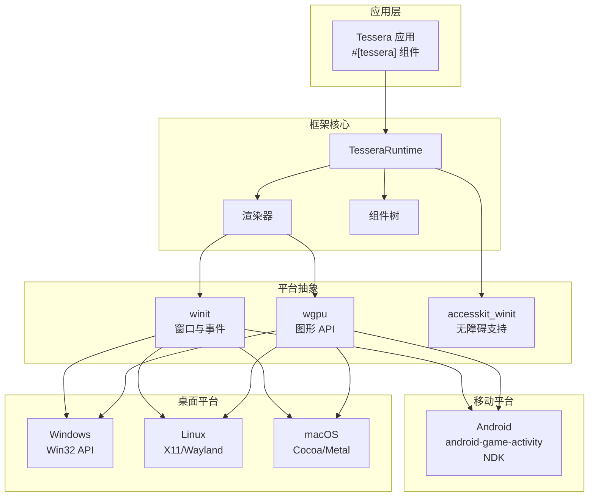
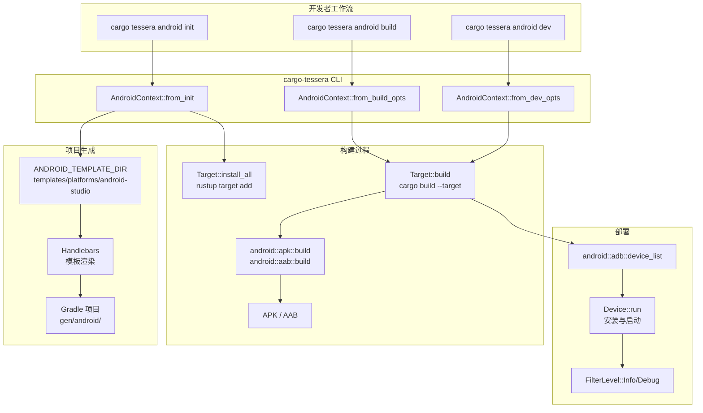
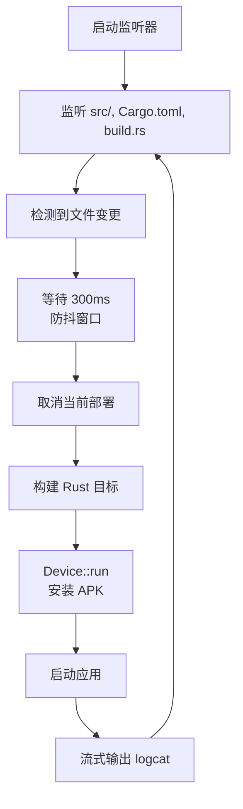

# 跨平台支持

<details>
<summary><strong>相关源文件</strong></summary>

* [Cargo.lock](https://github.com/tessera-ui/tessera/blob/821ebad7/Cargo.lock)
* [cargo-tessera/README.md](https://github.com/tessera-ui/tessera/blob/821ebad7/cargo-tessera/README.md)
* [cargo-tessera/docs/README_zh-CN.md](https://github.com/tessera-ui/tessera/blob/821ebad7/cargo-tessera/docs/README_zh-CN.md)
* [cargo-tessera/src/commands/android.rs](https://github.com/tessera-ui/tessera/blob/821ebad7/cargo-tessera/src/commands/android.rs)
* [cargo-tessera/src/commands/build.rs](https://github.com/tessera-ui/tessera/blob/821ebad7/cargo-tessera/src/commands/build.rs)
* [cargo-tessera/src/commands/dev.rs](https://github.com/tessera-ui/tessera/blob/821ebad7/cargo-tessera/src/commands/dev.rs)
* [cargo-tessera/src/main.rs](https://github.com/tessera-ui/tessera/blob/821ebad7/cargo-tessera/src/main.rs)
* [example/README.md](https://github.com/tessera-ui/tessera/blob/821ebad7/example/README.md)
* [flake.lock](https://github.com/tessera-ui/tessera/blob/821ebad7/flake.lock)
* [flake.nix](https://github.com/tessera-ui/tessera/blob/821ebad7/flake.nix)
* [tessera-ui/CHANGELOG.md](https://github.com/tessera-ui/tessera/blob/821ebad7/tessera-ui/CHANGELOG.md)
* [tessera-ui/Cargo.toml](https://github.com/tessera-ui/tessera/blob/821ebad7/tessera-ui/Cargo.toml)
</details>

## 目的与范围

本文档描述了 Tessera 的跨平台架构，涵盖了框架如何抽象平台差异以支持桌面操作系统（Windows, Linux, macOS）和 Android。它详细介绍了平台抽象层、条件编译策略、平台特定依赖项，以及每个目标平台的开发和构建工作流。

关于在所有平台上运行的渲染管线信息，请参阅 [渲染管线](Rendering-Pipeline.md)。关于构建工具命令，请参阅 [cargo-tessera CLI](cargo-tessera-CLI.md)。

---

## 平台架构概览

Tessera 通过三种主要机制实现跨平台支持：

1. **窗口抽象**：在所有平台上使用 `winit` 进行窗口管理和事件处理。
2. **条件编译**：通过 Cargo feature 和 `cfg` 属性选择平台特定的依赖项和代码路径。
3. **统一构建系统**：`cargo-tessera` CLI 抽象了平台特定的构建工具（桌面的 Cargo，Android 的 Gradle + NDK）。



**平台抽象架构**

来源：[tessera-ui/Cargo.toml L1-L54](https://github.com/tessera-ui/tessera/blob/821ebad7/tessera-ui/Cargo.toml#L1-L54)

 [Cargo.lock L186-L205](https://github.com/tessera-ui/tessera/blob/821ebad7/Cargo.lock#L186-L205)

---

## 支持的平台

| 平台 | 支持状态 | 后端 | 窗口管理 | 图形 API |
| --- | --- | --- | --- | --- |
| Windows | ✅ 完整支持 | Win32 | winit | DirectX 12 / Vulkan |
| Linux | ✅ 完整支持 | X11/Wayland | winit | Vulkan |
| macOS | ✅ 完整支持 | Cocoa | winit | Metal |
| Android | ✅ 完整支持 | NDK | winit + android-game-activity | Vulkan |
| iOS | ❌ 尚未支持 | - | - | - |
| Web | ❌ 尚未支持 | - | - | - |

该框架旨在通过利用 `winit` 的跨平台窗口化能力和 `wgpu` 的图形 API 抽象，在未来支持更多平台。

来源：[tessera-ui/Cargo.toml L40-L53](https://github.com/tessera-ui/tessera/blob/821ebad7/tessera-ui/Cargo.toml#L40-L53)

 [cargo-tessera/README.md L1-L68](https://github.com/tessera-ui/tessera/blob/821ebad7/cargo-tessera/README.md#L1-L68)

---

## 平台抽象层

### 窗口集成

Tessera 使用 `winit` 0.30.12 版本作为其主要的窗口抽象。桌面和 Android 之间的集成略有不同：

**桌面配置** [tessera-ui/Cargo.toml L46-L47](https://github.com/tessera-ui/tessera/blob/821ebad7/tessera-ui/Cargo.toml#L46-L47)：

```
[target.'cfg(not(target_os = "android"))'.dependencies]
winit = "0.30.12"
```

**Android 配置** [tessera-ui/Cargo.toml L49-L50](https://github.com/tessera-ui/tessera/blob/821ebad7/tessera-ui/Cargo.toml#L49-L50)：

```
[target.'cfg(target_os = "android")'.dependencies]
winit = { version = "0.30.12", features = ["android-game-activity"] }
```

`android-game-activity` feature 通过 `android-activity` crate 启用了特定于 Android 的事件处理和生命周期管理 [Cargo.lock L186-L204](https://github.com/tessera-ui/tessera/blob/821ebad7/Cargo.lock#L186-L204)。

### 图形 API 抽象

所有平台均使用 `wgpu` 28.0.0 [tessera-ui/Cargo.toml L23](https://github.com/tessera-ui/tessera/blob/821ebad7/tessera-ui/Cargo.toml#L23-L23) 进行 GPU 抽象，它会自动选择合适的原生图形 API：

* **Windows**: DirectX 12 或 Vulkan
* **Linux**: Vulkan
* **macOS**: Metal
* **Android**: Vulkan

这种抽象使得 Tessera 的渲染管线能够保持平台无关性，同时利用原生图形能力。

来源：[tessera-ui/Cargo.toml L23](https://github.com/tessera-ui/tessera/blob/821ebad7/tessera-ui/Cargo.toml#L23-L23)

 [tessera-ui/Cargo.toml L46-L53](https://github.com/tessera-ui/tessera/blob/821ebad7/tessera-ui/Cargo.toml#L46-L53)

 [Cargo.lock L186-L204](https://github.com/tessera-ui/tessera/blob/821ebad7/Cargo.lock#L186-L204)

---

## 桌面平台支持

桌面平台（Windows, Linux, macOS）共享通用的代码路径，仅包含极少数特定于平台的逻辑。

### 平台特定依赖

**Windows** [tessera-ui/Cargo.toml L43-L44](https://github.com/tessera-ui/tessera/blob/821ebad7/tessera-ui/Cargo.toml#L43-L44)：

```
[target.'cfg(target_os = "windows")'.dependencies]
windows = { version = "0.62.2", features = ["Win32_System_Threading"] }
```

Windows crate 用于特定于平台的线程优化和系统集成。

**Unix/Linux** [tessera-ui/Cargo.toml L40-L41](https://github.com/tessera-ui/tessera/blob/821ebad7/tessera-ui/Cargo.toml#L40-L41)：

```
[target.'cfg(target_family = "unix")'.dependencies]
libc = "0.2.180"
```

`libc` crate 为类 Unix 平台提供 POSIX 系统调用接口，包括线程管理和系统实用程序。

### 桌面构建工作流

桌面构建使用标准的 Cargo 工作流：

```go
# 开发构建
cargo tessera dev

# 发布构建
cargo tessera build --release

# 交叉编译
cargo tessera build --release --target x86_64-pc-windows-msvc
```

`cargo tessera dev` 命令 [cargo-tessera/src/commands/dev.rs L1-L192](https://github.com/tessera-ui/tessera/blob/821ebad7/cargo-tessera/src/commands/dev.rs#L1-L192) 提供了带有自动重建和重启的文件监听功能：

1. 监听 `src/`、`Cargo.toml` 和 `build.rs` [cargo-tessera/src/commands/dev.rs L41-L58](https://github.com/tessera-ui/tessera/blob/821ebad7/cargo-tessera/src/commands/dev.rs#L41-L58)。
2. 使用 300ms 的窗口对变更进行防抖处理 [cargo-tessera/src/commands/dev.rs L64](https://github.com/tessera-ui/tessera/blob/821ebad7/cargo-tessera/src/commands/dev.rs#L64-L64)。
3. 当新变更到达时取消进行中的构建 [cargo-tessera/src/commands/dev.rs L74-L78](https://github.com/tessera-ui/tessera/blob/821ebad7/cargo-tessera/src/commands/dev.rs#L74-L78)。
4. 自动重建并重启应用程序 [cargo-tessera/src/commands/dev.rs L126-L143](https://github.com/tessera-ui/tessera/blob/821ebad7/cargo-tessera/src/commands/dev.rs#L126-L143)。

来源：[tessera-ui/Cargo.toml L40-L47](https://github.com/tessera-ui/tessera/blob/821ebad7/tessera-ui/Cargo.toml#L40-L47)

 [cargo-tessera/src/commands/dev.rs L1-L192](https://github.com/tessera-ui/tessera/blob/821ebad7/cargo-tessera/src/commands/dev.rs#L1-L192)

 [cargo-tessera/src/commands/build.rs L1-L56](https://github.com/tessera-ui/tessera/blob/821ebad7/cargo-tessera/src/commands/build.rs#L1-L56)

---

## Android 平台支持

Android 支持更为复杂，需要与 Android NDK、Gradle 构建系统和设备部署工具集成。

### Android 特定依赖

**核心 Android 依赖** [tessera-ui/Cargo.toml L49-L53](https://github.com/tessera-ui/tessera/blob/821ebad7/tessera-ui/Cargo.toml#L49-L53)：

```
[target.'cfg(target_os = "android")'.dependencies]
winit = { version = "0.30.12", features = ["android-game-activity"] }
ndk-sys = "0.6.0"
jni = "0.21.1"
ndk-context = "0.1.1"
```

* `android-game-activity`: 通过 GameActivity API 进行 Activity 生命周期管理。
* `ndk-sys`: 低级 NDK 绑定。
* `jni`: 用于 Android 集成的 Java 原生接口。
* `ndk-context`: Android 服务的上下文管理。

### Android 构建系统架构



**Android 构建流**

Android 构建系统集成了三个组件：

1. **Rust 原生库**：通过 `cargo` 配合 Android NDK 工具链构建。
2. **Gradle 项目**：从模板生成，管理 Android 打包。
3. **部署工具**：使用 `adb` 进行设备安装和 logcat 过滤。

来源：[cargo-tessera/src/commands/android.rs L1-L1044](https://github.com/tessera-ui/tessera/blob/821ebad7/cargo-tessera/src/commands/android.rs#L1-L1044)

### Android 初始化

`android init` 命令 [cargo-tessera/src/commands/android.rs L309-L378](https://github.com/tessera-ui/tessera/blob/821ebad7/cargo-tessera/src/commands/android.rs#L309-L378) 执行一次性设置：

1. **安装 Rust Target** [cargo-tessera/src/commands/android.rs L323](https://github.com/tessera-ui/tessera/blob/821ebad7/cargo-tessera/src/commands/android.rs#L323-L323)： ```yaml Target::install_all() // 安装 aarch64-linux-android 等。 ```
2. **生成 Gradle 项目** [cargo-tessera/src/commands/android.rs L332-L364](https://github.com/tessera-ui/tessera/blob/821ebad7/cargo-tessera/src/commands/android.rs#L332-L364)： * 从 `ANDROID_TEMPLATE_DIR` 渲染模板 [cargo-tessera/src/commands/android.rs L47-L48](https://github.com/tessera-ui/tessera/blob/821ebad7/cargo-tessera/src/commands/android.rs#L47-L48)。 * 创建 `gen/android/` 项目结构。 * 生成 `build.gradle.kts`、`settings.gradle` 和 Android 清单文件。
3. **配置元数据** [cargo-tessera/src/commands/android.rs L215-L231](https://github.com/tessera-ui/tessera/blob/821ebad7/cargo-tessera/src/commands/android.rs#L215-L231)： * 从 `Cargo.toml` 读取 `[package.metadata.tessera.android]`。 * 配置最低 SDK 版本（默认：24）[cargo-tessera/src/commands/android.rs L44](https://github.com/tessera-ui/tessera/blob/821ebad7/cargo-tessera/src/commands/android.rs#L44-L44)。 * 设置权限、依赖项和 Activity 名称。

**模板数据结构** [cargo-tessera/src/commands/android.rs L692-L762](https://github.com/tessera-ui/tessera/blob/821ebad7/cargo-tessera/src/commands/android.rs#L692-L762)：

```
json!({
    "app": app,
    "android": {
        "min-sdk-version": ctx.config.min_sdk_version(),
    },
    "root-dir-rel": root_dir_rel,
    "android-app-plugins": ctx.metadata.app_plugins,
    "android-project-dependencies": project_dependencies,
    "android-app-dependencies": ctx.metadata.app_dependencies,
    // ...
})
```

来源：[cargo-tessera/src/commands/android.rs L309-L378](https://github.com/tessera-ui/tessera/blob/821ebad7/cargo-tessera/src/commands/android.rs#L309-L378)

 [cargo-tessera/src/commands/android.rs L692-L762](https://github.com/tessera-ui/tessera/blob/821ebad7/cargo-tessera/src/commands/android.rs#L692-L762)

### Android 构建流程

`android build` 命令 [cargo-tessera/src/commands/android.rs L424-L486](https://github.com/tessera-ui/tessera/blob/821ebad7/cargo-tessera/src/commands/android.rs#L424-L486) 编排完整构建：

1. **同步项目** [cargo-tessera/src/commands/android.rs L431](https://github.com/tessera-ui/tessera/blob/821ebad7/cargo-tessera/src/commands/android.rs#L431-L431)： * 如果元数据更改，则更新 Gradle 文件。 * 同步插件模块。
2. **构建 Rust 库** [cargo-tessera/src/commands/android.rs L450-L459](https://github.com/tessera-ui/tessera/blob/821ebad7/cargo-tessera/src/commands/android.rs#L450-L459)： ```yaml for target in &targets {     target.build(         &ctx.config,         &ctx.metadata,         &env,         NoiseLevel::Polite,         true,         profile,     )?; } ``` 通过 `--arch` 标志支持目标架构 [cargo-tessera/src/commands/android.rs L253-L270](https://github.com/tessera-ui/tessera/blob/821ebad7/cargo-tessera/src/commands/android.rs#L253-L270)： * `arm64` / `aarch64-linux-android` (默认) * `armv7` / `armv7-linux-androideabi` * `x86` / `i686-linux-android` * `x86_64` / `x86_64-linux-android`
3. **打包 Android 产物** [cargo-tessera/src/commands/android.rs L461-L478](https://github.com/tessera-ui/tessera/blob/821ebad7/cargo-tessera/src/commands/android.rs#L461-L478)： ```javascript let outputs = match ctx.format {     AndroidFormat::Apk => android::apk::build(...),     AndroidFormat::Aab => android::aab::build(...), }; ```

构建系统使用 `cargo-mobile2` [Cargo.lock L848-L863](https://github.com/tessera-ui/tessera/blob/821ebad7/Cargo.lock#L848-L863) 进行 Android 集成，它提供了：

* NDK 工具链管理。
* Gradle 集成。
* APK/AAB 打包。
* 设备部署。

来源：[cargo-tessera/src/commands/android.rs L424-L486](https://github.com/tessera-ui/tessera/blob/821ebad7/cargo-tessera/src/commands/android.rs#L424-L486)

 [cargo-tessera/src/commands/android.rs L253-L270](https://github.com/tessera-ui/tessera/blob/821ebad7/cargo-tessera/src/commands/android.rs#L253-L270)

### Android 开发工作流

`android dev` 命令 [cargo-tessera/src/commands/android.rs L488-L609](https://github.com/tessera-ui/tessera/blob/821ebad7/cargo-tessera/src/commands/android.rs#L488-L609) 为 Android 提供热重载功能：



**Android 热重载流**

关键实现细节 [cargo-tessera/src/commands/android.rs L515-L609](https://github.com/tessera-ui/tessera/blob/821ebad7/cargo-tessera/src/commands/android.rs#L515-L609)：

1. **文件监听** [cargo-tessera/src/commands/android.rs L527-L546](https://github.com/tessera-ui/tessera/blob/821ebad7/cargo-tessera/src/commands/android.rs#L527-L546)： * 递归监控源目录。 * 监听 `Cargo.toml` 和 `build.rs` 的变更。
2. **防抖处理** [cargo-tessera/src/commands/android.rs L551-L563](https://github.com/tessera-ui/tessera/blob/821ebad7/cargo-tessera/src/commands/android.rs#L551-L563)： * 300ms 窗口以批量处理快速变更。 * 当新变更到达时取消正在进行的构建。
3. **构建与部署** [cargo-tessera/src/commands/android.rs L574-L582](https://github.com/tessera-ui/tessera/blob/821ebad7/cargo-tessera/src/commands/android.rs#L574-L582)： ```javascript fn run_once(     ctx: &AndroidContext,     env: &AndroidEnv,     profile: Profile,     device_id: &str,     noise_level: NoiseLevel, ) -> Result<ChildHandle> {     let device = find_device(env, device_id)?;     let target = device.target();     target.build(&ctx.config, &ctx.metadata, env, noise_level, true, profile)?;     device.run(&ctx.config, env, noise_level, profile, filter, ...) } ```
4. **Logcat 过滤** [cargo-tessera/src/commands/android.rs L648-L653](https://github.com/tessera-ui/tessera/blob/821ebad7/cargo-tessera/src/commands/android.rs#L648-L653)： * 将噪声级别映射到 logcat 过滤级别。 * `Polite` → `FilterLevel::Info` * `LoudAndProud` → `FilterLevel::Debug` * `FranklyQuitePedantic` → `FilterLevel::Verbose`

来源：[cargo-tessera/src/commands/android.rs L488-L609](https://github.com/tessera-ui/tessera/blob/821ebad7/cargo-tessera/src/commands/android.rs#L488-L609)

 [cargo-tessera/src/commands/android.rs L636-L665](https://github.com/tessera-ui/tessera/blob/821ebad7/cargo-tessera/src/commands/android.rs#L636-L665)

### Android 配置

Android 特定配置位于 `Cargo.toml` 的 `[package.metadata.tessera.android]` 下：

```go
[package.metadata.tessera.android]
package = "com.example.myapp"
min_sdk = 24
arch = "arm64"
format = "apk"
permissions = ["INTERNET", "WRITE_EXTERNAL_STORAGE"]
app_plugins = ["kotlin-android"]
project_dependencies = ["androidx.core:core-ktx:1.10.1"]
```

**配置字段** [cargo-tessera/src/commands/android.rs L140-L160](https://github.com/tessera-ui/tessera/blob/821ebad7/cargo-tessera/src/commands/android.rs#L140-L160)：

* `package`: Android 包标识符（如 `com.example.app`）。
* `min_sdk`: 最低 Android SDK 版本（默认：24）。
* `arch`: 默认目标架构。
* `format`: 输出格式（`apk` 或 `aab`）。
* `permissions`: Android 清单权限。
* `app_plugins`: 要应用的 Gradle 插件。
* `project_dependencies`: Gradle 项目依赖项。
* `app_dependencies`: App 模块依赖项。

来源：[cargo-tessera/src/commands/android.rs L132-L244](https://github.com/tessera-ui/tessera/blob/821ebad7/cargo-tessera/src/commands/android.rs#L132-L244)

---

## 平台特定代码模式

### 条件编译

平台特定代码使用 Rust 的 `cfg` 属性：

**平台检测**：

```
#[cfg(target_os = "windows")]
// Windows 特定代码

#[cfg(target_family = "unix")]
// 类 Unix 平台

#[cfg(target_os = "android")]
// Android 特定代码

#[cfg(not(target_os = "android"))]
// 仅限桌面平台
```

**依赖项选择** [tessera-ui/Cargo.toml L40-L53](https://github.com/tessera-ui/tessera/blob/821ebad7/tessera-ui/Cargo.toml#L40-L53)：

```
[target.'cfg(target_family = "unix")'.dependencies]
libc = "0.2.180"

[target.'cfg(target_os = "windows")'.dependencies]
windows = { version = "0.62.2", features = ["Win32_System_Threading"] }

[target.'cfg(not(target_os = "android"))'.dependencies]
winit = "0.30.12"

[target.'cfg(target_os = "android")'.dependencies]
winit = { version = "0.30.12", features = ["android-game-activity"] }
ndk-sys = "0.6.0"
jni = "0.21.1"
ndk-context = "0.1.1"
```

这种模式确保平台特定依赖项仅在其目标平台上编译。

来源：[tessera-ui/Cargo.toml L40-L53](https://github.com/tessera-ui/tessera/blob/821ebad7/tessera-ui/Cargo.toml#L40-L53)

---

## 开发环境搭建

### 桌面开发

**前置条件**：

* Rust 工具链。
* 平台特定的图形驱动。

**设置**：

```go
cargo install cargo-tessera
cargo tessera new my-app
cd my-app
cargo tessera dev
```

### Android 开发

**前置条件**：

* Android SDK (platform-tools, build-tools 34.0.0)。
* Android NDK (随 SDK 捆绑)。
* `adb` 已加入 PATH。

**设置**：

```go
# 安装 CLI
cargo install cargo-tessera

# 安装 Rust 目标
rustup target add aarch64-linux-android

# 初始化 Android 项目
cargo tessera android init

# 连接设备 (使用 `adb devices` 获取 ID)
cargo tessera android dev --device <device_id>
```

### Nix 开发环境

对于 Nix 用户，仓库提供了一个 `flake.nix` [flake.nix L1-L136](https://github.com/tessera-ui/tessera/blob/821ebad7/flake.nix#L1-L136)，其中包含两个开发 shell：

**桌面 Shell** [flake.nix L89-L101](https://github.com/tessera-ui/tessera/blob/821ebad7/flake.nix#L89-L101)：

```
nix develop
```

包含：Rust stable, pkg-config, Wayland/X11 库, Vulkan。

**Android Shell** [flake.nix L104-L132](https://github.com/tessera-ui/tessera/blob/821ebad7/flake.nix#L104-L132)：

```
nix develop .#android
```

包含：rustup, Android SDK/NDK, cargo-ndk, adb。

Android shell 会自动：

* 设置 `ANDROID_HOME` 和 `ANDROID_NDK_HOME` [flake.nix L121-L123](https://github.com/tessera-ui/tessera/blob/821ebad7/flake.nix#L121-L123)。
* 安装 stable 工具链和 `aarch64-linux-android` 目标 [flake.nix L127-L128](https://github.com/tessera-ui/tessera/blob/821ebad7/flake.nix#L127-L128)。
* 配置 Android 工具的 PATH。

来源：[flake.nix L1-L136](https://github.com/tessera-ui/tessera/blob/821ebad7/flake.nix#L1-L136)

 [flake.nix L60-L67](https://github.com/tessera-ui/tessera/blob/821ebad7/flake.nix#L60-L67)

---

## 平台差异与注意事项

### 线程

**桌面**: 使用标准线程，通过 `windows` crate (Windows) 或 `libc` (Unix) 进行平台特定优化。

**Android**: 必须遵循 Android 的线程模型：

* 用于 UI 和 Java 交互的主线程。
* 由 Tessera 管理的渲染线程。
* 用于计算的后台线程。

### 生命周期管理

**桌面**: 简单的启动/停止生命周期。

**Android**: 通过 `android-game-activity` 管理复杂的 Activity 生命周期：

* `onCreate`, `onStart`, `onResume`
* `onPause`, `onStop`, `onDestroy`
* 由 winit 的 Android 后端内部处理。

### 图形 API 选择

`wgpu` 后端会自动选择最优的图形 API：

| 平台 | 首选 API | 备选方案 |
| --- | --- | --- |
| Windows | DirectX 12 | Vulkan |
| Linux | Vulkan | - |
| macOS | Metal | - |
| Android | Vulkan | - |

### 触控输入

**桌面**: 通过 winit 获取鼠标事件。

**Android**: 通过 winit + `android-game-activity` 获取触控事件。

* 支持多点触控。
* 触控惯性处理。
* 手势识别。

两者都映射到 Tessera 统一的 `CursorState` 和事件处理系统（详见 [事件处理](Event-Handling.md)）。

来源：[tessera-ui/Cargo.toml L40-L53](https://github.com/tessera-ui/tessera/blob/821ebad7/tessera-ui/Cargo.toml#L40-L53)

 [Cargo.lock L186-L204](https://github.com/tessera-ui/tessera/blob/821ebad7/Cargo.lock#L186-L204)

---

## 构建产物

### 桌面

**Debug 构建**:

```markdown
target/debug/my-app          # Linux/macOS 可执行文件
target/debug/my-app.exe      # Windows 可执行文件
```

**Release 构建**:

```markdown
target/release/my-app        # 优化后的二进制文件
```

**交叉编译**:

```markdown
target/<triple>/release/my-app
# 示例: target/x86_64-pc-windows-msvc/release/my-app.exe
```

### Android

**APK** [cargo-tessera/src/commands/android.rs L461-L469](https://github.com/tessera-ui/tessera/blob/821ebad7/cargo-tessera/src/commands/android.rs#L461-L469)：

```
gen/android/app/build/outputs/apk/debug/app-debug.apk
gen/android/app/build/outputs/apk/release/app-release.apk
```

**AAB** [cargo-tessera/src/commands/android.rs L470-L477](https://github.com/tessera-ui/tessera/blob/821ebad7/cargo-tessera/src/commands/android.rs#L470-L477)：

```
gen/android/app/build/outputs/bundle/debug/app-debug.aab
gen/android/app/build/outputs/bundle/release/app-release.aab
```

构建系统会报告产物位置 [cargo-tessera/src/commands/android.rs L480-L485](https://github.com/tessera-ui/tessera/blob/821ebad7/cargo-tessera/src/commands/android.rs#L480-L485)：

```
output::status("Finished", "android build");
output::status("Package", ctx.package_name.clone());
for out in outputs {
    output::status("Artifact", display_path(&out));
}
```

来源：[cargo-tessera/src/commands/android.rs L461-L485](https://github.com/tessera-ui/tessera/blob/821ebad7/cargo-tessera/src/commands/android.rs#L461-L485)

 [cargo-tessera/src/commands/build.rs L46-L53](https://github.com/tessera-ui/tessera/blob/821ebad7/cargo-tessera/src/commands/build.rs#L46-L53)

---

## 总结

Tessera 的跨平台支持建立在三大支柱之上：

1. **统一抽象**：使用 `winit` 抽象窗口，`wgpu` 抽象图形，确保各平台 API 一致。
2. **条件编译**：在编译时选择平台特定的依赖项和代码路径。
3. **集成工具**：`cargo-tessera` 抽象了构建和部署工作流中的平台差异。

这种架构允许开发者编写平台无关的 Tessera 应用程序，同时框架会透明地处理特定于平台的集成。桌面平台共享通用代码路径且差异极小，而 Android 虽然需要额外的构建系统集成，但保持了相同的应用层 API。
