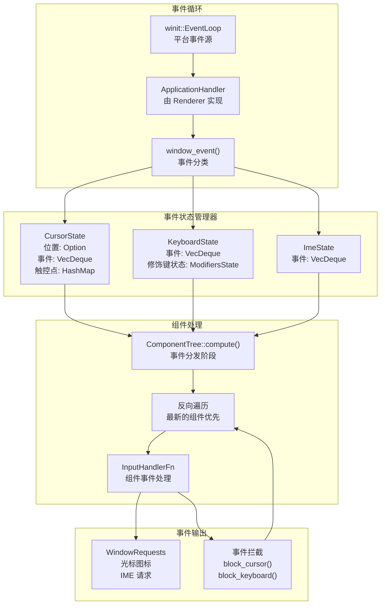
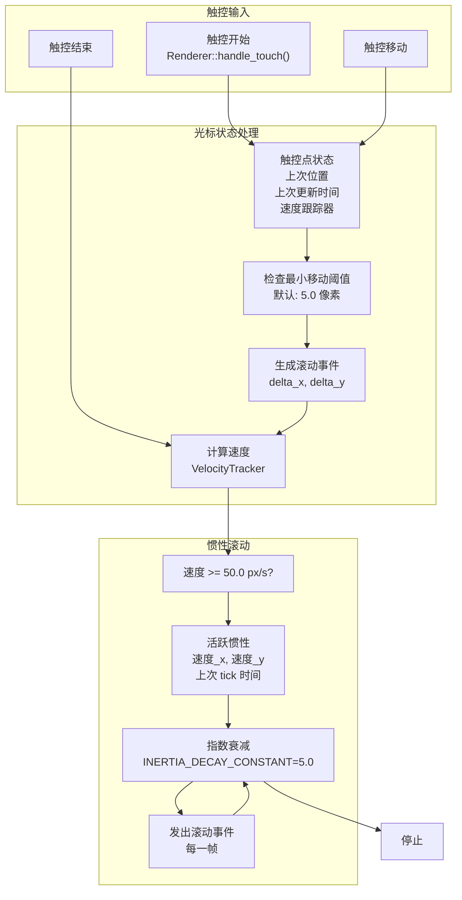
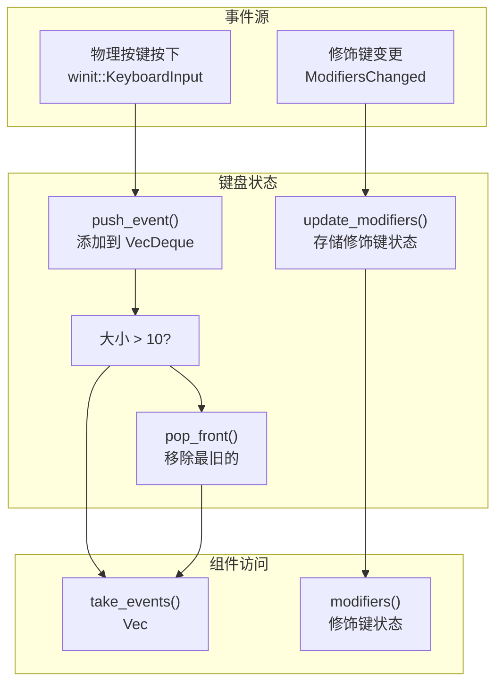
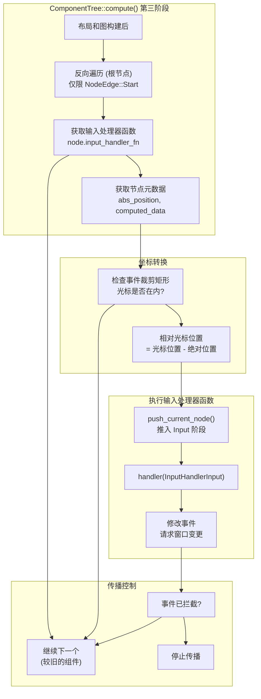
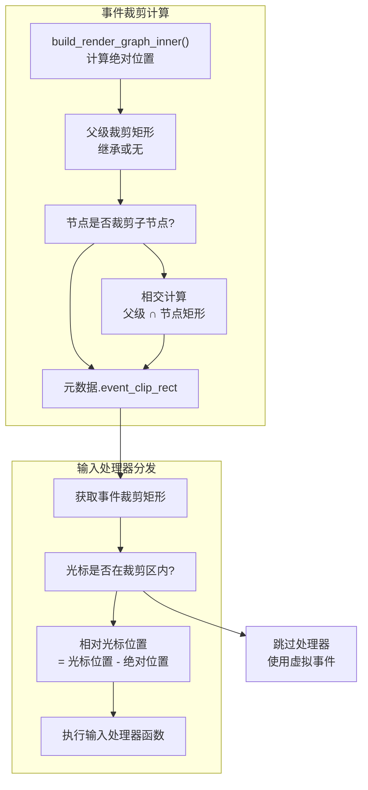
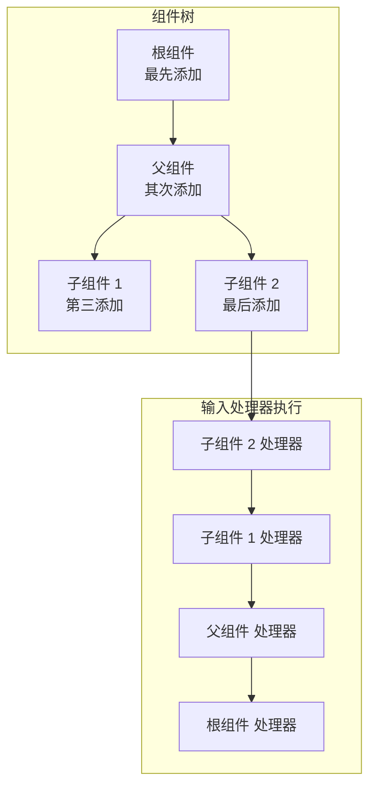
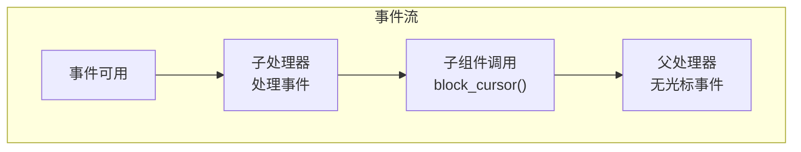
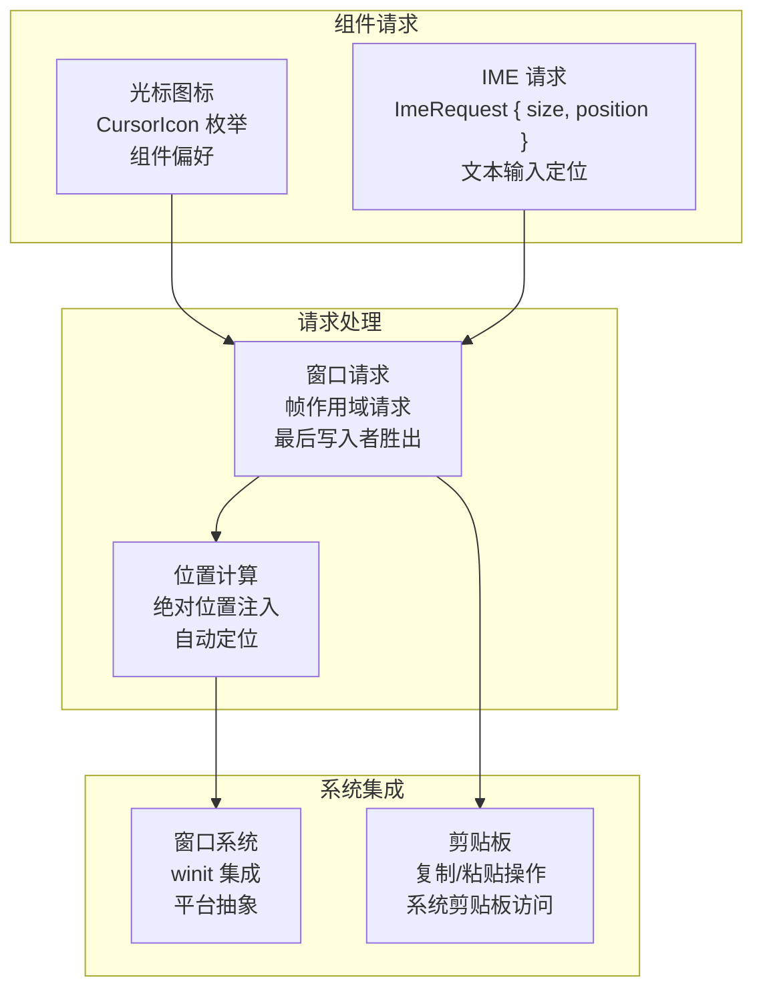

# 事件处理

<details>
<summary><strong>相关源文件</strong></summary>

* [tessera-ui/src/accessibility.rs](https://github.com/tessera-ui/tessera/blob/821ebad7/tessera-ui/src/accessibility.rs)
* [tessera-ui/src/component_tree.rs](https://github.com/tessera-ui/tessera/blob/821ebad7/tessera-ui/src/component_tree.rs)
* [tessera-ui/src/component_tree/constraint.rs](https://github.com/tessera-ui/tessera/blob/821ebad7/tessera-ui/src/component_tree/constraint.rs)
* [tessera-ui/src/component_tree/node.rs](https://github.com/tessera-ui/tessera/blob/821ebad7/tessera-ui/src/component_tree/node.rs)
* [tessera-ui/src/context.rs](https://github.com/tessera-ui/tessera/blob/821ebad7/tessera-ui/src/context.rs)
* [tessera-ui/src/cursor.rs](https://github.com/tessera-ui/tessera/blob/821ebad7/tessera-ui/src/cursor.rs)
* [tessera-ui/src/focus_state.rs](https://github.com/tessera-ui/tessera/blob/821ebad7/tessera-ui/src/focus_state.rs)
* [tessera-ui/src/ime_state.rs](https://github.com/tessera-ui/tessera/blob/821ebad7/tessera-ui/src/ime_state.rs)
* [tessera-ui/src/lib.rs](https://github.com/tessera-ui/tessera/blob/821ebad7/tessera-ui/src/lib.rs)
* [tessera-ui/src/px.rs](https://github.com/tessera-ui/tessera/blob/821ebad7/tessera-ui/src/px.rs)
* [tessera-ui/src/renderer.rs](https://github.com/tessera-ui/tessera/blob/821ebad7/tessera-ui/src/renderer.rs)
* [tessera-ui/src/router.rs](https://github.com/tessera-ui/tessera/blob/821ebad7/tessera-ui/src/router.rs)
* [tessera-ui/src/runtime.rs](https://github.com/tessera-ui/tessera/blob/821ebad7/tessera-ui/src/runtime.rs)
* [tessera-ui/src/thread_utils.rs](https://github.com/tessera-ui/tessera/blob/821ebad7/tessera-ui/src/thread_utils.rs)
</details>

本文档涵盖了 Tessera UI 中的事件处理系统，包括输入事件处理、光标状态、键盘状态、IME 状态，以及事件通过组件树的传播。关于状态管理的信息，请参阅 [状态管理](State-Management.md)。关于布局系统的详情，请参阅 [布局系统](Layout-System.md)。

## 架构概览

Tessera UI 的事件处理系统处理来自窗口系统 (`winit`) 的输入，并通过结构化管线将其分发给组件。`Renderer` 负责事件收集，而 `ComponentTree::compute` 负责将事件分发到组件的输入处理器。

**事件流架构**



来源：[tessera-ui/src/renderer.rs L228-L262](https://github.com/tessera-ui/tessera/blob/821ebad7/tessera-ui/src/renderer.rs#L228-L262)

 [tessera-ui/src/renderer.rs L1024-L1165](https://github.com/tessera-ui/tessera/blob/821ebad7/tessera-ui/src/renderer.rs#L1024-L1165)

 [tessera-ui/src/component_tree.rs L196-L379](https://github.com/tessera-ui/tessera/blob/821ebad7/tessera-ui/src/component_tree.rs#L196-L379)

 [tessera-ui/src/cursor.rs L133-L148](https://github.com/tessera-ui/tessera/blob/821ebad7/tessera-ui/src/cursor.rs#L133-L148)

 [tessera-ui/src/ime_state.rs L30-L79](https://github.com/tessera-ui/tessera/blob/821ebad7/tessera-ui/src/ime_state.rs#L30-L79)

## 渲染器中的事件收集

`Renderer` 实现 `winit::ApplicationHandler` 以接收来自窗口系统的事件。事件被分类并路由到相应的状态管理器。

**窗口事件分类**

```mermaid
flowchart TD

WE["WindowEvent"]
CLASSIFY["事件类型匹配"]
CURSOR_MOVED["光标移动<br>Renderer::handle_cursor_moved()"]
MOUSE_INPUT["鼠标输入<br>Renderer::handle_mouse_input()"]
MOUSE_WHEEL["鼠标滚轮<br>Renderer::handle_mouse_wheel()"]
TOUCH["触控<br>Renderer::handle_touch()"]
KEY_INPUT["键盘输入<br>Renderer::handle_keyboard_input()"]
MODIFIERS["修饰键变更<br>KeyboardState::update_modifiers()"]
IME_EVENT["Ime 事件<br>Renderer::handle_ime()"]
RESIZED["窗口缩放<br>Renderer::handle_resized()"]
REDRAW["请求重绘<br>Renderer::execute_render_frame()"]

CLASSIFY --> CURSOR_MOVED
CLASSIFY --> MOUSE_INPUT
CLASSIFY --> MOUSE_WHEEL
CLASSIFY --> TOUCH
CLASSIFY --> KEY_INPUT
CLASSIFY --> MODIFIERS
CLASSIFY --> IME_EVENT
CLASSIFY --> RESIZED
CLASSIFY --> REDRAW

subgraph subGraph4 ["窗口事件"]
    RESIZED
    REDRAW
end

subgraph subGraph3 ["IME 事件"]
    IME_EVENT
end

subgraph subGraph2 ["键盘事件"]
    KEY_INPUT
    MODIFIERS
end

subgraph subGraph1 ["光标事件"]
    CURSOR_MOVED
    MOUSE_INPUT
    MOUSE_WHEEL
    TOUCH
end

subgraph Renderer::window_event() ["Renderer::window_event()"]
    WE
    CLASSIFY
    WE --> CLASSIFY
end
```

来源：[tessera-ui/src/renderer.rs L1024-L1165](https://github.com/tessera-ui/tessera/blob/821ebad7/tessera-ui/src/renderer.rs#L1024-L1165)

## 光标状态管理

`CursorState` 管理光标和触控输入，包括位置跟踪、事件排队、手势识别以及惯性滚动。

| 字段 | 类型 | 用途 |
| --- | --- | --- |
| `position` | `Option<PxPosition>` | 当前光标在窗口坐标系中的位置 |
| `events` | `VecDeque<CursorEvent>` | 有界事件队列（最大 10 个事件） |
| `touch_points` | `HashMap<u64, TouchPointState>` | 用于手势跟踪的活跃触控点 |
| `touch_scroll_config` | `TouchScrollConfig` | 触控滚动行为配置 |
| `active_inertia` | `Option<ActiveInertia>` | 当前惯性滚动状态 |

**触控手势处理**



**光标事件类型**

| 事件类型 | 内容 | 触发条件 |
| --- | --- | --- |
| `CursorEventContent::Click` | `PressKeyEventType` | 鼠标按钮点击 |
| `CursorEventContent::Press` | `PressKeyEventType` | 鼠标按钮按下 |
| `CursorEventContent::Release` | `PressKeyEventType` | 鼠标按钮释放 |
| `CursorEventContent::Move` | 无 | 光标位置变更 |
| `CursorEventContent::Scroll` | `ScrollEventContent { delta_x, delta_y }` | 鼠标滚轮或触控滚动 |

来源：[tessera-ui/src/cursor.rs L133-L148](https://github.com/tessera-ui/tessera/blob/821ebad7/tessera-ui/src/cursor.rs#L133-L148)

 [tessera-ui/src/cursor.rs L207-L239](https://github.com/tessera-ui/tessera/blob/821ebad7/tessera-ui/src/cursor.rs#L207-L239)

 [tessera-ui/src/cursor.rs L284-L585](https://github.com/tessera-ui/tessera/blob/821ebad7/tessera-ui/src/cursor.rs#L284-L585)

 [tessera-ui/src/renderer.rs L1024-L1043](https://github.com/tessera-ui/tessera/blob/821ebad7/tessera-ui/src/renderer.rs#L1024-L1043)

## 键盘状态管理

`KeyboardState` 缓冲键盘事件并跟踪修饰键状态。事件存储在有界队列中，以防止快速输入期间的内存问题。

| 字段 | 类型 | 用途 |
| --- | --- | --- |
| `events` | `VecDeque<KeyEvent>` | 有界键盘事件队列 |
| `modifiers` | `ModifiersState` | Ctrl, Shift, Alt 等的当前状态 |

队列维持最大 `KEEP_EVENTS_COUNT` (10) 个事件，超过限制时自动移除旧事件。

**键盘事件处理**



来源：[tessera-ui/src/renderer.rs L1097-L1110](https://github.com/tessera-ui/tessera/blob/821ebad7/tessera-ui/src/renderer.rs#L1097-L1110)

 [tessera-ui/src/component_tree.rs L652-L654](https://github.com/tessera-ui/tessera/blob/821ebad7/tessera-ui/src/component_tree.rs#L652-L654)

## IME 状态管理

`ImeState` 管理用于复杂文本输入（如亚洲语言、表情符号选择器）的输入法编辑器事件。与 `KeyboardState` 类似，它也使用有界队列。

| 常量 | 值 | 用途 |
| --- | --- | --- |
| `KEEP_EVENTS_COUNT` | 10 | 队列中最大 IME 事件数 |

**IME 事件类型**

* `Ime::Enabled`: IME 已激活
* `Ime::Preedit`: 组合文本预览
* `Ime::Commit`: 最终文本已提交
* `Ime::Disabled`: IME 已停用

来源：[tessera-ui/src/ime_state.rs L14-L79](https://github.com/tessera-ui/tessera/blob/821ebad7/tessera-ui/src/ime_state.rs#L14-L79)

 [tessera-ui/src/renderer.rs L1141-L1156](https://github.com/tessera-ui/tessera/blob/821ebad7/tessera-ui/src/renderer.rs#L1141-L1156)

## 组件树中的事件分发

在布局测量和渲染图生成之后，`ComponentTree::compute` 以反向树遍历顺序（最新/最深的组件优先）将事件分发到组件的输入处理器。

**事件分发流**



来源：[tessera-ui/src/component_tree.rs L268-L373](https://github.com/tessera-ui/tessera/blob/821ebad7/tessera-ui/src/component_tree.rs#L268-L373)

## 输入处理器函数与输入

组件通过 `InputHandlerFn` 定义输入处理行为，这是一个接收 `InputHandlerInput`（包含所有事件数据和工具）的装箱闭包。

**输入处理器函数类型**

```
type InputHandlerFn = dyn Fn(InputHandlerInput) + Send + Sync
```

**输入处理器输入结构**

| 字段 | 类型 | 访问权限 | 用途 |
| --- | --- | --- | --- |
| `computed_data` | `ComputedData` | 只读 | 布局计算出的组件大小 |
| `cursor_position_rel` | `Option<PxPosition>` | 只读 | 相对于组件的光标位置 |
| `cursor_events` | `&mut Vec<CursorEvent>` | 可变 | 本帧的光标事件 |
| `keyboard_events` | `&mut Vec<KeyEvent>` | 可变 | 本帧的键盘事件 |
| `ime_events` | `&mut Vec<Ime>` | 可变 | 本帧的 IME 事件 |
| `key_modifiers` | `ModifiersState` | 只读 | 当前修饰键状态 |
| `requests` | `&mut WindowRequests` | 可变 | 窗口系统请求 |

**事件裁剪与坐标转换**



来源：[tessera-ui/src/component_tree/node.rs L372-L504](https://github.com/tessera-ui/tessera/blob/821ebad7/tessera-ui/src/component_tree/node.rs#L372-L504)

 [tessera-ui/src/component_tree.rs L434-L529](https://github.com/tessera-ui/tessera/blob/821ebad7/tessera-ui/src/component_tree.rs#L434-L529)

 [tessera-ui/src/component_tree.rs L296-L310](https://github.com/tessera-ui/tessera/blob/821ebad7/tessera-ui/src/component_tree.rs#L296-L310)

## 事件传播与拦截

输入处理器按反向树遍历顺序执行，允许子组件先于父组件处理事件。组件可以拦截（拦截）事件传播，以防止较旧的组件接收事件。

**传播顺序**



**事件拦截方法**

| 方法 | 实现 | 效果 |
| --- | --- | --- |
| `block_cursor()` | `cursor_position_abs.take()``cursor_events.clear()` | 防止光标位置和事件到达较旧的处理器 |
| `block_keyboard()` | `keyboard_events.clear()` | 停止键盘事件传播 |
| `block_ime()` | `ime_events.clear()` | 停止 IME 事件传播 |
| `block_all()` | 调用上述所有拦截方法 | 完全的事件隔离 |

**拦截行为示例**



来源：[tessera-ui/src/component_tree/node.rs L407-L432](https://github.com/tessera-ui/tessera/blob/821ebad7/tessera-ui/src/component_tree/node.rs#L407-L432)

 [tessera-ui/src/component_tree.rs L268-L310](https://github.com/tessera-ui/tessera/blob/821ebad7/tessera-ui/src/component_tree.rs#L268-L310)

## 窗口请求与系统集成

组件可以通过 `WindowRequests` 结构向窗口系统发出请求，该结构每帧处理一次。



当多个组件在同一帧内发出冲突的请求时，遵循“最后写入者胜出”原则，即处理顺序靠后（更新的组件）具有优先权。

来源：[tessera-ui/src/component_tree/node.rs L309-L340](https://github.com/tessera-ui/tessera/blob/821ebad7/tessera-ui/src/component_tree/node.rs#L309-L340)

 [tessera-ui/src/component_tree.rs L240-L244](https://github.com/tessera-ui/tessera/blob/821ebad7/tessera-ui/src/component_tree.rs#L240-L244)
