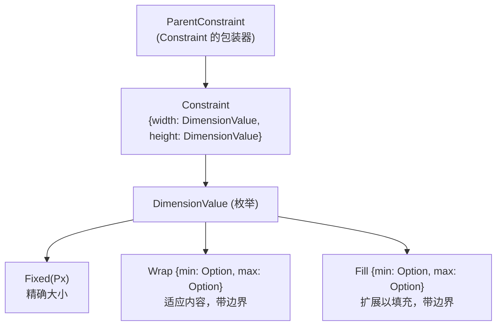
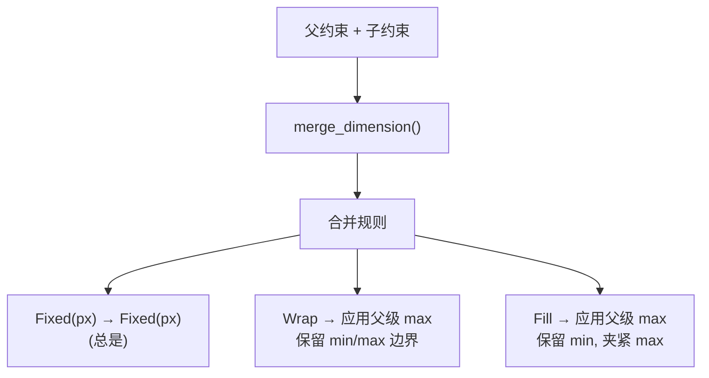
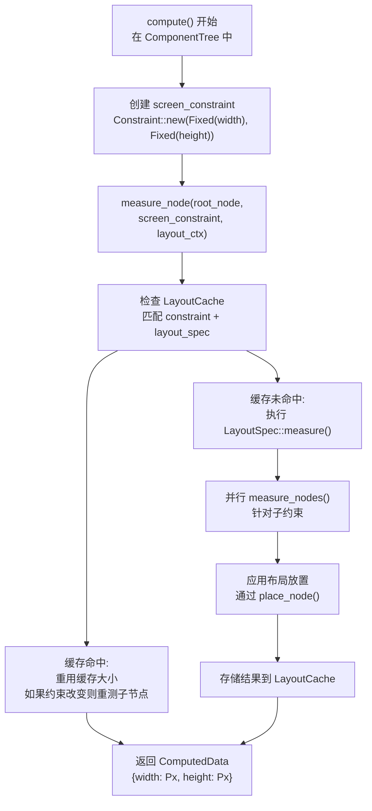
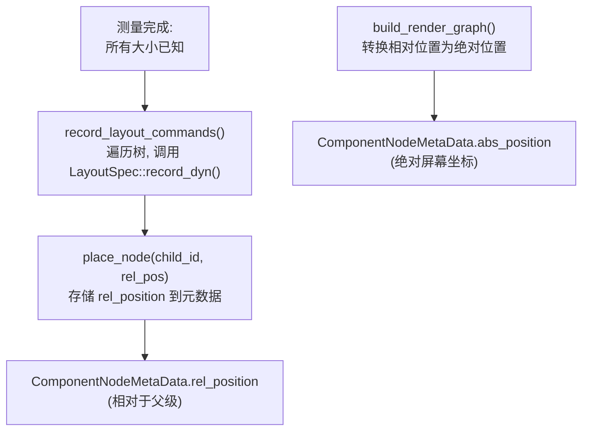
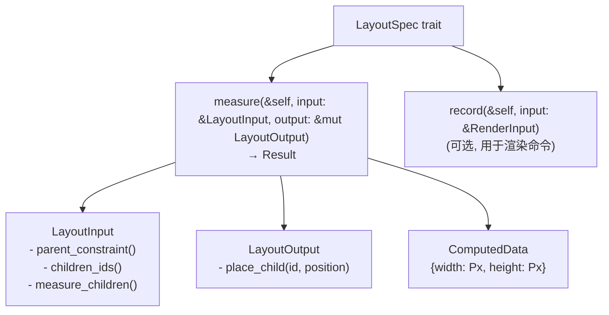
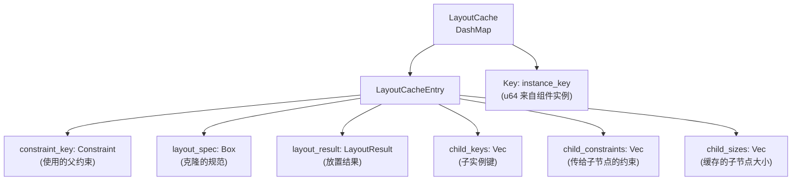
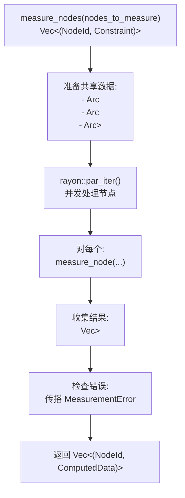

# 布局系统

<details>
<summary><strong>相关源文件</strong></summary>

* [tessera-ui/src/accessibility.rs](https://github.com/tessera-ui/tessera/blob/821ebad7/tessera-ui/src/accessibility.rs)
* [tessera-ui/src/component_tree.rs](https://github.com/tessera-ui/tessera/blob/821ebad7/tessera-ui/src/component_tree.rs)
* [tessera-ui/src/component_tree/constraint.rs](https://github.com/tessera-ui/tessera/blob/821ebad7/tessera-ui/src/component_tree/constraint.rs)
* [tessera-ui/src/component_tree/node.rs](https://github.com/tessera-ui/tessera/blob/821ebad7/tessera-ui/src/component_tree/node.rs)
* [tessera-ui/src/context.rs](https://github.com/tessera-ui/tessera/blob/821ebad7/tessera-ui/src/context.rs)
* [tessera-ui/src/cursor.rs](https://github.com/tessera-ui/tessera/blob/821ebad7/tessera-ui/src/cursor.rs)
* [tessera-ui/src/focus_state.rs](https://github.com/tessera-ui/tessera/blob/821ebad7/tessera-ui/src/focus_state.rs)
* [tessera-ui/src/ime_state.rs](https://github.com/tessera-ui/tessera/blob/821ebad7/tessera-ui/src/ime_state.rs)
* [tessera-ui/src/lib.rs](https://github.com/tessera-ui/tessera/blob/821ebad7/tessera-ui/src/lib.rs)
* [tessera-ui/src/px.rs](https://github.com/tessera-ui/tessera/blob/821ebad7/tessera-ui/src/px.rs)
* [tessera-ui/src/renderer.rs](https://github.com/tessera-ui/tessera/blob/821ebad7/tessera-ui/src/renderer.rs)
* [tessera-ui/src/router.rs](https://github.com/tessera-ui/tessera/blob/821ebad7/tessera-ui/src/router.rs)
* [tessera-ui/src/runtime.rs](https://github.com/tessera-ui/tessera/blob/821ebad7/tessera-ui/src/runtime.rs)
* [tessera-ui/src/thread_utils.rs](https://github.com/tessera-ui/tessera/blob/821ebad7/tessera-ui/src/thread_utils.rs)
</details>

布局系统是 Tessera 基于约束的布局引擎，用于计算 UI 层次结构中所有组件的大小和位置。它采用两阶段方法：测量（Calculating sizes）和放置（Determining positions）。该系统支持三种基本的尺寸策略（Fixed, Wrap, Fill），并包含布局缓存和并行测量等优化。

关于渲染计算出的布局，请参阅 [渲染管线](Rendering-Pipeline.md)。关于组件如何定义其布局行为的细节，请参阅 [组件模型](Component-Model.md)。

---

## 核心概念

### 约束系统

布局系统围绕着从父组件传播到子组件的约束构建。每个约束指定了组件如何在宽度和高度维度上调整自身大小，使用 `DimensionValue` 类型。



**来源：** [tessera-ui/src/component_tree/constraint.rs L1-L515](https://github.com/tessera-ui/tessera/blob/821ebad7/tessera-ui/src/component_tree/constraint.rs#L1-L515)

`Constraint` 结构结合了宽度和高度维度值以提供完整的布局规范。`ParentConstraint` 包装器的存在是为了通过区分布局引擎提供的约束与用户合成的约束来确保 API 的类型安全。

### DimensionValue 类型

每个维度可以使用以下三种策略之一指定：

| 类型 | 行为 | 用例 | 示例 |
| --- | --- | --- | --- |
| `Fixed(Px)` | 精确大小，不能被覆盖 | 按钮、图标、固定大小容器 | `DimensionValue::Fixed(Px(100))` |
| `Wrap { min, max }` | 在可选边界内适应内容大小 | 文本标签、动态内容 | `DimensionValue::Wrap { min: Some(Px(50)), max: Some(Px(200)) }` |
| `Fill { min, max }` | 在可选边界内扩展到可用空间 | 弹性容器、背景 | `DimensionValue::Fill { min: None, max: Some(Px(800)) }` |

**来源：** [tessera-ui/src/component_tree/constraint.rs L133-L247](https://github.com/tessera-ui/tessera/blob/821ebad7/tessera-ui/src/component_tree/constraint.rs#L133-L247)

### 约束合并

当组件嵌套时，它们的约束必须合并以解决冲突：

* **Fixed 总是胜出**：固定约束不能被其父级覆盖。
* **Wrap 保留内容尺寸**：Wrap 约束保持固有的尺寸行为。
* **Fill 适应可用空间**：Fill 约束在父级边界内扩展。

合并逻辑在 `Constraint::merge()` 和 `merge_dimension()` 中实现：



**来源：** [tessera-ui/src/component_tree/constraint.rs L516-L649](https://github.com/tessera-ui/tessera/blob/821ebad7/tessera-ui/src/component_tree/constraint.rs#L516-L649)

---

## 布局过程

布局系统在帧渲染周期中执行两个不同的阶段：

### 测量阶段



**来源：** [tessera-ui/src/component_tree.rs L196-L246](https://github.com/tessera-ui/tessera/blob/821ebad7/tessera-ui/src/component_tree.rs#L196-L246)

 [tessera-ui/src/component_tree/node.rs L572-L720](https://github.com/tessera-ui/tessera/blob/821ebad7/tessera-ui/src/component_tree/node.rs#L572-L720)

测量阶段由 `ComponentTree::compute()` 编排，它使用屏幕尺寸作为固定约束在根节点上调用 `measure_node()`。`measure_node()` 函数：

1. **检查布局缓存**：如果约束、布局规范和子节点未更改，则重用缓存结果。
2. **执行布局规范**：调用 `LayoutSpec::measure()` 来计算组件的大小。
3. **并行测量子节点**：使用 `measure_nodes()` 并发测量多个子节点。
4. **应用放置**：通过 `place_node()` 存储相对位置。
5. **缓存结果**：将计算出的大小存储在 `LayoutCache` 中以供未来帧使用。

并行测量在 `measure_nodes()` 中实现：

**来源：** [tessera-ui/src/component_tree/node.rs L721-L864](https://github.com/tessera-ui/tessera/blob/821ebad7/tessera-ui/src/component_tree/node.rs#L721-L864)

该函数使用 `rayon::par_iter()` 并发测量独立的子节点，显著提高了复杂布局的性能。

### 放置阶段

测量后，组件相对于其父级定位：



**来源：** [tessera-ui/src/component_tree.rs L383-L399](https://github.com/tessera-ui/tessera/blob/821ebad7/tessera-ui/src/component_tree.rs#L383-L399)

 [tessera-ui/src/component_tree.rs L402-L529](https://github.com/tessera-ui/tessera/blob/821ebad7/tessera-ui/src/component_tree.rs#L402-L529)

`place_node()` 函数将相对位置存储在 `ComponentNodeMetaData` 中：

**来源：** [tessera-ui/src/component_tree/node.rs L1281-L1291](https://github.com/tessera-ui/tessera/blob/821ebad7/tessera-ui/src/component_tree/node.rs#L1281-L1291)

稍后，在渲染图构建期间，`build_render_graph_inner()` 通过累加父级位置将相对位置转换为绝对屏幕坐标：

**来源：** [tessera-ui/src/component_tree.rs L435-L529](https://github.com/tessera-ui/tessera/blob/821ebad7/tessera-ui/src/component_tree.rs#L435-L529)

---

## 布局规范

### LayoutSpec Trait

组件通过实现 `LayoutSpec` trait 定义其布局行为：



**来源：** [tessera-ui/src/layout.rs L1-L500](https://github.com/tessera-ui/tessera/blob/821ebad7/tessera-ui/src/layout.rs#L1-L500)

`measure()` 方法接收：

* `LayoutInput`: 提供对父约束、子节点 ID 的访问，以及测量子节点的方法。
* `LayoutOutput`: 允许在特定位置放置子节点。

示例实现模式：

```javascript
impl LayoutSpec for MyLayoutSpec {
    fn measure(&self, input: &LayoutInput, output: &mut LayoutOutput) 
        -> Result<ComputedData, MeasurementError> {
        // 1. 获取父约束
        let parent_constraint = Constraint::new(
            input.parent_constraint().width(),
            input.parent_constraint().height(),
        );
        
        // 2. 测量子节点
        let nodes_to_measure = input.children_ids()
            .iter()
            .map(|&id| (id, child_constraint))
            .collect();
        let sizes = input.measure_children(nodes_to_measure)?;
        
        // 3. 放置子节点
        for (child_id, size) in sizes {
            output.place_child(child_id, position);
        }
        
        // 4. 返回计算出的大小
        Ok(ComputedData { width, height })
    }
}
```

**来源：** [tessera-ui/src/lib.rs L262-L313](https://github.com/tessera-ui/tessera/blob/821ebad7/tessera-ui/src/lib.rs#L262-L313)

### LayoutInput API

`LayoutInput` 结构体提供了在测量期间访问布局信息的方法：

| 方法 | 返回 | 用途 |
| --- | --- | --- |
| `parent_constraint()` | `ParentConstraint` | 从父级获取约束 |
| `children_ids()` | `&[NodeId]` | 获取子节点 ID 列表 |
| `measure_children()` | `Result<Vec<(NodeId, ComputedData)>>` | 使用给定约束测量多个子节点 |
| `measure_child()` | `Result<ComputedData>` | 测量单个子节点 |

**来源：** [tessera-ui/src/layout.rs L200-L450](https://github.com/tessera-ui/tessera/blob/821ebad7/tessera-ui/src/layout.rs#L200-L450)

`measure_children()` 方法特别重要，因为它根据子节点的数量启用顺序或并行测量。

### 设置 Layout Spec

组件使用由 `#[tessera]` 宏注入的 `layout()` 辅助函数设置其布局规范：

**来源：** [tessera-ui/src/runtime.rs L315-L329](https://github.com/tessera-ui/tessera/blob/821ebad7/tessera-ui/src/runtime.rs#L315-L329)

这调用 `TesseraRuntime::set_current_layout_spec()`，将布局规范存储在当前组件节点中。

---

## 性能优化

### 布局缓存

布局缓存存储测量结果以避免跨帧的冗余计算：



**来源：** [tessera-ui/src/runtime.rs L262-L274](https://github.com/tessera-ui/tessera/blob/821ebad7/tessera-ui/src/runtime.rs#L262-L274)

在测量期间检查缓存：

**来源：** [tessera-ui/src/component_tree/node.rs L626-L689](https://github.com/tessera-ui/tessera/blob/821ebad7/tessera-ui/src/component_tree/node.rs#L626-L689)

缓存失效发生于：

* 父约束改变
* 布局规范改变（通过 `dyn_eq()` 检测）
* 子节点改变（不同的 instance key）
* 子约束改变
* 任何子节点大小改变（需要重新测量）

元数据跟踪：

**来源：** [tessera-ui/src/component_tree/node.rs L276-L281](https://github.com/tessera-ui/tessera/blob/821ebad7/tessera-ui/src/component_tree/node.rs#L276-L281)

`layout_cache_hit` 标志用于分析和调试。

### 并行测量

当多个子节点的测量相互独立时，可以并发测量它们：



**来源：** [tessera-ui/src/component_tree/node.rs L721-L864](https://github.com/tessera-ui/tessera/blob/821ebad7/tessera-ui/src/component_tree/node.rs#L721-L864)

并行测量实现：

1. 将共享数据包装在 `Arc` 中以进行线程安全访问。
2. 使用 `rayon::par_iter()` 将工作分配到线程池。
3. 每个线程独立测量一个或多个节点。
4. 收集结果并传播任何错误。

这为具有许多子节点（例如列表、网格）的布局提供了显著的性能提升。

---

## 与组件树集成

布局系统与组件树生命周期紧密集成：

```mermaid
sequenceDiagram
  participant Renderer
  participant ComponentTree
  participant measure_node()
  participant LayoutSpec
  participant LayoutCache
  participant ComponentNodeMetaDatas

  Renderer->>ComponentTree: compute(screen_size, events, ...)
  ComponentTree->>ComponentTree: 创建 screen_constraint
  ComponentTree->>measure_node(): measure_node(root, constraint, layout_ctx)
  measure_node()->>LayoutCache: 检查 instance_key 的缓存
  loop [缓存命中]
    LayoutCache-->>measure_node(): 返回缓存条目
    measure_node()->>measure_node(): 验证子节点未改变
    measure_node()-->>ComponentTree: 返回缓存的 ComputedData
    measure_node()->>LayoutSpec: measure(input, output)
    LayoutSpec->>LayoutSpec: 计算布局
    LayoutSpec->>measure_node(): place_child() 调用
    measure_node()->>ComponentNodeMetaDatas: 存储 rel_position
    LayoutSpec-->>measure_node(): 返回 ComputedData
    measure_node()->>LayoutCache: 存储新缓存条目
    measure_node()-->>ComponentTree: 返回 ComputedData
  end
  ComponentTree->>ComponentTree: record_layout_commands()
  ComponentTree->>ComponentTree: build_render_graph()
  ComponentTree->>ComponentNodeMetaDatas: 转换 rel_position 为 abs_position
  ComponentTree-->>Renderer: 返回
```

**来源：** [tessera-ui/src/component_tree.rs L196-L380](https://github.com/tessera-ui/tessera/blob/821ebad7/tessera-ui/src/component_tree.rs#L196-L380)

 [tessera-ui/src/component_tree/node.rs L572-L720](https://github.com/tessera-ui/tessera/blob/821ebad7/tessera-ui/src/component_tree/node.rs#L572-L720)

关键集成点：

1. **组件节点创建**：每个组件节点存储一个 `layout_spec: Box<dyn LayoutSpecDyn>` 字段，在组件构建期间设置。**来源：** [tessera-ui/src/component_tree/node.rs L259-L273](https://github.com/tessera-ui/tessera/blob/821ebad7/tessera-ui/src/component_tree/node.rs#L259-L273)
2. **元数据存储**：布局结果存储在 `ComponentNodeMetaData` 中。**来源：** [tessera-ui/src/component_tree/node.rs L276-L305](https://github.com/tessera-ui/tessera/blob/821ebad7/tessera-ui/src/component_tree/node.rs#L276-L305)
3. **缓存管理**：`LayoutCache` 由 `TesseraRuntime` 拥有并传递给测量函数。**来源：** [tessera-ui/src/runtime.rs L236-L251](https://github.com/tessera-ui/tessera/blob/821ebad7/tessera-ui/src/runtime.rs#L236-L251)
4. **线程本地上下文**：在测量期间，通过线程本地状态跟踪当前节点以进行控制流插桩。**来源：** [tessera-ui/src/component_tree/node.rs L605-L607](https://github.com/tessera-ui/tessera/blob/821ebad7/tessera-ui/src/component_tree/node.rs#L605-L607)

这使得 `remember()` 和其他状态管理函数在布局期间能够正确工作。

---

## 单位和类型

布局系统内部使用物理像素，但在公共 API 中接受密度无关像素：

| 类型 | 用途 | 转换 |
| --- | --- | --- |
| `Px` | 物理屏幕像素 | 内部渲染单位 |
| `Dp` | 密度无关像素 | 公共 API，通过缩放因子转换为 `Px` |
| `PxPosition` | 屏幕坐标 `{x: Px, y: Px}` | 绝对和相对定位 |
| `PxSize` | 尺寸 `{width: Px, height: Px}` | 组件大小 |
| `ComputedData` | 布局结果 `{width: Px, height: Px}` | 测量的输出 |

**来源：** [tessera-ui/src/px.rs L1-L100](https://github.com/tessera-ui/tessera/blob/821ebad7/tessera-ui/src/px.rs#L1-L100)

 [tessera-ui/src/dp.rs L1-L150](https://github.com/tessera-ui/tessera/blob/821ebad7/tessera-ui/src/dp.rs#L1-L150)

 [tessera-ui/src/component_tree/node.rs L19-L29](https://github.com/tessera-ui/tessera/blob/821ebad7/tessera-ui/src/component_tree/node.rs#L19-L29)

`Constraint` 系统对所有维度值使用 `Px`，从 `Dp` 的转换是通过 `From<Dp>` trait 实现自动进行的。

**来源：** [tessera-ui/src/component_tree/constraint.rs L374-L386](https://github.com/tessera-ui/tessera/blob/821ebad7/tessera-ui/src/component_tree/constraint.rs#L374-L386)
