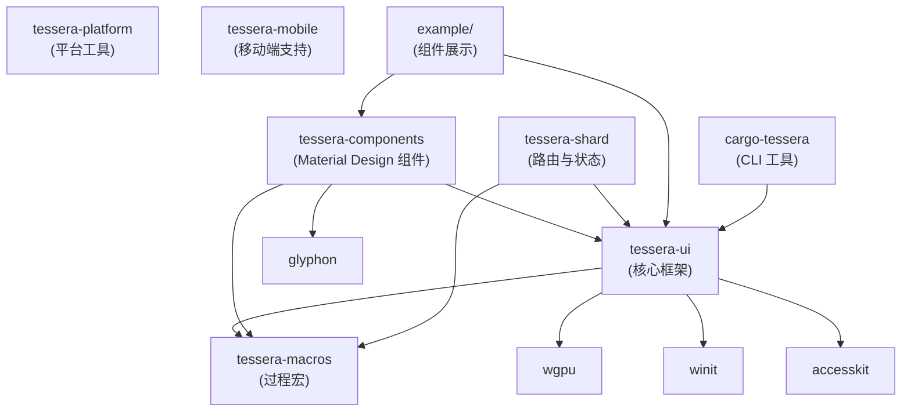
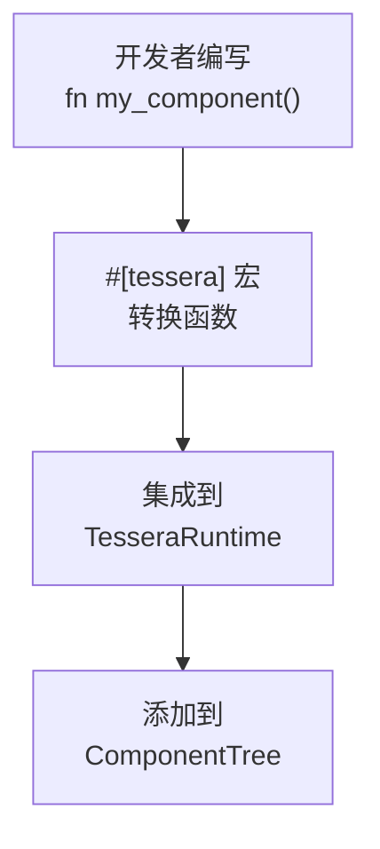
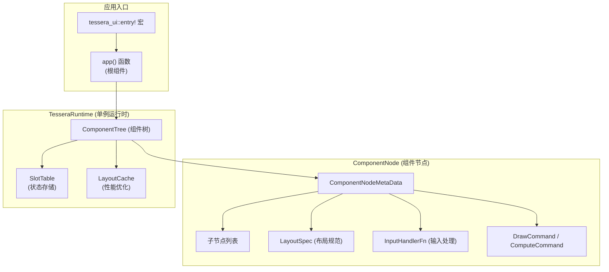
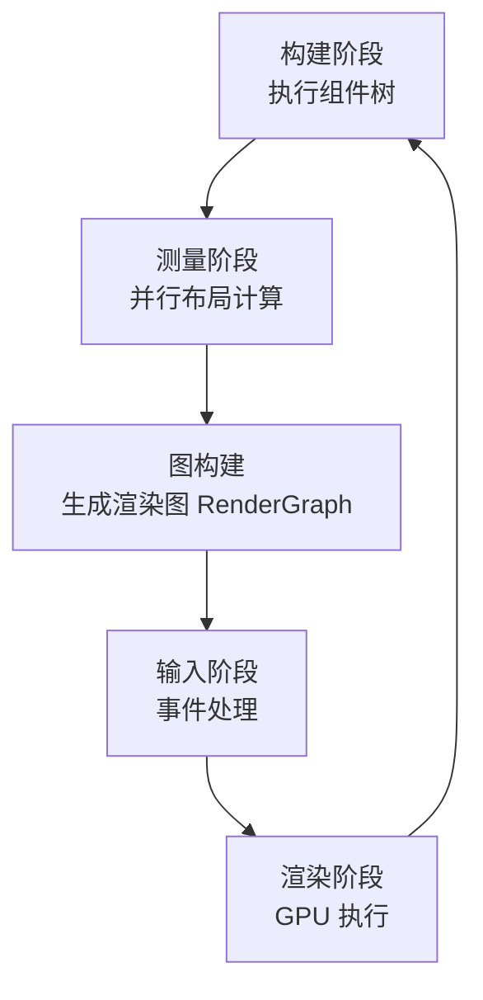
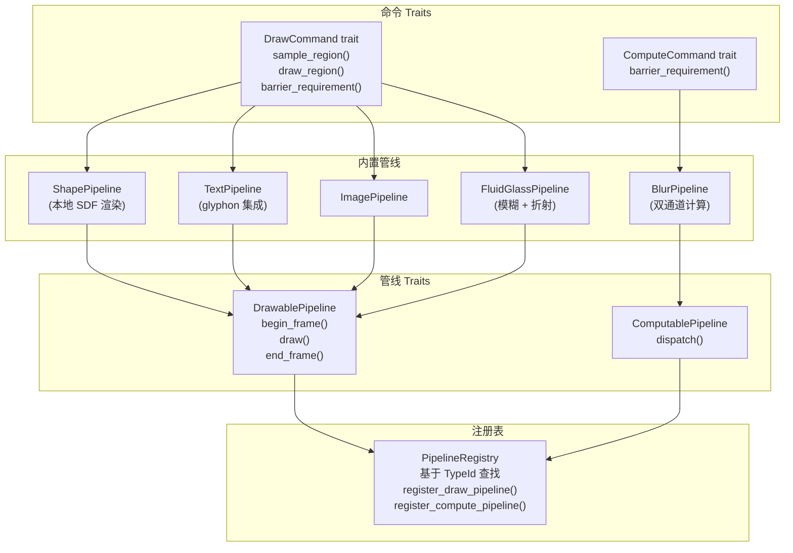
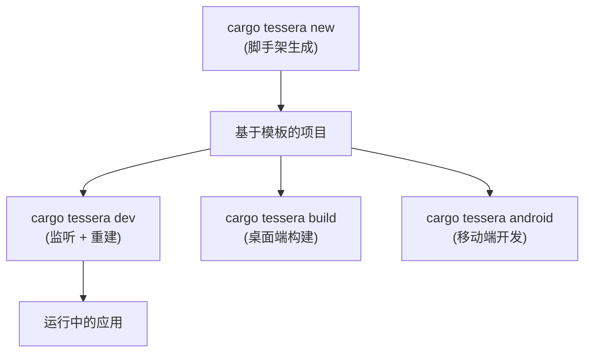
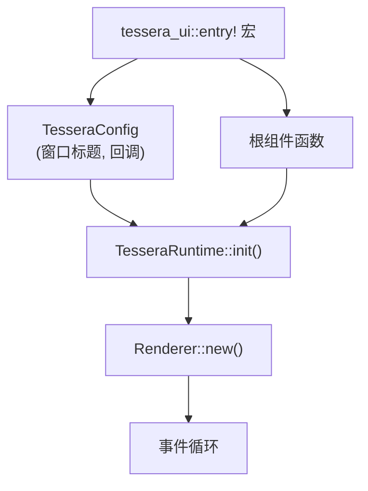

# 概览

<details>
<summary><strong>相关源文件</strong></summary>

* [AGENTS.md](https://github.com/tessera-ui/tessera/blob/821ebad7/AGENTS.md)
* [Cargo.lock](https://github.com/tessera-ui/tessera/blob/821ebad7/Cargo.lock)
* [README.md](https://github.com/tessera-ui/tessera/blob/821ebad7/README.md)
* [assets/logo.svg](https://github.com/tessera-ui/tessera/blob/821ebad7/assets/logo.svg)
* [docs/README_zh-CN.md](https://github.com/tessera-ui/tessera/blob/821ebad7/docs/README_zh-CN.md)
* [docs/RELEASE_RULE.md](https://github.com/tessera-ui/tessera/blob/821ebad7/docs/RELEASE_RULE.md)
* [docs/RELEASE_RULE_zh-CN.md](https://github.com/tessera-ui/tessera/blob/821ebad7/docs/RELEASE_RULE_zh-CN.md)
* [tessera-macros/CHANGELOG.md](https://github.com/tessera-ui/tessera/blob/821ebad7/tessera-macros/CHANGELOG.md)
* [tessera-macros/Cargo.toml](https://github.com/tessera-ui/tessera/blob/821ebad7/tessera-macros/Cargo.toml)
* [tessera-macros/README.md](https://github.com/tessera-ui/tessera/blob/821ebad7/tessera-macros/README.md)
* [tessera-macros/docs/README_zh-CN.md](https://github.com/tessera-ui/tessera/blob/821ebad7/tessera-macros/docs/README_zh-CN.md)
* [tessera-ui/CHANGELOG.md](https://github.com/tessera-ui/tessera/blob/821ebad7/tessera-ui/CHANGELOG.md)
* [tessera-ui/Cargo.toml](https://github.com/tessera-ui/tessera/blob/821ebad7/tessera-ui/Cargo.toml)

</details>

本文档对 Tessera UI 框架、其架构设计以及核心概念进行了高层介绍。它阐述了 Tessera 是什么、其设计哲学以及主要子系统是如何协同工作的。关于特定子系统的详细信息，请参阅 **架构设计** (#2) 章节及其子页面。

**来源：** [README.md L1-L126](https://github.com/tessera-ui/tessera/blob/821ebad7/README.md#L1-L126)

 [tessera-ui/Cargo.toml L1-L54](https://github.com/tessera-ui/tessera/blob/821ebad7/tessera-ui/Cargo.toml#L1-L54)

 [AGENTS.md L1-L216](https://github.com/tessera-ui/tessera/blob/821ebad7/AGENTS.md#L1-L216)

---

## 什么是 Tessera

Tessera 是一个用于 Rust 的跨平台、声明式、函数式 UI 库，专注于高性能和可扩展性。它允许开发者使用受 React 和 Compose 启发的编程模型，构建运行在桌面和 Android 平台上的 GPU 加速用户界面。

框架提供：

* **声明式组件定义**：通过 `#[tessera]` 过程宏实现。
* **基于约束的布局系统**：支持并行测量。
* **可插拔渲染管线**：支持自定义着色器和 GPU 计算。
* **状态管理**：通过 `remember()` 和 `retain()` 原语实现。
* **Material Design 组件库**：内置毛玻璃 效果。
* **跨平台窗口管理**：通过 `winit` 实现窗口管理，`wgpu` 实现渲染。

**来源：** [README.md L26-L35](https://github.com/tessera-ui/tessera/blob/821ebad7/README.md#L26-L35)

 [tessera-ui/Cargo.toml L9](https://github.com/tessera-ui/tessera/blob/821ebad7/tessera-ui/Cargo.toml#L9-L9)

 [docs/README_zh-CN.md L13-L34](https://github.com/tessera-ui/tessera/blob/821ebad7/docs/README_zh-CN.md#L13-L34)

---

## 工作区结构

Tessera 项目作为一个 Cargo 工作区（Workspace）组织，包含多个相互依赖的 Crate：



**核心 Crate：**

| Crate | 用途 | 关键依赖 |
| --- | --- | --- |
| `tessera-ui` | 框架核心：运行时、组件树、渲染、布局、事件处理 | `wgpu`, `winit`, `accesskit`, `rayon` |
| `tessera-macros` | 用于组件定义的 `#[tessera]` 和 `#[shard]` 过程宏 | `syn`, `quote`, `proc-macro2` |
| `tessera-components` | Material Design 组件库，内置渲染管线 | `tessera-ui`, `glyphon` |
| `tessera-shard` | 客户端路由和导航系统 | `tessera-ui` |
| `cargo-tessera` | 用于项目脚手架生成、开发和构建的 CLI 工具 | `handlebars`, `notify`, `cargo_metadata` |
| `example` | 组件展示和测试应用 | `tessera-ui`, `tessera-components` |

**来源：** [Cargo.lock L848-L864](https://github.com/tessera-ui/tessera/blob/821ebad7/Cargo.lock#L848-L864)

 [tessera-ui/Cargo.toml L1-L54](https://github.com/tessera-ui/tessera/blob/821ebad7/tessera-ui/Cargo.toml#L1-L54)

 [tessera-macros/Cargo.toml L1-L23](https://github.com/tessera-ui/tessera/blob/821ebad7/tessera-macros/Cargo.toml#L1-L23)

---

## 编程模型

Tessera 采用 **声明式、函数式编程模型**，其中 UI 组件是用 `#[tessera]` 标注的无状态 Rust 函数。这种设计灵感来源于 React Hooks 和 Jetpack Compose。

### 组件定义



一个基础组件示例：

```rust
#[tessera]
fn app() {
    surface(
        SurfaceArgs::default().modifier(Modifier::new().fill_max_size()),
        || {
            column(ColumnArgs::default(), |scope| {
                scope.child(|| text("Hello, Tessera!"));
            });
        },
    );
}
```

`#[tessera]` 宏会注入：

* **`layout(spec)`**：通过 `LayoutSpec` trait 指定自定义布局行为的函数。
* **`input_handler(fn)`**：通过 `InputHandlerInput` 参数处理输入事件的函数。
* **组件树管理**：自动处理节点的创建、追踪和清理。

**来源：** [README.md L42-L98](https://github.com/tessera-ui/tessera/blob/821ebad7/README.md#L42-L98)

 [tessera-macros/README.md L8-L127](https://github.com/tessera-ui/tessera/blob/821ebad7/tessera-macros/README.md#L8-L127)

 [AGENTS.md L29-L38](https://github.com/tessera-ui/tessera/blob/821ebad7/AGENTS.md#L29-L38)

### 状态管理

组件本身是 **无状态的** —— 它们不直接存储数据。状态通过两个原语进行管理：

| 函数 | 作用域 | 生命周期 | 存储位置 |
| --- | --- | --- | --- |
| `remember(init)` | 组件实例 | 当组件卸载时清除 | `SlotTable` |
| `retain(init)` | 进程级 | 在应用生命周期内持久存在 | `SlotTable` |

两者都返回 `State<T>`，它封装了 `Arc<RwLock<T>>` 以确保线程安全访问：

```javascript
#[tessera]
fn counter() {
    let count = remember(|| 0);
    
    button(
        ButtonArgs::filled(move || count.with_mut(|c| *c += 1)),
        || text(format!("Count: {}", count.get())),
    );
}
```

状态的标识 由以下因素决定：

* **`logic_id`**：由 `module_path!()` + 函数名生成。
* **`GROUP_PATH_STACK`**：在控制流（if/match/for）中的位置。
* **`CALL_COUNTER_STACK`**：组件内的顺序调用计数。

即使存在条件逻辑，这也使得状态在重渲染之间保持稳定。

**来源：** [README.md L72-L98](https://github.com/tessera-ui/tessera/blob/821ebad7/README.md#L72-L98)

 [AGENTS.md L82-L88](https://github.com/tessera-ui/tessera/blob/821ebad7/AGENTS.md#L82-L88)

---

## 组件树架构

组件树管理 UI 层次结构，是布局、渲染和事件处理的基础：



树中的每个 `ComponentNode` 存储：

* **元数据**：布局规范、输入处理器、绘制/计算命令。
* **计算数据**：尺寸 (`ComputedData`)、绝对位置 (`PxPosition`)。
* **子节点**：子节点的有序列表。

组件树在每一帧通过自顶向下执行组件函数来重建，随后进行测量和渲染。

**来源：** [AGENTS.md L40-L42](https://github.com/tessera-ui/tessera/blob/821ebad7/AGENTS.md#L40-L42)

 [Diagram 2 in high-level architecture](<https://github.com/tessera-ui/tessera/blob/821ebad7/Diagram> 2 in high-level architecture)

---

## 帧渲染周期

Tessera 遵循由 `Renderer` 管理的严格五阶段渲染周期：



**阶段详情：**

1. **构建**：执行所有组件函数，使用当前状态重建 `ComponentTree`。
2. **测量**：通过 `measure_nodes()` 运行并行布局测量，计算尺寸和位置。
3. **图构建**：生成 `RenderGraph`，包含所有绘制/计算命令的绝对坐标。
4. **输入**：按反向树顺序（子节点优先）处理光标、键盘和 IME 事件。
5. **渲染**：通过 `DrawablePipeline` 和 `ComputablePipeline` 的实现执行 GPU 命令。

**优化措施：**

* **脏帧检测**：如果无变化则跳过渲染。
* **视口剔除**：仅处理可见组件。
* **指令重排**：将相似命令分组以减少 GPU 状态切换。
* **命令批处理**：合并兼容的绘制调用。

**来源：** [Diagram 3 in high-level architecture](<https://github.com/tessera-ui/tessera/blob/821ebad7/Diagram> 3 in high-level architecture)

 [AGENTS.md L55-L79](https://github.com/tessera-ui/tessera/blob/821ebad7/AGENTS.md#L55-L79)

---

## 渲染管线系统

渲染系统采用基于 Trait 的可插拔架构：



**屏障系统：**

`BarrierRequirement` 枚举控制昂贵的纹理拷贝发生时机：

* **`Global`**：采样整个屏幕（全纹理拷贝）。
* **`PaddedLocal(PaddingRect)`**：采样组件周围区域（裁剪优化）。
* **`Absolute(PxRect)`**：采样特定屏幕区域。

具有屏障需求的命令会尽可能 **批处理** 到同一个渲染通道中，以避免冗余拷贝。

**来源：** [AGENTS.md L55-L79](https://github.com/tessera-ui/tessera/blob/821ebad7/AGENTS.md#L55-L79)

 [Diagram 3 in high-level architecture](<https://github.com/tessera-ui/tessera/blob/821ebad7/Diagram> 3 in high-level architecture)

---

## 单位系统

Tessera 使用两种单位类型来平衡开发体验与渲染精度：

| 类型 | 用途 | 使用场景 | 转换 |
| --- | --- | --- | --- |
| `Dp` (独立像素) | 公共 API，组件尺寸，间距 | 开发者主要使用的尺寸 | 根据 DPI 自动缩放 |
| `Px` (物理像素) | 内部渲染，GPU 坐标 | 测量，渲染 | 直接的像素值 |

框架会根据从 `winit` 获取的屏幕缩放因子自动在 `Dp` 和 `Px` 之间转换。开发者通常使用 `Dp`，而内部系统则使用 `Px`。

**来源：** [AGENTS.md L92-L95](https://github.com/tessera-ui/tessera/blob/821ebad7/AGENTS.md#L92-L95)

 [Diagram 2 in high-level architecture](<https://github.com/tessera-ui/tessera/blob/821ebad7/Diagram> 2 in high-level architecture)

---

## 开发工作流

`cargo-tessera` CLI 工具提供了完整的开发体验：



**关键命令：**

* **`new`**：从 Handlebars 模板（`basic`, `blank`, `plugin`）生成项目脚手架。
* **`dev`**：文件监听器，自动重建并重启应用。
* **`build`**：桌面平台的生产构建。
* **`android init/build/dev/rust-build`**：完整的 Android 开发工作流。

**CI/CD 集成：**

项目使用 GitHub Actions 工作流：

* **`ci.yml`**：每次推送/PR 时进行构建、测试和格式检查。
* **`release.yml`**：通过 `scripts/release-package.rs` 生成变更日志并自动发布。
* **`docs.yml`**：将 API 文档部署到 GitHub Pages。

**来源：** [Diagram 5 in high-level architecture](<https://github.com/tessera-ui/tessera/blob/821ebad7/Diagram> 5 in high-level architecture)

 [docs/RELEASE_RULE.md L1-L58](https://github.com/tessera-ui/tessera/blob/821ebad7/docs/RELEASE_RULE.md#L1-L58)

---

## 入口点结构

Tessera 应用程序始于 `tessera_ui::entry!` 宏：



入口点示例：

```rust
use tessera_ui::entry;

#[tessera]
fn app() {
    // 根 UI 组件
}

entry!(app);
```

`entry!` 宏执行以下操作：

1. 初始化 `TesseraRuntime` 单例。
2. 创建 `wgpu::Device`, `wgpu::Queue`, 和 `wgpu::Surface`。
3. 通过 `PipelineRegistry` 注册所有渲染管线。
4. 启动 `winit` 事件循环。
5. 每帧调用根组件函数。

**来源：** [README.md L42-L50](https://github.com/tessera-ui/tessera/blob/821ebad7/README.md#L42-L50)

 [AGENTS.md L29-L38](https://github.com/tessera-ui/tessera/blob/821ebad7/AGENTS.md#L29-L38)

---

## 关键设计决策

**无状态组件与记忆化状态：**
组件是纯函数，不持有状态。状态存储在全局的 `SlotTable` 中，并通过从调用栈计算出的稳定键 进行检索。这实现了类似 React 的行为，即状态在重渲染之间保持持久。

**GPU 优先渲染：**
所有渲染都通过 `wgpu` 进行，支持自定义着色器、计算管线和高级效果（如毛玻璃）。`DrawablePipeline` 和 `ComputablePipeline` traits 抽象了 GPU 细节，同时允许完全 control。

**并行布局：**
布局测量使用 `rayon` 进行并行计算。`measure_nodes()` 函数同时测量多个子节点，减少多核系统上的延迟。

**类型擦除的管线注册表：**
`PipelineRegistry` 使用 `TypeId` 进行动态分发，允许组件指定任何命令类型，同时保持统一的渲染接口。这在不牺牲类型安全的情况下实现了可扩展性。

**屏障批处理：**
需要后台采样的命令会被分批处理到带有裁剪矩形 的渲染通道中，在支持模糊和折射等效果的同时，最大限度地减少昂贵的全纹理拷贝。

**来源：** [Diagram 4 in high-level architecture](<https://github.com/tessera-ui/tessera/blob/821ebad7/Diagram> 4 in high-level architecture)

 [AGENTS.md L64-L79](https://github.com/tessera-ui/tessera/blob/821ebad7/AGENTS.md#L64-L79)

---

## 下一步

关于特定子系统的详细信息：

* **架构设计** (#2)：深入了解主要子系统。
* **组件模型** (#2.1)：组件内部是如何工作的。
* **状态管理** (#2.2)：`SlotTable`, `remember()`, `retain()`, 上下文系统。
* **布局系统** (#2.3)：基于约束的布局和并行测量。
* **渲染管线** (#2.4)：GPU 渲染、管线和优化。
* **快速开始** (#5.1)：构建你的第一个 Tessera 应用的教程。
