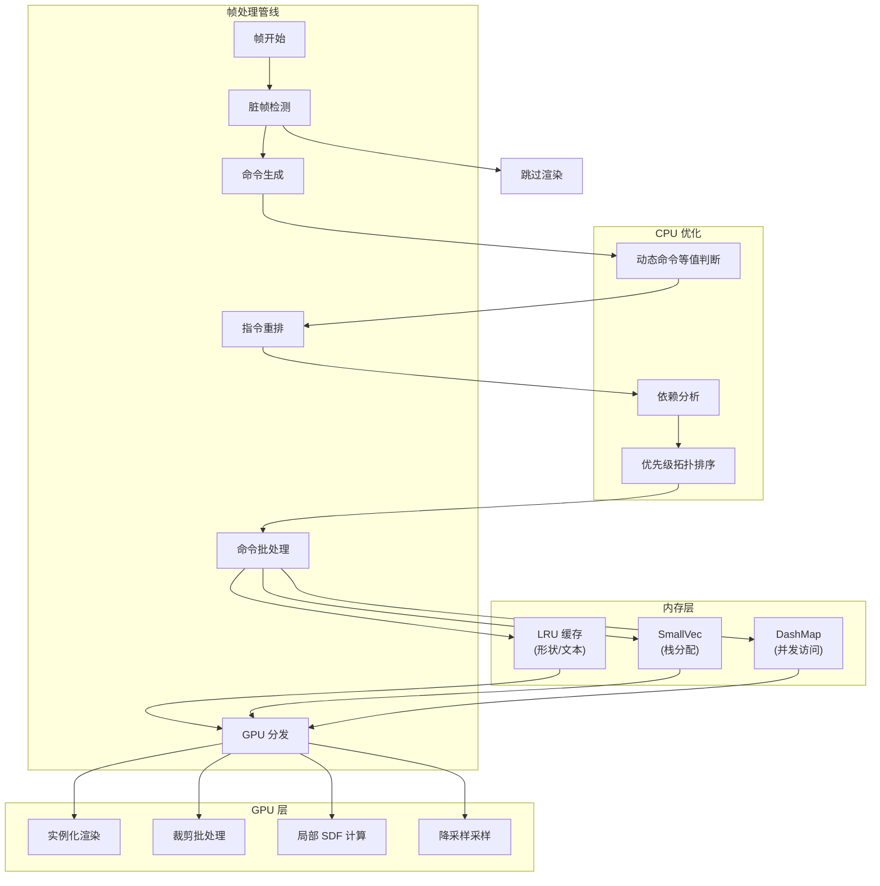
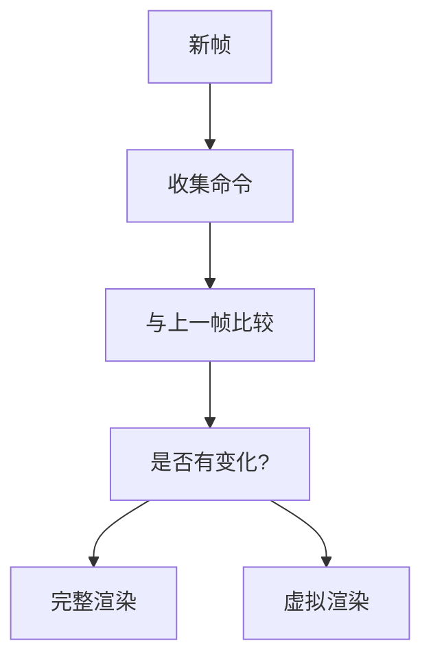
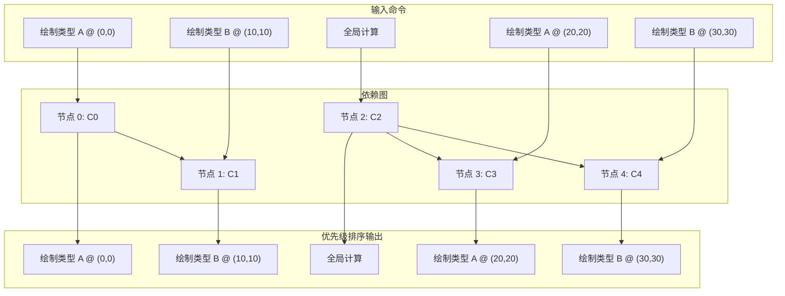
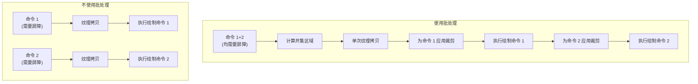
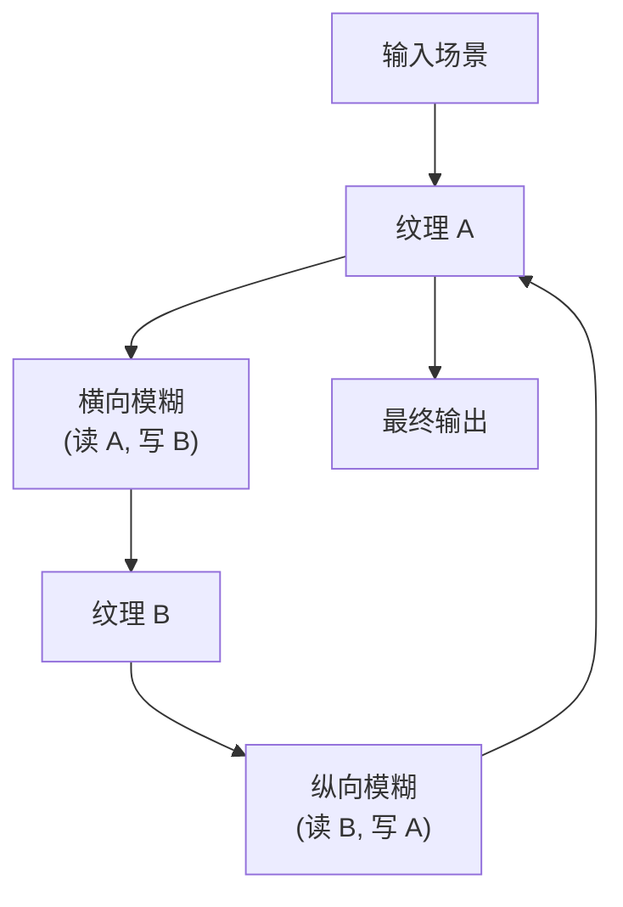

# 性能优化

<details>
<summary><strong>相关源文件</strong></summary>

* [tessera-ui/src/component_tree.rs](https://github.com/tessera-ui/tessera/blob/821ebad7/tessera-ui/src/component_tree.rs)
* [tessera-ui/src/component_tree/node.rs](https://github.com/tessera-ui/tessera/blob/821ebad7/tessera-ui/src/component_tree/node.rs)
* [tessera-ui/src/lib.rs](https://github.com/tessera-ui/tessera/blob/821ebad7/tessera-ui/src/lib.rs)
* [tessera-ui/src/renderer.rs](https://github.com/tessera-ui/tessera/blob/821ebad7/tessera-ui/src/renderer.rs)
* [tessera-ui/src/renderer/compute/command.rs](https://github.com/tessera-ui/tessera/blob/821ebad7/tessera-ui/src/renderer/compute/command.rs)
* [tessera-ui/src/renderer/compute/pipeline.rs](https://github.com/tessera-ui/tessera/blob/821ebad7/tessera-ui/src/renderer/compute/pipeline.rs)
* [tessera-ui/src/renderer/drawer.rs](https://github.com/tessera-ui/tessera/blob/821ebad7/tessera-ui/src/renderer/drawer.rs)
* [tessera-ui/src/renderer/drawer/command.rs](https://github.com/tessera-ui/tessera/blob/821ebad7/tessera-ui/src/renderer/drawer/command.rs)
* [tessera-ui/src/renderer/drawer/pipeline.rs](https://github.com/tessera-ui/tessera/blob/821ebad7/tessera-ui/src/renderer/drawer/pipeline.rs)
* [tessera-ui/src/runtime.rs](https://github.com/tessera-ui/tessera/blob/821ebad7/tessera-ui/src/runtime.rs)
</details>

本文档描述了 Tessera UI 在 CPU、内存和 GPU 层面的全面性能优化策略。它涵盖了帧级优化（如脏检测和命令重排）、利用缓存和栈分配的内存效率技术，以及 GPU 端的优化（包括实例化渲染、屏障批处理和计算管线设计）。

关于整体渲染架构的信息，请参阅 [渲染系统](State-Management.md)。关于组件模型和测量系统的详情，请参阅 [组件模型](Component-Model.md)。

---

## 概览

Tessera UI 通过在渲染管线的每个阶段运行多层优化策略，实现了复杂 UI 的 60+ FPS 表现。优化分为三个主要类别：

1. **CPU 端优化**：通过智能帧检测、命令批处理和依赖分析最小化 CPU 开销。
2. **内存优化**：利用 LRU 缓存、栈分配集合和无锁并发数据结构减少分配并提高缓存局部性。
3. **GPU 端优化**：通过实例化渲染、局部计算和智能状态变更批处理最大化 GPU 效率。



**来源**：架构概览图 6，tessera-ui/CHANGELOG.md:v2.2.0，tessera-ui/CHANGELOG.md:v1.11.0

---

## CPU 端优化

CPU 端优化侧重于在命令到达 GPU 之前，最大限度地减少冗余工作并增加批处理机会。这些优化在每帧的命令处理阶段应用。

### 脏帧检测

Tessera UI 实现了脏帧检测，以避免在 UI 状态未更改时重新渲染。渲染器跟踪跨帧的命令等值，如果没有任何更改，则跳过整个渲染通道。

**关键机制**：

* **动态命令等值**：命令实现等值检查，以确定其视觉输出是否与上一帧完全相同。
* **位置与尺寸跟踪**：系统不仅跟踪命令类型，还跟踪它们的位置和尺寸，以检测布局变更。
* **干净帧上的虚拟渲染**：当未检测到更改时，执行轻量级的虚拟渲染，以较低成本维持即时模式的更新循环。



**来源**：tessera-ui/CHANGELOG.md:v1.11.0 (第 163-170 行)，tessera-ui/CHANGELOG.md:v1.11.2 (第 141-150 行)

### 指令重排

指令重排系统在保持正确性的同时，重新组织渲染命令以最大化 GPU 批处理。它根据空间重叠和屏障需求构建依赖图，然后执行优先级拓扑排序，将相似的命令分组。

**核心组件**：

| 组件 | 类型 | 用途 |
| --- | --- | --- |
| `InstructionInfo` | 结构体 | 包装带有元数据（位置、尺寸、类别、type_id）的命令 |
| `InstructionCategory` | 枚举 | 按优先级对命令分类（连续绘制、屏障绘制、计算、状态变更） |
| `PriorityNode` | 结构体 | 用于基于优先级的拓扑排序的堆节点 |
| `reorder_instructions()` | 函数 | 指令重排的主要入口点 |
| `build_dependency_graph()` | 函数 | 构建命令依赖的有向无环图 |
| `priority_topological_sort()` | 函数 | 为批处理进行最优排序 |

**依赖规则**：

1. **状态变更栅栏**：由 `ClipPush`/`ClipPop` 分隔的命令保持原始顺序。
2. **显式依赖**：计算命令必须在依赖它们的屏障绘制命令之前执行。
3. **重叠绘制**：具有重叠矩形的绘制命令遵循画家算法顺序。
4. **绘制→计算**：绘制命令在与之重叠的计算命令之前执行。



**批处理潜力启发式算法**：优先级排序偏好“批处理潜力”较小（相同类别+类型的计数）的节点，以便优先清除孤立命令，从而最大化相同类型的连续批次。

**来源**：tessera-ui/src/renderer/reorder.rs:1-331，tessera-ui/CHANGELOG.md:v1.9.0 (第 239-246 行)，tessera-ui-basic-components/CHANGELOG.md:v1.10.0 (第 224-227 行)

### 命令批处理

重排后，相同类型的连续命令被批处理在一起，以最小化状态变更和绘制调用。批处理系统维护一个 `last_type_id` 来跟踪当前批次并相应地对命令进行分组。

**批处理策略**：

* 具有相同 `TypeId` 的命令被分组到单个 GPU 分发中。
* 状态变更命令（`ClipPush`/`ClipPop`）会打破批处理并重置跟踪。
* 优先级排序器在可能的情况下会偏向于相同类型的延续。

**来源**：tessera-ui/src/renderer/reorder.rs:218-244，tessera-ui-basic-components/CHANGELOG.md:v1.10.0 (第 226-227 行)

---

## 内存优化

内存优化减少了分配开销并提高了缓存局部性，特别是对于每帧执行的热点路径。

### LRU 缓存策略

Tessera UI 使用 LRU（最近最少使用）缓存来记忆开销巨大的 CPU 端计算结果。

**缓存的操作**：

| 缓存类型 | 缓存的数据 | 用途 |
| --- | --- | --- |
| 形状缓存 | 细分后的几何体 | 避免每帧重新细分 Lyon 路径 |
| 文本缓存 | 字形布局和度量 | 避免每帧重新对文本运行进行布局 |

**热度跟踪**：形状缓存跟踪访问频率，以避免缓存仅出现一次的瞬态形状，防止缓存污染。

**来源**：tessera-ui-basic-components/CHANGELOG.md:v2.3.0 (第 58-62 行)，tessera-ui-basic-components/CHANGELOG.md:v1.13.0 (第 174-175 行)

### 用于栈分配的 SmallVec

在热点代码路径中广泛使用 `SmallVec`，以避免小型集合的堆分配。它在栈上内联存储元素（直到达到配置的阈值），仅在必要时才回退到堆分配。

**使用位置**：

* 命令收集缓冲区。
* 模糊管线中的权重生成。
* 测量中的临时向量存储。

```javascript
// 示例模式
use smallvec::SmallVec;

// 在栈上存储最多 16 个元素，超出则进行堆分配
let mut buffer: SmallVec<[Command; 16]> = SmallVec::new();
```

**来源**：tessera-ui/Cargo.toml:31，tessera-ui-basic-components/CHANGELOG.md:v2.5.0 (第 28 行)，tessera-ui/CHANGELOG.md:v2.4.0 (第 12 行)

### 用于并发访问的 DashMap

`DashMap` 提供无锁并发哈希映射访问，在渲染管线中用于存储共享状态，多个线程在并行测量或管线分发期间可能会访问这些状态。

**优势**：

* 无锁读取允许无竞争的并行访问。
* 通过分片最小化写入竞争。
* 对于并发工作负载，开销低于 `RwLock<HashMap>`。

**来源**：tessera-ui/Cargo.toml:24，Cargo.lock:1097-1108

---

## GPU 渲染优化

GPU 端优化侧重于通过减少绘制调用、最小化全屏操作以及利用硬件功能来最大化吞吐量。

### 实例化渲染

实例化渲染允许在单个绘制调用中绘制相同几何体的多个实例，通过 uniform 或顶点属性传递每个实例的数据（位置、颜色等）。

**实现模式**：

```javascript
// 收集相同形状类型的多个实例
let instances: Vec<ShapeInstance> = /* ... */;

// 带有实例计数的单个绘制调用
render_pass.draw_indexed_instanced(
    indices,
    0..instance_count,
    0,
);
```

**收益**：将 n 个相同类型实例的绘制调用开销从 O(n) 降低到 O(1)。

**来源**：tessera-ui-basic-components/CHANGELOG.md:v2.2.0 (第 84 行)，tessera-ui-basic-components/CHANGELOG.md:v1.10.0 (第 230-232 行)

### 局部 SDF 计算

Tessera UI 不在整个屏幕上计算有向距离场，而是仅在每个形状的局部包围盒内计算 SDF，从而大幅减少片元着色器的调用次数。

**对比**：

| 方法 | 片元调用次数 | 示例 (1920×1080 上的 100×100 形状) |
| --- | --- | --- |
| 全屏 SDF | 宽 × 高 | 2,073,600 个片元 |
| 局部 SDF | 形状宽 × 形状高 | 10,000 个片元 |
| **减少量** | **>200 倍** | **减少 99.5% 的片元** |

**实现**：

* 生成带有局部包围矩形的实例数据。
* 在顶点着色器中将屏幕空间坐标转换为形状局部空间。
* 仅对包围盒内的片元计算 SDF。

**来源**：tessera-ui-basic-components/CHANGELOG.md:v2.2.0 (第 84 行)，架构概览图 6

### 裁剪与屏障批处理

屏障批处理系统允许在单个渲染通道中执行多个需要场景采样的命令，避免在每个命令之间进行昂贵的全纹理拷贝。

**屏障需求**：

```
pub enum BarrierRequirement {
    Global,                    // 需要全屏拷贝
    PaddedLocal(PaddingRect),  // 局部区域 + 填充
    Absolute(PxRect),          // 特定屏幕区域
}
```

**批处理逻辑**：

1. 计算批次中所有屏障区域的并集。
2. 为并集区域执行单次纹理拷贝。
3. 应用裁剪矩形以限制每个命令的实际绘制区域。
4. 按顺序执行所有命令，无需额外拷贝。

**填充策略**：

* **采样填充**：读取像素的区域（例如模糊半径）。
* **冲突填充**：用于依赖分析和批处理决策的区域。
* 两者解耦，以允许较大的采样区域，同时保持精细的批处理控制。



**来源**：tessera-ui/src/renderer/command.rs:1-171，tessera-ui/CHANGELOG.md:v1.9.0 (第 245-246 行)，tessera-ui/CHANGELOG.md:v2.4.0 (第 15 行)，tessera-ui-basic-components/CHANGELOG.md:v1.7.0 (第 301 行)

---

## 计算管线优化

计算管线优化侧重于高效的后处理效果，特别是计算量巨大的模糊操作。

### 双通道高斯模糊

高斯模糊实现为可分离滤波器，将 2D 模糊分解为两个 1D 通道（横向 + 纵向）。这将复杂度从 O(n²) 降低到 O(2n)。

**算法**：

1. 横向通道：独立模糊每一行，写入中间纹理。
2. 纵向通道：使用中间纹理模糊每一列，写入最终输出。

**命令结构**：

```
pub struct DualBlurCommand {
    pub passes: [BlurCommand; 2],  // [横向, 纵向]
}

pub struct BlurCommand {
    pub radius: f32,
    pub direction: (f32, f32),  // (1.0, 0.0) 或
}
```

**来源**：tessera-ui-basic-components/src/pipelines/blur/command.rs:33-62，tessera-ui-basic-components/CHANGELOG.md:v2.2.0 (第 73 行)

### 降采样采样

对于较大的模糊半径，在降采样后的输入纹理上执行采样，以减少纹理抓取次数。降采样因子根据模糊半径选择。

**降采样因子选择**：

```rust
pub fn downscale_factor_for_radius(radius: f32) -> u32 {
    if radius <= 6.0 {
        1  // 不降采样
    } else if radius <= 18.0 {
        2  // 2 倍降采样 (像素减少 4 倍)
    } else {
        4  // 4 倍降采样 (像素减少 16 倍)
    }
}
```

**屏障填充调整**：
进行降采样时，必须按比例缩放屏障填充，以确保捕获足够的源像素：

```javascript
let downscale = downscale_factor_for_radius(max_radius) as f32;
let sampling_padding = (max_radius * downscale).ceil() as i32;
```

**性能影响**：对于 75px 的模糊半径，4 倍降采样在保持视觉质量的同时，将纹理抓取减少了 16 倍。

**来源**：tessera-ui-basic-components/src/pipelines/blur/command.rs:38-86，tessera-ui-basic-components/CHANGELOG.md:v2.5.0 (第 26 行)，tessera-ui-basic-components/CHANGELOG.md:v2.2.0 (第 75-76 行)

### 批量计算分发

在依赖关系允许的情况下，将多个计算命令批处理在一起，减少分发开销。指令重排系统会在任何依赖绘制命令之前，将相同类型的计算命令分组。

**分发模式**：

```
计算类型 A (实例 0)
计算类型 A (实例 1)  } 带有实例计数的单次分发
计算类型 A (实例 2)
---
依赖类型 A 结果的绘制命令
```

**来源**：tessera-ui/CHANGELOG.md:v2.2.0 (第 39 行)，tessera-ui-basic-components/CHANGELOG.md:v2.2.0 (第 77 行)，tessera-ui-basic-components/CHANGELOG.md:v1.10.0 (第 227 行)

### 乒乓纹理

多通道效果（如双通道模糊）使用乒乓渲染：在两个纹理之间交替作为源和目标，以避免同步停顿。

**模式**：

1. 第 1 通道：从纹理 A 读取，写入纹理 B。
2. 第 2 通道：从纹理 B 读取，写入纹理 A（或最终输出）。

**优化**：不直接在通道之间拷贝整个纹理，而是使用 blit 着色器仅拷贝后续命令所需的特定区域，从而减少带宽。



**来源**：tessera-ui-basic-components/CHANGELOG.md:v2.5.0 (第 29 行)，tessera-ui/CHANGELOG.md:v2.2.0 (第 50-56 行)，架构概览图 6

---

## 屏障系统与填充策略

屏障系统是 Tessera UI 中多通道渲染优化的基石。它允许命令声明其采样需求，使渲染器能够做出智能的批处理决策。

### 屏障需求类型

**全局屏障**：

* 当命令需要从整个已渲染场景中采样时使用。
* 强制执行全屏纹理拷贝。
* 示例：全屏后处理效果。

**填充局部屏障**：

* 局部效果最常用的类型。
* 定义了与冲突填充相互独立的采样填充。
* 采样填充：从中读取像素的区域（决定纹理拷贝大小）。
* 冲突填充：用于依赖分析（决定批处理行为）。

**绝对屏障**：

* 指定要采样的确切屏幕空间区域。
* 用于从特定 UI 区域采样的效果，无论组件位置如何。

### 填充优化策略

**核心洞察**：对于模糊等需要大面积采样但目标区域较小的效果，使用较大的采样填充，同时依靠组件的测量边界进行依赖检查。这允许不重叠的模糊组件进行批处理，即使它们的采样区域重叠。

**示例场景**：

```yaml
组件 A: (0, 0) 处的 100×100, 模糊半径 75px
组件 B: (300, 0) 处的 100×100, 模糊半径 75px

采样区域: 在 x=150-175 处重叠
组件边界: 不重叠

结果: 两个命令可以批处理在一起，因为依赖分析使用组件边界，
      而纹理拷贝包含两个采样区域。
```

### 实现示例

```javascript
impl ComputeCommand for DualBlurCommand {
    fn barrier(&self) -> BarrierRequirement {
        let max_radius = self.passes.iter()
            .map(|pass| pass.radius)
            .fold(0.0f32, f32::max);
        
        let downscale = downscale_factor_for_radius(max_radius) as f32;
        let sampling_padding = (max_radius * downscale).ceil() as i32;
        
        BarrierRequirement::uniform_padding_local(Px(sampling_padding))
    }
}
```

**来源**：tessera-ui/src/renderer/command.rs:14-96，tessera-ui-basic-components/src/pipelines/blur/command.rs:64-85

---

## 性能表现

这些优化的结合使 Tessera UI 能够在以下复杂 UI 场景中实现 60+ FPS：

* 多个动画组件。
* 实时模糊和毛玻璃效果。
* 大面积可滚动内容。
* 动态布局变更。

**优化影响摘要**：

| 优化 | 影响 | 指标 |
| --- | --- | --- |
| 脏帧检测 | 完全跳过未更改的帧 | 无变化时约 0ms |
| 指令重排 | 最大化批处理 | 状态变更减少多达 10 倍 |
| LRU 缓存 | 避免 CPU 工作 | 形状/文本缓存命中率 90%+ |
| 局部 SDF | 减轻片元负载 | 片元数较全屏方案减少 99%+ |
| 屏障批处理 | 最小化纹理拷贝 | N 个命令 → 每批次 1 次拷贝 |
| 降采样模糊 | 减少纹理抓取 | 大半径下抓取次数减少 16 倍 |
| 双通道模糊 | 算法效率 | O(2n) vs O(n²) |

**来源**：架构概览图 6，tessera-ui/CHANGELOG.md（多个版本），tessera-ui-basic-components/CHANGELOG.md（多个版本）
