# 渲染管线

<strong>相关源文件</strong>

* [tessera-ui/src/component_tree.rs](https://github.com/tessera-ui/tessera/blob/821ebad7/tessera-ui/src/component_tree.rs)
* [tessera-ui/src/component_tree/node.rs](https://github.com/tessera-ui/tessera/blob/821ebad7/tessera-ui/src/component_tree/node.rs)
* [tessera-ui/src/lib.rs](https://github.com/tessera-ui/tessera/blob/821ebad7/tessera-ui/src/lib.rs)
* [tessera-ui/src/renderer.rs](https://github.com/tessera-ui/tessera/blob/821ebad7/tessera-ui/src/renderer.rs)
* [tessera-ui/src/renderer/compute/command.rs](https://github.com/tessera-ui/tessera/blob/821ebad7/tessera-ui/src/renderer/compute/command.rs)
* [tessera-ui/src/renderer/compute/pipeline.rs](https://github.com/tessera-ui/tessera/blob/821ebad7/tessera-ui/src/renderer/compute/pipeline.rs)
* [tessera-ui/src/renderer/drawer.rs](https://github.com/tessera-ui/tessera/blob/821ebad7/tessera-ui/src/renderer/drawer.rs)
* [tessera-ui/src/renderer/drawer/command.rs](https://github.com/tessera-ui/tessera/blob/821ebad7/tessera-ui/src/renderer/drawer/command.rs)
* [tessera-ui/src/renderer/drawer/pipeline.rs](https://github.com/tessera-ui/tessera/blob/821ebad7/tessera-ui/src/renderer/drawer/pipeline.rs)
* [tessera-ui/src/runtime.rs](https://github.com/tessera-ui/tessera/blob/821ebad7/tessera-ui/src/runtime.rs)

本文档描述了 Tessera 中的渲染管线系统，该系统负责协调组件树到 GPU 渲染命令的转换。它涵盖了帧渲染周期、用于图形和计算操作的管线系统架构、命令分发以及最大化渲染性能的优化系统。

关于输入到此管线的组件树结构，请参阅 [组件模型](Component-Model.md)。关于渲染之前的布局计算详情，请参阅 [布局系统](Layout-System.md)。关于渲染系统特定的性能优化，请参阅 [性能优化](Performance-Optimizations.md)。

## 帧渲染周期

渲染管线在每帧都遵循严格的多阶段执行模型。`Renderer` 通过 `execute_render_frame` 方法编排这一周期。

**帧渲染阶段**

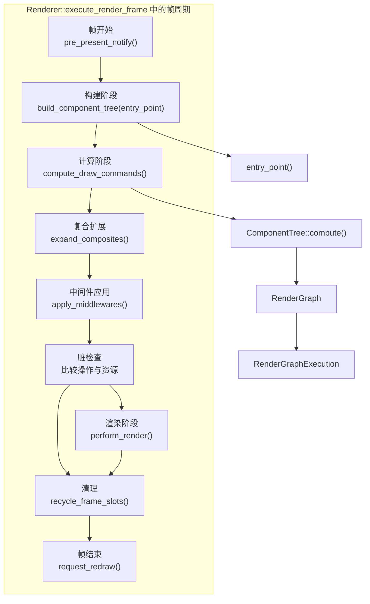

来源：[tessera-ui/src/renderer.rs L739-L968](https://github.com/tessera-ui/tessera/blob/821ebad7/tessera-ui/src/renderer.rs#L739-L968)

帧周期始于窗口系统请求重绘。每个阶段都有特定的职责：

| 阶段 | 方法 | 用途 |
| --- | --- | --- |
| **构建** | `build_component_tree` | 执行组件函数以构建树结构 |
| **计算** | `compute_draw_commands` | 计算布局并生成渲染命令 |
| **扩展** | `expand_composites` | 将复合命令处理为基本操作 |
| **中间件** | `apply_middlewares` | 对渲染图应用转换 |
| **脏检查** | 比较操作与资源 | 如果场景未更改，则跳过渲染 |
| **渲染** | `perform_render` | 执行 GPU 渲染命令 |
| **清理** | 各类清理函数 | 回收资源并为下一帧做准备 |

来源：[tessera-ui/src/renderer.rs L605-L641](https://github.com/tessera-ui/tessera/blob/821ebad7/tessera-ui/src/renderer.rs#L605-L641)

 [tessera-ui/src/renderer.rs L643-L680](https://github.com/tessera-ui/tessera/blob/821ebad7/tessera-ui/src/renderer.rs#L643-L680)

 [tessera-ui/src/renderer.rs L682-L696](https://github.com/tessera-ui/tessera/blob/821ebad7/tessera-ui/src/renderer.rs#L682-L696)

 [tessera-ui/src/renderer.rs L700-L736](https://github.com/tessera-ui/tessera/blob/821ebad7/tessera-ui/src/renderer.rs#L700-L736)

**脏帧检测**

渲染管线实现了一种脏检查优化，当场景未发生变化时跳过 GPU 工作。系统会将当前帧的 `RenderGraphOp` 列表和 `RenderResource` 声明与上一帧进行比较。

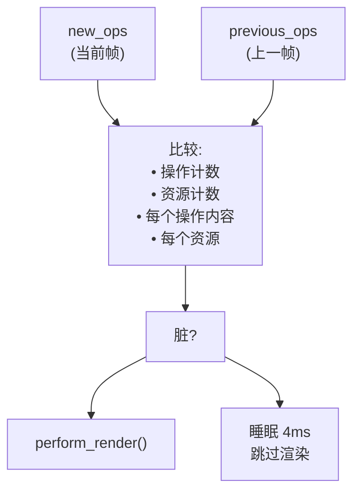

来源：[tessera-ui/src/renderer.rs L786-L867](https://github.com/tessera-ui/tessera/blob/821ebad7/tessera-ui/src/renderer.rs#L786-L867)

## 管线系统架构

渲染系统使用基于 Trait 的管线架构，将图形渲染 (`DrawablePipeline`) 与 GPU 计算操作 (`ComputablePipeline`) 分开。两者都使用类型擦除来实现动态分发，同时保持类型安全。

**管线类型层次结构**

```mermaid
flowchart TD

ComputeCommand["ComputeCommand trait<br>• barrier()"]
ComputablePipeline["ComputablePipeline<C: ComputeCommand><br>• dispatch()"]
ErasedComputable["ErasedComputablePipeline<br>(内部 trait)"]
ComputeRegistry["ComputePipelineRegistry<br>HashMap<TypeId, Box<dyn Erased...>>"]
DrawCommand["DrawCommand trait<br>• sample_region()<br>• draw_region()<br>• apply_opacity()"]
DrawablePipeline["DrawablePipeline<T: DrawCommand><br>• begin_frame()<br>• begin_pass()<br>• draw()<br>• end_pass()<br>• end_frame()"]
ErasedDrawable["ErasedDrawablePipeline<br>(内部 trait)"]
PipelineRegistry["PipelineRegistry<br>HashMap<TypeId, Box<dyn Erased...>>"]

subgraph subGraph1 ["计算管线系统"]
    ComputeCommand
    ComputablePipeline
    ErasedComputable
    ComputeRegistry
    ComputeCommand --> ComputablePipeline
    ComputablePipeline --> ErasedComputable
    ErasedComputable --> ComputeRegistry
end

subgraph subGraph0 ["绘制管线系统"]
    DrawCommand
    DrawablePipeline
    ErasedDrawable
    PipelineRegistry
    DrawCommand --> DrawablePipeline
    DrawablePipeline --> ErasedDrawable
    ErasedDrawable --> PipelineRegistry
end
```

来源：[tessera-ui/src/renderer/drawer/pipeline.rs L201-L361](https://github.com/tessera-ui/tessera/blob/821ebad7/tessera-ui/src/renderer/drawer/pipeline.rs#L201-L361)

 [tessera-ui/src/renderer/compute/pipeline.rs L172-L253](https://github.com/tessera-ui/tessera/blob/821ebad7/tessera-ui/src/renderer/compute/pipeline.rs#L172-L253)

**命令 Trait 要求**

`DrawCommand` 和 `ComputeCommand` 都必须实现特定的 Trait 约束，以便类型擦除系统使用：

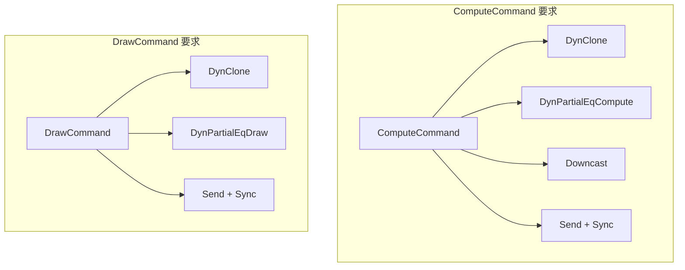

来源：[tessera-ui/src/renderer/drawer/command.rs L38-L78](https://github.com/tessera-ui/tessera/blob/821ebad7/tessera-ui/src/renderer/drawer/command.rs#L38-L78)

 [tessera-ui/src/renderer/compute/command.rs L13-L21](https://github.com/tessera-ui/tessera/blob/821ebad7/tessera-ui/src/renderer/compute/command.rs#L13-L21)

## 绘制管线生命周期

图形管线遵循五个阶段的生命周期，这使得资源管理和批处理更加高效。`DrawablePipeline` trait 定义了这些阶段。

**绘制管线阶段流**

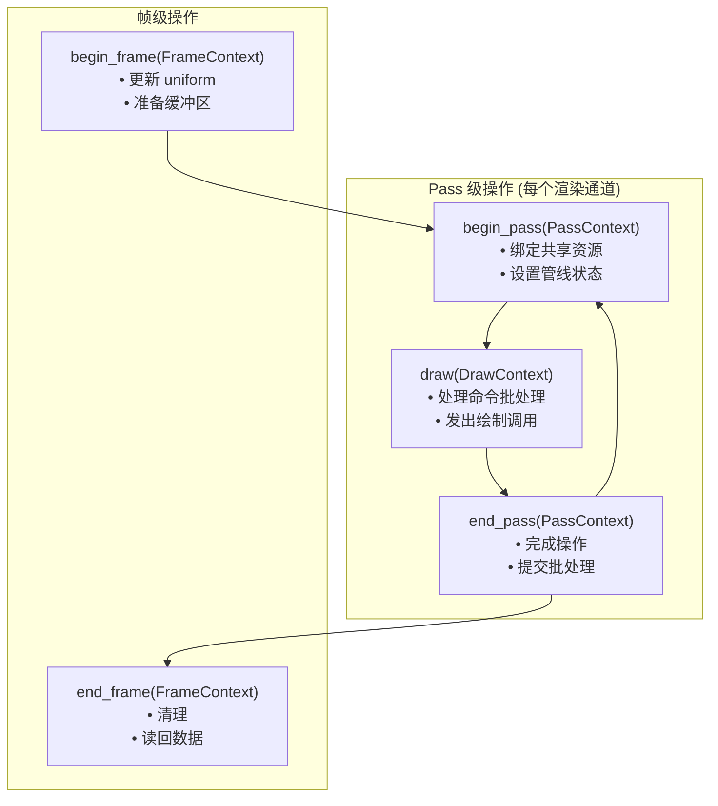

来源：[tessera-ui/src/renderer/drawer/pipeline.rs L244-L360](https://github.com/tessera-ui/tessera/blob/821ebad7/tessera-ui/src/renderer/drawer/pipeline.rs#L244-L360)

**各阶段上下文类型**

管线系统为每个阶段提供不同的上下文类型，包含适当的 `wgpu` 资源和元数据：

| 上下文类型 | 阶段 | 关键字段 |
| --- | --- | --- |
| `FrameContext` | begin_frame, end_frame | `device`, `queue`, `config` |
| `PassContext` | begin_pass, end_pass | `device`, `queue`, `config`, `target_size`, `render_pass`, `scene_texture_view` |
| `DrawContext<T>` | draw | 所有 PassContext 字段，外加 `commands`, `clip_rect` |

来源：[tessera-ui/src/renderer/drawer/pipeline.rs L110-L181](https://github.com/tessera-ui/tessera/blob/821ebad7/tessera-ui/src/renderer/drawer/pipeline.rs#L110-L181)

**管线注册与分发**

`PipelineRegistry` 管理所有注册的绘制管线，并根据命令的 `TypeId` 将命令分发到适当的管线。

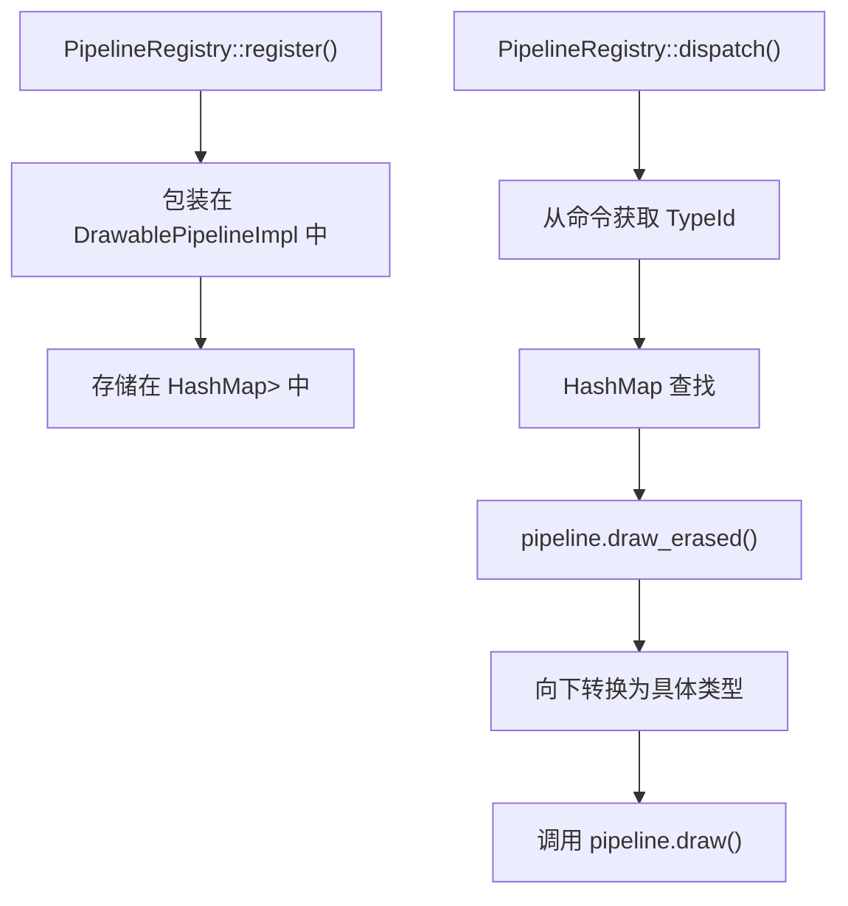

来源：[tessera-ui/src/renderer/drawer/pipeline.rs L394-L576](https://github.com/tessera-ui/tessera/blob/821ebad7/tessera-ui/src/renderer/drawer/pipeline.rs#L394-L576)

## 计算管线系统

计算管线处理 GPU 计算操作，通常用于模糊或颜色调整等后处理效果。该系统在多通道操作中使用乒乓 纹理方法。

**计算管线架构**

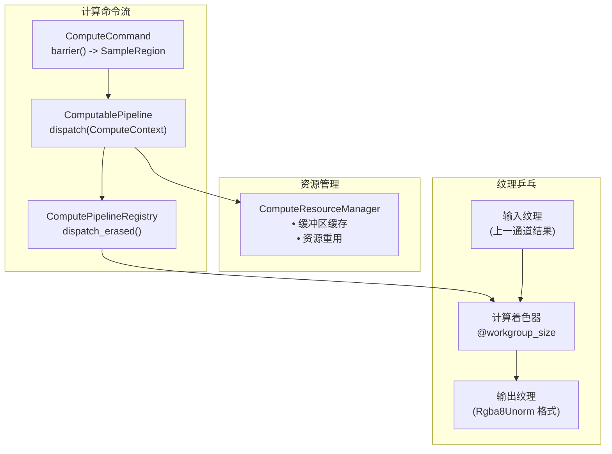

来源：[tessera-ui/src/renderer/compute/pipeline.rs L172-L253](https://github.com/tessera-ui/tessera/blob/821ebad7/tessera-ui/src/renderer/compute/pipeline.rs#L172-L253)

 [tessera-ui/src/renderer/compute/pipeline.rs L325-L423](https://github.com/tessera-ui/tessera/blob/821ebad7/tessera-ui/src/renderer/compute/pipeline.rs#L325-L423)

**计算上下文结构**

`ComputeContext` 为计算操作提供所有必要的资源：

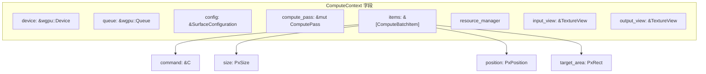

来源：[tessera-ui/src/renderer/compute/pipeline.rs L139-L158](https://github.com/tessera-ui/tessera/blob/821ebad7/tessera-ui/src/renderer/compute/pipeline.rs#L139-L158)

## 命令系统

命令是渲染工作的基本单元。它们描述了要渲染什么（绘制命令）或要执行什么计算（计算命令）。

**绘制命令接口**

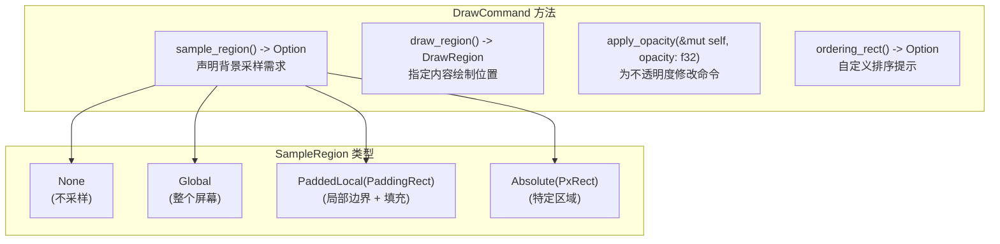

来源：[tessera-ui/src/renderer/drawer/command.rs L38-L78](https://github.com/tessera-ui/tessera/blob/821ebad7/tessera-ui/src/renderer/drawer/command.rs#L38-L78)

**绘制区域与采样区域**

`draw_region` 与 `sample_region` 的区别使得屏障优化成为可能：

| 方法 | 用途 | 使用场景 |
| --- | --- | --- |
| `draw_region()` | 命令写入像素的位置 | 布局计算，视口剔除 |
| `sample_region()` | 命令从背景读取的位置 | 屏障规划，纹理依赖 |

例如，模糊效果可能具有 `PaddedLocal` 绘制区域（写入组件边界），但具有更大的 `sample_region`（从周围像素读取）。

来源：[tessera-ui/src/renderer/drawer/command.rs L45-L58](https://github.com/tessera-ui/tessera/blob/821ebad7/tessera-ui/src/renderer/drawer/command.rs#L45-L58)

**计算命令接口**

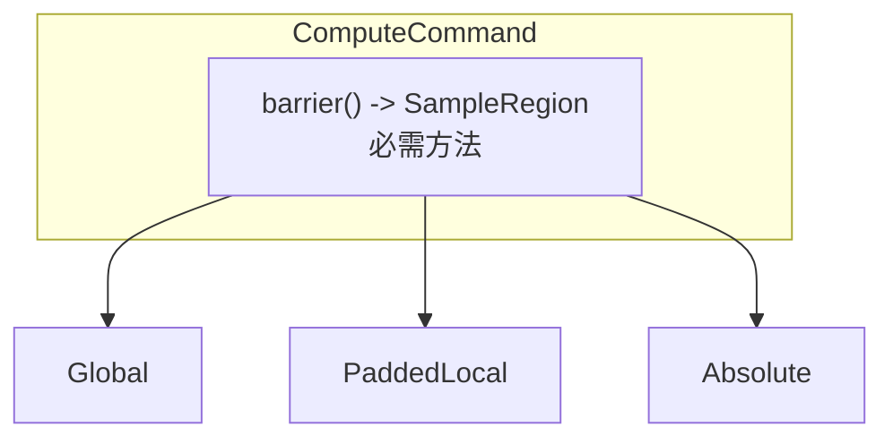

计算命令必须通过 `barrier()` 方法声明其采样要求。这会在需要纹理屏障时通知渲染图优化器。

来源：[tessera-ui/src/renderer/compute/command.rs L13-L21](https://github.com/tessera-ui/tessera/blob/821ebad7/tessera-ui/src/renderer/compute/command.rs#L13-L21)

## 渲染图构建

`RenderGraph` 是一个中间表示，它将组件树转换为带有绝对定位的渲染操作线性序列。

**渲染图构建过程**

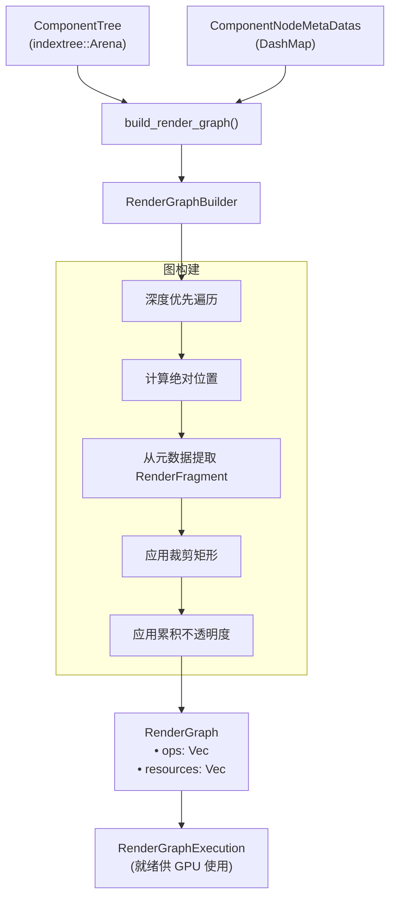

来源：[tessera-ui/src/component_tree.rs L401-L529](https://github.com/tessera-ui/tessera/blob/821ebad7/tessera-ui/src/component_tree.rs#L401-L529)

**RenderGraphOp 结构**

渲染图中的每个操作包含：

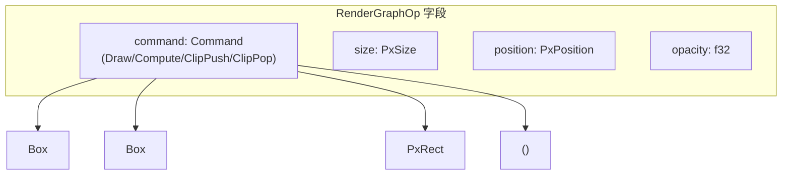

图构建器遍历组件树，并为每个节点：

1. 从元数据检索相对位置。
2. 通过添加父节点位置计算绝对位置。
3. 将绝对位置存储在元数据中供后续阶段使用。
4. 从节点元数据提取 `RenderFragment`。
5. 应用裁剪和不透明度转换。
6. 将操作追加到构建器。

来源：[tessera-ui/src/component_tree.rs L434-L529](https://github.com/tessera-ui/tessera/blob/821ebad7/tessera-ui/src/component_tree.rs#L434-L529)

## 渲染期间的管线分发

在渲染阶段，处理 `RenderGraphExecution` 并将命令分发到各个管线。系统按类型对命令进行分组，以实现高效的批处理。

**命令分发流**

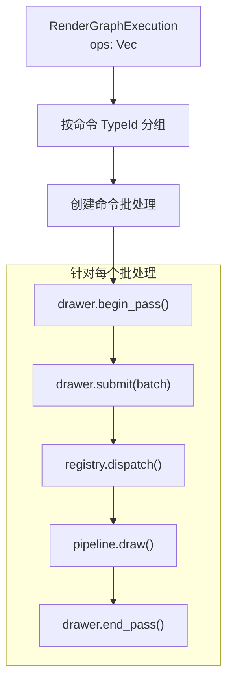

**帧级管线协调**

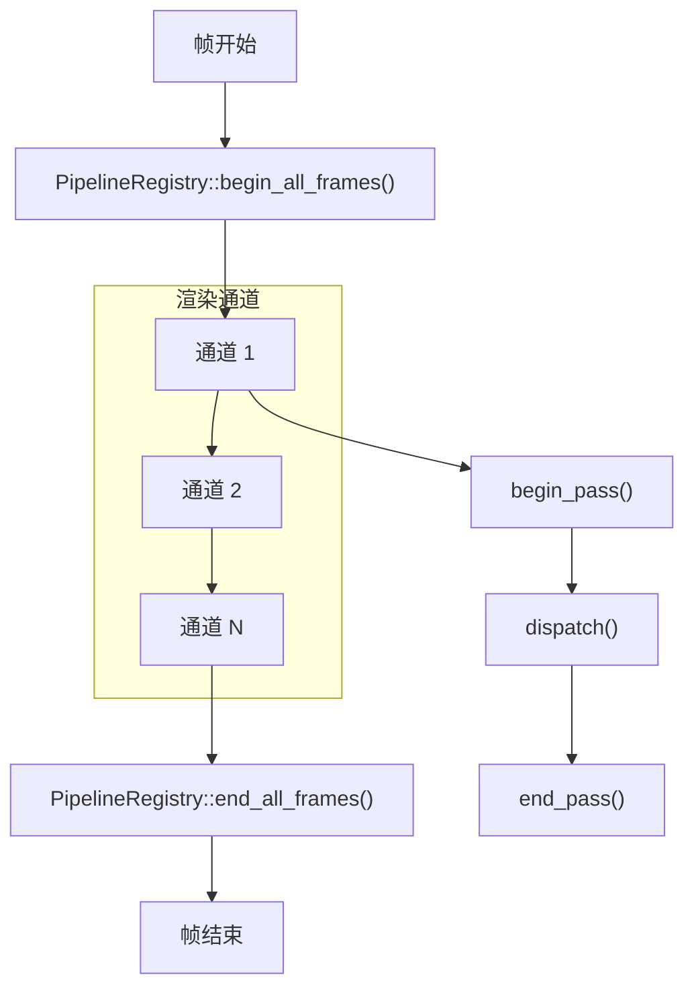

`PipelineRegistry` 协调所有管线，确保在任何渲染通道之前调用 `begin_frame`，并在所有通道完成后调用 `end_frame`。

来源：[tessera-ui/src/renderer/drawer/pipeline.rs L465-L576](https://github.com/tessera-ui/tessera/blob/821ebad7/tessera-ui/src/renderer/drawer/pipeline.rs#L465-L576)

## 优化系统

渲染管线包含多个优化系统，用于减少 GPU 工作负载并提高性能。

**指令重排**

对命令进行重排，将相似的操作组合在一起，从而最大限度地减少 GPU 状态切换。系统会分析命令类型并尝试批量处理相同类型的命令。

**视口剔除**

渲染图构建器在添加节点操作之前，会针对屏幕边界检查每个节点：

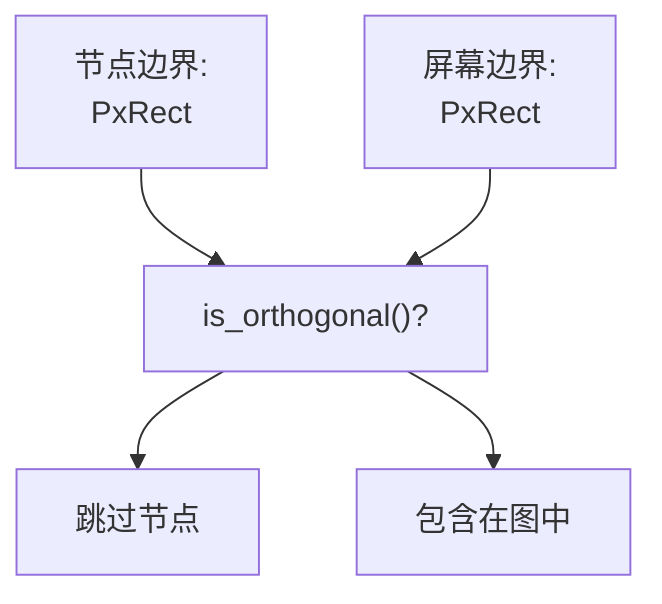

来源：[tessera-ui/src/component_tree.rs L495-L499](https://github.com/tessera-ui/tessera/blob/821ebad7/tessera-ui/src/component_tree.rs#L495-L499)

**屏障系统**

当效果需要从先前渲染的内容中采样时，屏障系统管理渲染操作之间的依赖关系。命令通过 `sample_region()` 和 `barrier()` 方法声明其采样需求，系统确保正确的同步。

**命令批处理**

具有兼容状态的同类型命令被分组成批次，以实现更高效的 GPU 提交。`PipelineRegistry` 在将命令一起分发到管线的 `draw()` 方法之前，会收集给定类型的所有命令。

来源：[tessera-ui/src/renderer/drawer/pipeline.rs L465-L576](https://github.com/tessera-ui/tessera/blob/821ebad7/tessera-ui/src/renderer/drawer/pipeline.rs#L465-L576)

**布局缓存**

纯布局规范可以跨帧缓存。运行时中的 `LayoutCache` 存储以前的测量结果（以实例键为索引），当约束和子节点未发生变化时，可避免冗余的布局计算。详见 [布局系统](Layout-System.md)。

来源：[tessera-ui/src/component_tree/node.rs L626-L638](https://github.com/tessera-ui/tessera/blob/821ebad7/tessera-ui/src/component_tree/node.rs#L626-L638)
