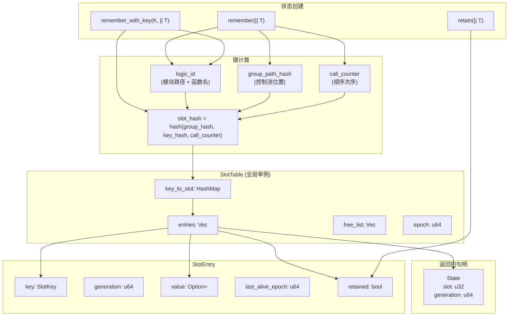
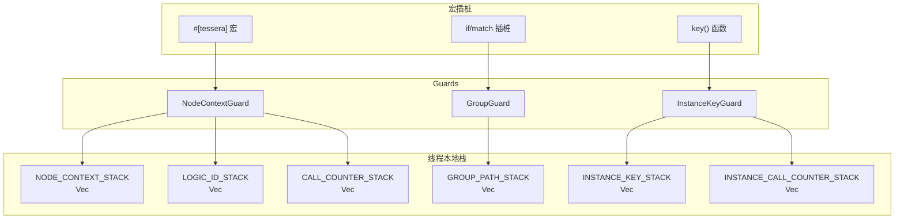
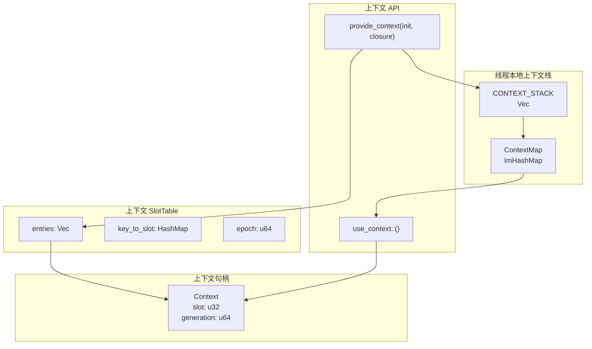
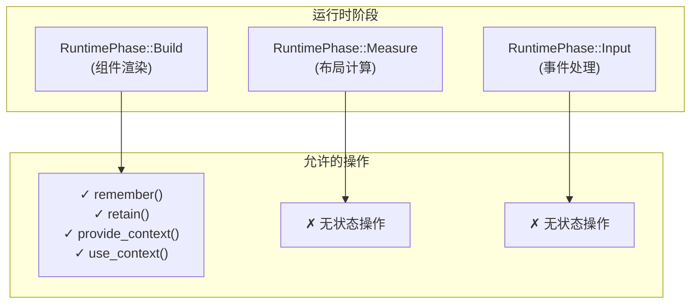
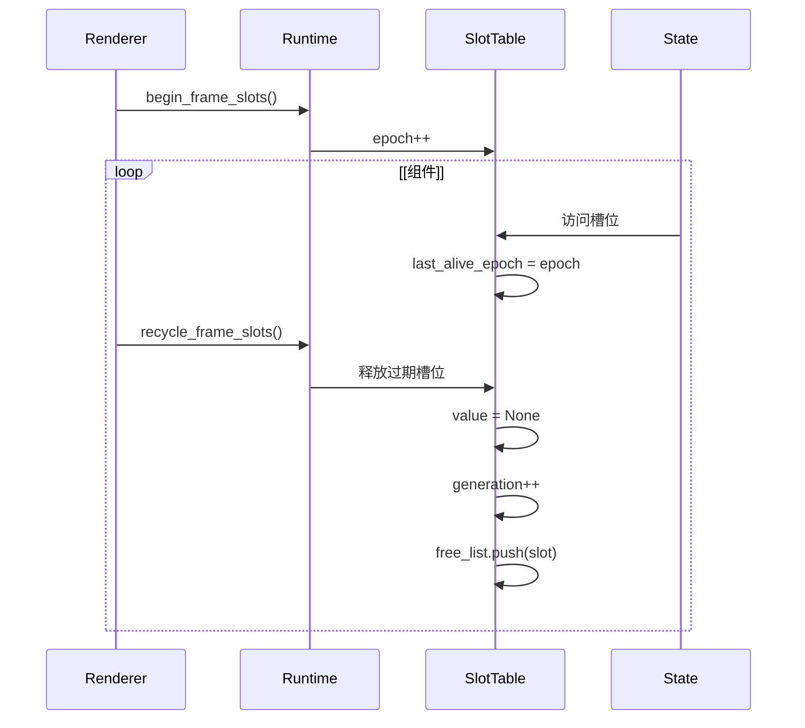
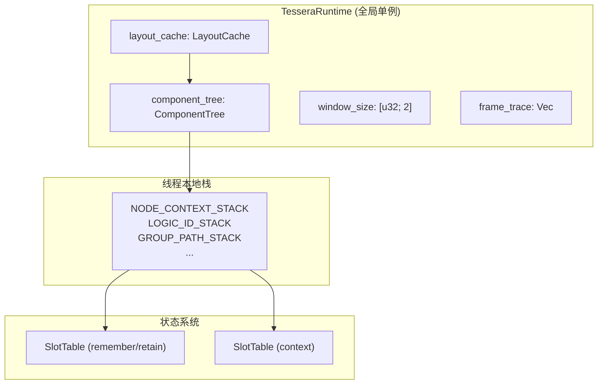

# 状态管理

<details>
<summary><strong>相关源文件</strong></summary>

* [tessera-ui/src/accessibility.rs](https://github.com/tessera-ui/tessera/blob/821ebad7/tessera-ui/src/accessibility.rs)
* [tessera-ui/src/component_tree.rs](https://github.com/tessera-ui/tessera/blob/821ebad7/tessera-ui/src/component_tree.rs)
* [tessera-ui/src/component_tree/constraint.rs](https://github.com/tessera-ui/tessera/blob/821ebad7/tessera-ui/src/component_tree/constraint.rs)
* [tessera-ui/src/component_tree/node.rs](https://github.com/tessera-ui/tessera/blob/821ebad7/tessera-ui/src/component_tree/node.rs)
* [tessera-ui/src/context.rs](https://github.com/tessera-ui/tessera/blob/821ebad7/tessera-ui/src/context.rs)
* [tessera-ui/src/cursor.rs](https://github.com/tessera-ui/tessera/blob/821ebad7/tessera-ui/src/cursor.rs)
* [tessera-ui/src/focus_state.rs](https://github.com/tessera-ui/tessera/blob/821ebad7/tessera-ui/src/focus_state.rs)
* [tessera-ui/src/ime_state.rs](https://github.com/tessera-ui/tessera/blob/821ebad7/tessera-ui/src/ime_state.rs)
* [tessera-ui/src/lib.rs](https://github.com/tessera-ui/tessera/blob/821ebad7/tessera-ui/src/lib.rs)
* [tessera-ui/src/px.rs](https://github.com/tessera-ui/tessera/blob/821ebad7/tessera-ui/src/px.rs)
* [tessera-ui/src/renderer.rs](https://github.com/tessera-ui/tessera/blob/821ebad7/tessera-ui/src/renderer.rs)
* [tessera-ui/src/router.rs](https://github.com/tessera-ui/tessera/blob/821ebad7/tessera-ui/src/router.rs)
* [tessera-ui/src/runtime.rs](https://github.com/tessera-ui/tessera/blob/821ebad7/tessera-ui/src/runtime.rs)
* [tessera-ui/src/thread_utils.rs](https://github.com/tessera-ui/tessera/blob/821ebad7/tessera-ui/src/thread_utils.rs)
</details>

本文档描述了 Tessera 如何在函数式、即时模式 UI 范式中管理跨帧的有状态数据。状态管理包括记忆化组件状态、依赖注入 以及底层的 `SlotTable` 存储系统。

关于组件生命周期和 `#[tessera]` 宏的信息，请参阅 [组件模型](Component-Model.md)。关于特定于布局的状态，请参阅 [布局系统](Layout-System.md)。

---

## 概览

Tessera 组件是每帧都会被调用的无状态函数。为了在帧之间持久化数据，框架提供了两类记忆化：

* **组件作用域状态** (`remember`, `remember_with_key`): 当组件卸载时被清除。
* **进程作用域状态** (`retain`, `retain_with_key`): 在应用程序生命周期内持久存在。

所有状态都存储在全局的 `SlotTable` 中，并通过 `State<T>` 句柄访问，该句柄通过 `Arc<RwLock<T>>` 提供线程安全的内部可变性。

来源：[tessera-ui/src/runtime.rs L1-L1162](https://github.com/tessera-ui/tessera/blob/821ebad7/tessera-ui/src/runtime.rs#L1-L1162)

 [tessera-ui/src/lib.rs L47-L189](https://github.com/tessera-ui/tessera/blob/821ebad7/tessera-ui/src/lib.rs#L47-L189)

---

## 状态原语

### remember 和 remember_with_key

组件作用域状态使用 `remember()` 或 `remember_with_key()` 创建。`init` 闭包仅在首次分配状态时调用一次。

**remember() - 自动键生成：**

```javascript
#[tessera]
fn counter() {
    let count = remember(|| 0);
    count.with_mut(|c| *c += 1);
}
```

**remember_with_key() - 循环中的显式键：**

```javascript
#[tessera]
fn user_list() {
    let users = vec![
        User { id: 101, name: "Alice".to_string() },
        User { id: 205, name: "Bob".to_string() },
    ];
    
    for user in users.iter() {
        let likes = remember_with_key(user.id, || 0);
        // 状态跟随 user.id，无论其位置如何
    }
}
```

**键计算：**

* `logic_id`: 稳定的组件标识符（来自 `module_path!()` + 函数名）。
* `group_path_hash`: 控制流位置（if/match/loop 跟踪）。
* `call_counter`: 同一组件内的顺序调用次序。

来源：[tessera-ui/src/runtime.rs L775-L862](https://github.com/tessera-ui/tessera/blob/821ebad7/tessera-ui/src/runtime.rs#L775-L862)

 [tessera-ui/src/lib.rs L56-L125](https://github.com/tessera-ui/tessera/blob/821ebad7/tessera-ui/src/lib.rs#L56-L125)

### retain 和 retain_with_key

进程作用域状态在组件卸载后仍然存在。用于滚动位置、展开状态或应该在导航后幸存的缓存数据。

```javascript
#[tessera]
fn scrollable_page(page_id: &str) {
    // 即使导航离开，滚动位置也会保留
    let scroll_offset = retain(|| 0.0f32);
}
```

API 与 `remember` 相同，但槽位被标记为 `retained` 标志，并从基于帧的回收中排除。

来源：[tessera-ui/src/runtime.rs L863-L946](https://github.com/tessera-ui/tessera/blob/821ebad7/tessera-ui/src/runtime.rs#L863-L946)

 [tessera-ui/src/lib.rs L126-L189](https://github.com/tessera-ui/tessera/blob/821ebad7/tessera-ui/src/lib.rs#L126-L189)

### State API

所有状态原语都返回一个包装了 `Arc<RwLock<T>>` 的 `State<T>` 句柄。这提供了具有线程安全访问的内部可变性。

**可用方法：**

* `with<R>(&self, f: impl FnOnce(&T) -> R)` - 读取访问。
* `with_mut<R>(&self, f: impl FnOnce(&mut T) -> R)` - 写入访问。
* `get(&self) -> T` where `T: Clone` - 克隆值。
* `set(&self, value: T)` - 替换值。

该句柄是 `Copy` 的，可以自由传递或存储。

来源：[tessera-ui/src/runtime.rs L123-L231](https://github.com/tessera-ui/tessera/blob/821ebad7/tessera-ui/src/runtime.rs#L123-L231)

---

## SlotTable 架构



**SlotKey 结构：**

```javascript
struct SlotKey {
    logic_id: u64,      // 组件函数标识符
    slot_hash: u64,     // 组件内的位置（组路径 + 调用顺序 + 键）
    type_id: TypeId,    // 存储值的类型
}
```

**生命周期：**

1. `begin_frame_slots()` - 在帧开始时增加 epoch 计数器。
2. 状态访问 - 标记 `last_alive_epoch = current_epoch`。
3. `recycle_frame_slots()` - 释放 `last_alive_epoch != current_epoch && !retained` 的槽位。

来源：[tessera-ui/src/runtime.rs L70-L121](https://github.com/tessera-ui/tessera/blob/821ebad7/tessera-ui/src/runtime.rs#L70-L121)

 [tessera-ui/src/runtime.rs L692-L773](https://github.com/tessera-ui/tessera/blob/821ebad7/tessera-ui/src/runtime.rs#L692-L773)

---

## 线程本地上下文跟踪

框架维护多个线程本地栈来跟踪执行上下文，以生成稳定的槽键：



**栈用途：**

| 栈 | 用途 | 推入者 |
| --- | --- | --- |
| `NODE_CONTEXT_STACK` | 当前组件节点 ID | `NodeContextGuard` (来自 `#[tessera]` 宏) |
| `LOGIC_ID_STACK` | 组件实例标识符 | `push_current_node()` |
| `GROUP_PATH_STACK` | 控制流位置 | `GroupGuard` (宏注入) |
| `CALL_COUNTER_STACK` | 顺序 `remember()` 调用次序 | `push_current_node()` |
| `INSTANCE_KEY_STACK` | 来自 `key()` 的显式键覆盖 | `InstanceKeyGuard` |
| `INSTANCE_CALL_COUNTER_STACK` | 子组件调用次序 | `push_current_node()` |

**Instance key 计算：**

```javascript
// 组合 base_logic_id, parent_logic_id, 和 parent_call_index
let instance_logic_id = hash_components(&[
    &base_logic_id,
    &parent_logic_id,
    &instance_salt  // parent_call_index 或 key_hash
]);
```

这确保了多次调用的 `foo(); foo();` 获得不同的 logic ID，并且区分不同容器实例中的组件。

来源：[tessera-ui/src/runtime.rs L21-L44](https://github.com/tessera-ui/tessera/blob/821ebad7/tessera-ui/src/runtime.rs#L21-L44)

 [tessera-ui/src/runtime.rs L438-L543](https://github.com/tessera-ui/tessera/blob/821ebad7/tessera-ui/src/runtime.rs#L438-L543)

 [tessera-ui/src/runtime.rs L591-L690](https://github.com/tessera-ui/tessera/blob/821ebad7/tessera-ui/src/runtime.rs#L591-L690)

---

## 上下文系统

上下文系统提供依赖注入，用于在组件树中向下传递数据，而无需穿透参数。



**使用模式：**

```javascript
#[derive(Default, Clone)]
struct Theme {
    color: Color,
}

#[tessera]
fn parent() {
    provide_context(
        || Theme { color: Color::RED },
        || {
            child();
        },
    );
}

#[tessera]
fn child() {
    let theme = use_context::<Theme>().expect("Theme must be provided");
    theme.with(|t| assert_eq!(t.color, Color::RED));
}
```

**上下文传播：**

* `provide_context()` 推入一个新的 `ContextMap` 层，注册当前类型。
* 嵌套上下文会遮蔽同类型的父上下文。
* `use_context()` 沿栈向上查找最近的类型 `T` 提供者。

**独立的槽位存储：**
上下文使用自己的 `SlotTable` 以避免扰乱 `remember()` 的槽键。它具有相同的回收逻辑，但使用 `CONTEXT_CALL_COUNTER_STACK` 代替 `CALL_COUNTER_STACK`。

来源：[tessera-ui/src/context.rs L1-L315](https://github.com/tessera-ui/tessera/blob/821ebad7/tessera-ui/src/context.rs#L1-L315)

 [tessera-ui/src/lib.rs L190-L260](https://github.com/tessera-ui/tessera/blob/821ebad7/tessera-ui/src/lib.rs#L190-L260)

---

## 状态存储实现

### SlotTable 操作

**分配:**

1. 从 `logic_id`, `slot_hash`, 和 `TypeId` 计算 `SlotKey`。
2. 检查 `key_to_slot` HashMap 是否存在条目。
3. 如果找到且值为 `None`，调用 `init()` 并增加 generation。
4. 如果未找到，从 `free_list` 分配或推入新条目。
5. 返回带有槽位索引和 generation 的 `State<T>` 句柄。

**访问:**

```javascript
impl<T> State<T> {
    fn load_lock(&self) -> Arc<RwLock<T>> {
        let table = slot_table().read();
        let entry = table.entries[self.slot as usize];
        // 验证 generation 和 type_id
        entry.value.downcast::<RwLock<T>>()
    }
    
    pub fn with<R>(&self, f: impl FnOnce(&T) -> R) -> R {
        let lock = self.load_lock();
        let guard = lock.read();
        f(&guard)
    }
}
```

**回收:**

* `last_alive_epoch != current_epoch` 的非保留槽位被释放。
* 值设置为 `None`，generation 增加。
* 槽位索引添加到 `free_list`。
* 条目从 `key_to_slot` HashMap 中移除。

来源：[tessera-ui/src/runtime.rs L87-L121](https://github.com/tessera-ui/tessera/blob/821ebad7/tessera-ui/src/runtime.rs#L87-L121)

 [tessera-ui/src/runtime.rs L155-L231](https://github.com/tessera-ui/tessera/blob/821ebad7/tessera-ui/src/runtime.rs#L155-L231)

 [tessera-ui/src/runtime.rs L747-L773](https://github.com/tessera-ui/tessera/blob/821ebad7/tessera-ui/src/runtime.rs#L747-L773)

### 内部可变性与线程安全

所有状态值存储为 `Arc<RwLock<T>>`：

* `Arc` 允许跨 `State<T>` 句柄共享所有权。
* `RwLock` 提供带有读写锁的内部可变性。
* 多个读者可以同时访问。
* 写者拥有独占访问权。

**类型擦除：**
值作为 `Arc<dyn Any + Send + Sync>` 存储在 `SlotTable` 中，并通过 `State<T>` 访问时向下转换。通过在 `SlotKey` 中包含 `TypeId` 来强制类型安全。

来源：[tessera-ui/src/runtime.rs L155-L231](https://github.com/tessera-ui/tessera/blob/821ebad7/tessera-ui/src/runtime.rs#L155-L231)

---

## 阶段限制

状态操作被限制在特定的执行阶段以防止误用：



**强制执行：**
`ensure_build_phase()` 函数检查 `PHASE_STACK` 并在构建阶段之外调用时 panic。这防止在布局规范或输入处理器中分配状态，这将导致不稳定的槽键。

来源：[tessera-ui/src/runtime.rs L721-L736](https://github.com/tessera-ui/tessera/blob/821ebad7/tessera-ui/src/runtime.rs#L721-L736)

 [tessera-ui/src/runtime.rs L372-L404](https://github.com/tessera-ui/tessera/blob/821ebad7/tessera-ui/src/runtime.rs#L372-L404)

 [tessera-ui/src/runtime.rs L571-L589](https://github.com/tessera-ui/tessera/blob/821ebad7/tessera-ui/src/runtime.rs#L571-L589)

---

## 控制流插桩

`#[tessera]` 宏插桩控制流结构以维持稳定的状态身份：

**GroupGuard 注入：**

```javascript
// 源代码
if condition {
    let state = remember(|| 0);
}

// 宏展开后
{
    let _guard = GroupGuard::new(hash_of_if_condition_and_location);
    if condition {
        let state = remember(|| 0);
    }
}
```

`GroupGuard` 将唯一的组 ID 推入 `GROUP_PATH_STACK`，确保 `if` 块内的状态具有与外部状态不同的槽键。

**key() 函数用于循环：**

```javascript
for item in items {
    key(item.id, || {
        let state = remember(|| 0);
        // 对于此 item.id，state 是稳定的
    });
}
```

`key()` 函数创建一个 `InstanceKeyGuard`，它覆盖实例键计算，使得所有子组件和状态调用相对于提供的键稳定。

来源：[tessera-ui/src/runtime.rs L626-L646](https://github.com/tessera-ui/tessera/blob/821ebad7/tessera-ui/src/runtime.rs#L626-L646)

 [tessera-ui/src/runtime.rs L648-L682](https://github.com/tessera-ui/tessera/blob/821ebad7/tessera-ui/src/runtime.rs#L648-L682)

 [tessera-ui/src/lib.rs L104-L125](https://github.com/tessera-ui/tessera/blob/821ebad7/tessera-ui/src/lib.rs#L104-L125)

---

## 内存管理

### 基于帧的生命周期



**Epoch 跟踪：**

* 每一帧增加全局 `epoch` 计数器。
* 访问槽位更新其 `last_alive_epoch`。
* 当前帧未访问的槽位是回收的候选者。
* 保留 槽位永远不会基于 epoch 回收。

来源：[tessera-ui/src/runtime.rs L739-L773](https://github.com/tessera-ui/tessera/blob/821ebad7/tessera-ui/src/runtime.rs#L739-L773)

 [tessera-ui/src/renderer.rs L608-L609](https://github.com/tessera-ui/tessera/blob/821ebad7/tessera-ui/src/renderer.rs#L608-L609)

 [tessera-ui/src/renderer.rs L954-L956](https://github.com/tessera-ui/tessera/blob/821ebad7/tessera-ui/src/renderer.rs#L954-L956)

### Generation 计数器

每个槽位维护一个 `generation` 计数器，当槽位被释放并重新分配时递增。`State<T>` 句柄存储槽索引和 generation，允许检测过期的句柄：

```javascript
fn load_entry(&self) -> Arc<dyn Any + Send + Sync> {
    let entry = &table.entries[self.slot];
    if entry.generation != self.generation {
        panic!("State is stale");
    }
    entry.value.clone()
}
```

这防止了访问现在存储不同数据的回收槽位。

来源：[tessera-ui/src/runtime.rs L169-L197](https://github.com/tessera-ui/tessera/blob/821ebad7/tessera-ui/src/runtime.rs#L169-L197)

---

## 与组件树集成

状态管理系统通过 `TesseraRuntime` 与组件树集成：



**协调：**

* `TesseraRuntime::with()` 提供对运行时状态的读取访问。
* `TesseraRuntime::with_mut()` 提供写入访问。
* 线程本地栈跟踪当前执行上下文。
* SlotTable 是独立的静态全局变量。

来源：[tessera-ui/src/runtime.rs L233-L348](https://github.com/tessera-ui/tessera/blob/821ebad7/tessera-ui/src/runtime.rs#L233-L348)

 [tessera-ui/src/component_tree.rs L196-L380](https://github.com/tessera-ui/tessera/blob/821ebad7/tessera-ui/src/component_tree.rs#L196-L380)
