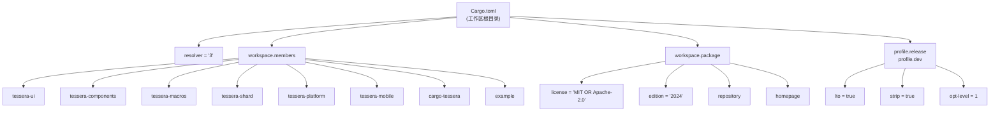
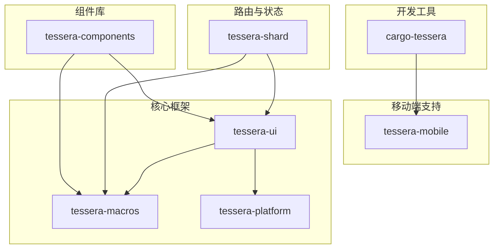
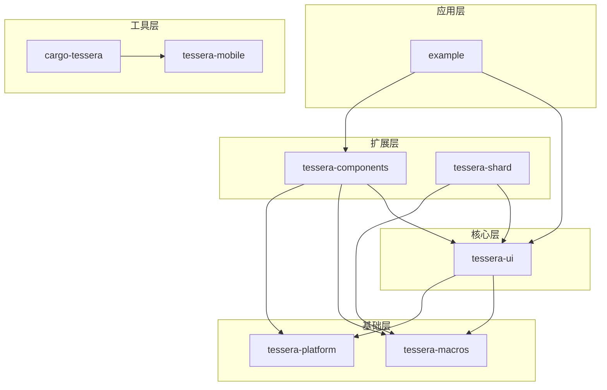
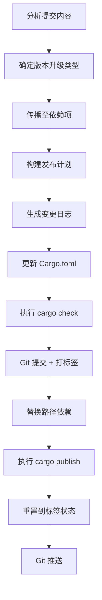
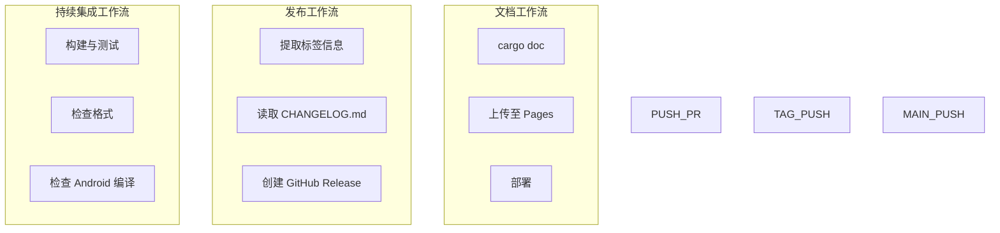

# 工作区结构

<strong>相关源文件</strong>

* [.github/workflows/ci.yml](https://github.com/tessera-ui/tessera/blob/821ebad7/.github/workflows/ci.yml)
* [.github/workflows/docs.yml](https://github.com/tessera-ui/tessera/blob/821ebad7/.github/workflows/docs.yml)
* [.github/workflows/release.yml](https://github.com/tessera-ui/tessera/blob/821ebad7/.github/workflows/release.yml)
* [Cargo.lock](https://github.com/tessera-ui/tessera/blob/821ebad7/Cargo.lock)
* [Cargo.toml](https://github.com/tessera-ui/tessera/blob/821ebad7/Cargo.toml)
* [scripts/release-package.rs](https://github.com/tessera-ui/tessera/blob/821ebad7/scripts/release-package.rs)
* [tessera-macros/src/lib.rs](https://github.com/tessera-ui/tessera/blob/821ebad7/tessera-macros/src/lib.rs)
* [tessera-ui/CHANGELOG.md](https://github.com/tessera-ui/tessera/blob/821ebad7/tessera-ui/CHANGELOG.md)
* [tessera-ui/Cargo.toml](https://github.com/tessera-ui/tessera/blob/821ebad7/tessera-ui/Cargo.toml)

本页面记录了 Tessera UI 框架的 Cargo 工作区组织、包结构、依赖关系以及发布管理基础设施。关于单个 Crate 内部架构的详情，请参阅 [tessera-ui 核心库](tessera-ui-Core.md)、[组件库](tessera-components.md)、[宏库](tessera-macros.md) 以及 [底层接口](tessera-shard.md)。关于开发工作流和工具用法，请参阅 [开发工作流](Development-Workflow.md)。

---

## 工作区配置

Tessera 使用 Cargo 的工作区（workspace）功能在单个仓库中管理多个相关的包。工作区定义在根目录的 [Cargo.toml](https://github.com/tessera-ui/tessera/blob/821ebad7/Cargo.toml#L1-L30) 中。

**工作区成员**

工作区包含八个成员包：

| 成员 | 类型 | 用途 |
| --- | --- | --- |
| `tessera-ui` | 库 | 核心框架实现 |
| `tessera-components` | 库 | Material Design 组件库 |
| `tessera-macros` | 过程宏 | `#[tessera]` 和 `#[shard]` 宏 |
| `tessera-shard` | 库 | 路由与分片状态管理 |
| `tessera-platform` | 库 | 平台特定工具函数 |
| `tessera-mobile` | 库 | 移动平台支持 |
| `cargo-tessera` | 二进制 | 项目管理 CLI 工具 |
| `example` | 二进制 | 组件展示与测试 |

**共享工作区元数据**

`[workspace.package]` 部分定义了所有成员包继承的元数据：

*   **license**: `MIT OR Apache-2.0` 双重许可。
*   **edition**: `2024` Rust 版本。
*   **repository**: `https://github.com/tessera-ui/tessera`。
*   **homepage**: `https://tessera-ui.github.io`。

**构建配置**

配置了发布和开发 profile：

*   **发布配置**：启用 `lto = true`、`codegen-units = 1` 和 `strip = true` 以实现最大化优化。
*   **开发配置**：使用 `opt-level = 1` 以实现更快的增量构建，并对依赖项使用 `debug = 0`。

**来源**：[Cargo.toml L1-L30](https://github.com/tessera-ui/tessera/blob/821ebad7/Cargo.toml#L1-L30)

---

## 包组织结构

### 可发布的包

有七个包会发布到 crates.io：

### tessera-ui

核心框架 crate。

**关键依赖**：

*   `wgpu`: GPU 抽象层。
*   `winit`: 跨平台窗口管理（包含 Android 特定功能）。
*   `accesskit`, `accesskit_winit`: 无障碍集成。
*   `rayon`: 并行布局计算。
*   `dashmap`: 线程安全的状态存储。
*   `tessera-macros`: 过程宏支持。
*   `tessera-shard`: 可选的路由功能（默认启用）。

**平台特定依赖**：

*   Unix: `libc`。
*   Windows: `windows` crate。
*   Android: `ndk-sys`, `jni`, `ndk-context`。

**来源**：[tessera-ui/Cargo.toml L1-L54](https://github.com/tessera-ui/tessera/blob/821ebad7/tessera-ui/Cargo.toml#L1-L54)

 [tessera-ui/CHANGELOG.md L1-L411](https://github.com/tessera-ui/tessera/blob/821ebad7/tessera-ui/CHANGELOG.md#L1-L411)

### tessera-macros

提供 `#[tessera]` 和 `#[shard]` 属性宏的过程宏包。

**关键功能**：

*   `tessera()`: 将函数转换为组件。
*   `shard()`: 生成 `RouterDestination` 实现。
*   `ControlFlowInstrumenter`: 使用 `GroupGuard` 测量控制流。

**来源**：[tessera-macros/src/lib.rs L1-L571](https://github.com/tessera-ui/tessera/blob/821ebad7/tessera-macros/src/lib.rs#L1-L571)

### cargo-tessera

用于项目管理的 CLI 工具。

**关键依赖**：

*   `clap`: 命令行参数解析。
*   `handlebars`: 模板渲染。
*   `notify`: 文件系统监听。
*   `cargo_metadata`: 工作区自检。
*   `tessera-mobile`: Android 构建集成。

**来源**：[Cargo.toml L848-L864](https://github.com/tessera-ui/tessera/blob/821ebad7/Cargo.toml#L848-L864)

---

## 依赖图谱

工作区具有清晰的依赖层次结构：

**拓扑排序顺序**

发布脚本会计算拓扑排序，以确保包按依赖顺序发布：

1.  `tessera-platform`
2.  `tessera-macros`
3.  `tessera-ui`
4.  `tessera-shard`
5.  `tessera-components`
6.  `tessera-mobile`
7.  `cargo-tessera`

这种排序确保当包发布时，其所有依赖项都已在 crates.io 上可用。

**来源**：[scripts/release-package.rs L634-L683](https://github.com/tessera-ui/tessera/blob/821ebad7/scripts/release-package.rs#L634-L683)

---

## 依赖管理

### 外部依赖

工作区使用了大量外部依赖项。关键的外部依赖包括：

| 依赖项 | 版本 | 用途 |
| --- | --- | --- |
| `wgpu` | 28.0.0 | GPU 抽象与渲染 |
| `winit` | 0.30.12 | 跨平台窗口管理 |
| `accesskit` | 0.23.0 | 无障碍树集成 |
| `rayon` | 1.11.0 | 并行计算 |
| `parking_lot` | 0.12.5 | 高效同步原语 |
| `dashmap` | 6.1.0 | 并发哈希映射 |

### 路径依赖与版本依赖

在开发期间，工作区成员使用路径依赖（path dependencies）。在发布时，发布脚本会暂时将路径依赖替换为版本依赖。这通过 `scripts/release-package.rs` 实现，它会读取每个成员的 `Cargo.toml`，识别工作区依赖，并将 `path = "../foo"` 替换为 `version = "x.y.z"`。

**来源**：[scripts/release-package.rs L717-L738](https://github.com/tessera-ui/tessera/blob/821ebad7/scripts/release-package.rs#L717-L738)

---

## 发布管理

### 自动化发布流程

发布流程由 `scripts/release-package.rs` 管理，这是一个根据约定式提交（conventional commits）实现语义化版本的 Rust 脚本。

**版本升级类型确定**

脚本实现了约定式提交解析：

| 提交模式 | 升级类型 |
| --- | --- |
| 正文/页脚包含 `BREAKING CHANGE:` | 主版本 |
| `feat!:` 或 `feat(scope)!:` | 主版本 |
| `feat:` 或 `feat(scope):` | 次版本 |
| `fix:` 或其他类型 | 修订号 |

**来源**：[scripts/release-package.rs L1-L958](https://github.com/tessera-ui/tessera/blob/821ebad7/scripts/release-package.rs#L1-L958)

---

## CI/CD 基础设施

### 工作流概览

三个 GitHub Actions 工作流自动化了开发和发布过程：

### CI 工作流

持续集成工作流在每次推送和拉取请求时运行：

*   **构建与测试任务**：运行 `cargo check`、`cargo test` 并检查代码格式。
*   **Android 检查任务**：安装 `cargo-ndk` 并为 `arm64-v8a` 交叉编译所有可发布的包，验证 Android 兼容性。

**来源**：[.github/workflows/ci.yml L1-L66](https://github.com/tessera-ui/tessera/blob/821ebad7/.github/workflows/ci.yml#L1-L66)

### 发布工作流

发布工作流在推送符合 `*-v*.*.*` 模式的标签时触发。它会解析包名和版本，从 `CHANGELOG.md` 提取相关章节，并创建带有变更日志的 GitHub Release。

**来源**：[.github/workflows/release.yml L1-L51](https://github.com/tessera-ui/tessera/blob/821ebad7/.github/workflows/release.yml#L1-L51)

### 文档工作流

文档工作流将 API 文档部署到 GitHub Pages。它运行 `cargo doc`，创建部署产物，并将其发布到 `github-pages` 环境。

**来源**：[.github/workflows/docs.yml L1-L49](https://github.com/tessera-ui/tessera/blob/821ebad7/.github/workflows/docs.yml#L1-L49)
