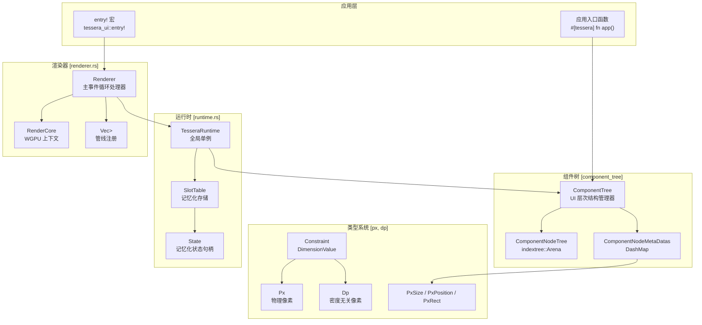
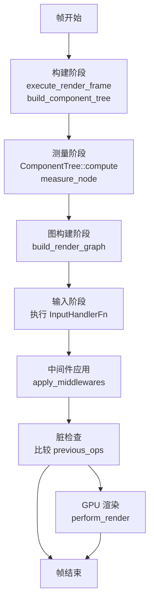

# tessera-ui 核心库

<strong>相关源文件</strong>

* [Cargo.lock](https://github.com/tessera-ui/tessera/blob/821ebad7/Cargo.lock)
* [tessera-ui/CHANGELOG.md](https://github.com/tessera-ui/tessera/blob/821ebad7/tessera-ui/CHANGELOG.md)
* [tessera-ui/Cargo.toml](https://github.com/tessera-ui/tessera/blob/821ebad7/tessera-ui/Cargo.toml)
* [tessera-ui/src/component_tree.rs](https://github.com/tessera-ui/tessera/blob/821ebad7/tessera-ui/src/component_tree.rs)
* [tessera-ui/src/component_tree/node.rs](https://github.com/tessera-ui/tessera/blob/821ebad7/tessera-ui/src/component_tree/node.rs)
* [tessera-ui/src/lib.rs](https://github.com/tessera-ui/tessera/blob/821ebad7/tessera-ui/src/lib.rs)
* [tessera-ui/src/renderer.rs](https://github.com/tessera-ui/tessera/blob/821ebad7/tessera-ui/src/renderer.rs)
* [tessera-ui/src/runtime.rs](https://github.com/tessera-ui/tessera/blob/821ebad7/tessera-ui/src/runtime.rs)

## 目的与范围

`tessera-ui` 是框架的基础包，提供了核心渲染引擎、状态管理、组件层次结构以及 Tessera UI 应用程序的基础类型系统。本文档涵盖了框架本身的内部架构。

关于以下方面的信息：
*   使用框架构建应用，请参阅 [快速开始](Getting-Started.md)。
*   组件模型与 `#[tessera]` 宏，请参阅 [组件模型](Component-Model.md)。
*   状态管理原语 (`remember`, `retain`)，请参阅 [状态管理](State-Management.md)。
*   布局系统与约束，请参阅 [布局系统](Layout-System.md)。
*   内置 UI 组件，请参阅 [组件库](Component-Library.md)。

**来源：** [tessera-ui/src/lib.rs L1-L15](https://github.com/tessera-ui/tessera/blob/821ebad7/tessera-ui/src/lib.rs#L1-L15)

---

## 库结构

`tessera-ui` 组织为几个核心模块：

| 模块 | 用途 |
| --- | --- |
| `renderer` | 事件循环管理、帧编排、渲染管线 |
| `runtime` | 全局状态单例、用于记忆化的槽表 |
| `component_tree` | UI 层次结构管理、测量、布局计算 |
| `layout` | 布局规范 Trait 与测量系统 |
| `px` / `dp` | 物理像素与密度无关像素的单位类型 |
| `color` | 颜色的表示与处理 |
| `cursor` | 光标与触控事件处理 |
| `keyboard_state` | 键盘输入跟踪 |
| `render_graph` | 绘制命令收集与优化 |
| `accessibility` | 用于屏幕阅读器的 AccessKit 集成 |
| `plugin` | 用于扩展的插件系统 |

**来源：** [tessera-ui/src/lib.rs L317-L349](https://github.com/tessera-ui/tessera/blob/821ebad7/tessera-ui/src/lib.rs#L317-L349)

---

## 核心架构

**来源：** [tessera-ui/src/renderer.rs L1-L263](https://github.com/tessera-ui/tessera/blob/821ebad7/tessera-ui/src/renderer.rs#L1-L263)

 [tessera-ui/src/runtime.rs L233-L252](https://github.com/tessera-ui/tessera/blob/821ebad7/tessera-ui/src/runtime.rs#L233-L252)

 [tessera-ui/src/component_tree.rs L48-L76](https://github.com/tessera-ui/tessera/blob/821ebad7/tessera-ui/src/component_tree.rs#L48-L76)

---

## 渲染器子系统

### 渲染器结构

`Renderer<F>` 结构体是主要的应用处理器，负责管理事件循环并编排帧渲染。

**来源：** [tessera-ui/src/renderer.rs L228-L263](https://github.com/tessera-ui/tessera/blob/821ebad7/tessera-ui/src/renderer.rs#L228-L263)

### 帧渲染周期

渲染器为每一帧遵循严格的多阶段周期：

**关键方法：**

*   **`Renderer::run`** / **`Renderer::run_with_config`**：创建事件循环并启动应用的入口点。
*   **`Renderer::execute_render_frame`**：编排完整的帧周期。
*   **`Renderer::build_component_tree`**：调用入口点函数以构建 UI 树。
*   **`Renderer::compute_draw_commands`**：测量布局并生成渲染图。
*   **`Renderer::perform_render`**：执行 GPU 渲染。

**来源：** [tessera-ui/src/renderer.rs L545-L848](https://github.com/tessera-ui/tessera/blob/821ebad7/tessera-ui/src/renderer.rs#L545-L848)

---

## 运行时子系统

### TesseraRuntime 单例

`TesseraRuntime` 是持有跨帧持久状态的全局单例。

**来源：** [tessera-ui/src/runtime.rs L233-L252](https://github.com/tessera-ui/tessera/blob/821ebad7/tessera-ui/src/runtime.rs#L233-L252)

 [runtime.rs L21-L44](https://github.com/tessera-ui/tessera/blob/821ebad7/tessera-ui/src/runtime.rs#L21-L44)

### 槽表与记忆化

`SlotTable` 为 `remember` 和 `retain` 状态提供稳定的存储。

**关键功能：**

*   **`remember_with_key`**：创建组件作用域的记忆化状态。
*   **`retain_with_key`**：创建进程作用域的记忆化状态。
*   **`begin_frame_slots`**：增加 epoch 计数器。
*   **`recycle_frame_slots`**：释放未使用的非保留槽位。

**来源：** [tessera-ui/src/runtime.rs L70-L122](https://github.com/tessera-ui/tessera/blob/821ebad7/tessera-ui/src/runtime.rs#L70-L122)

 [runtime.rs L739-L987](https://github.com/tessera-ui/tessera/blob/821ebad7/tessera-ui/src/runtime.rs#L739-L987)

---

## 组件树子系统

### 组件树结构

`ComponentTree` 使用 `indextree::Arena` 管理 UI 层次结构。

**来源：** [tessera-ui/src/component_tree.rs L48-L76](https://github.com/tessera-ui/tessera/blob/821ebad7/tessera-ui/src/component_tree.rs#L48-L76)

 [component_tree/node.rs L259-L305](https://github.com/tessera-ui/tessera/blob/821ebad7/component_tree/node.rs#L259-L305)

### 测量与布局

组件树通过 Rayon 使用并行测量。

**关键函数：**

*   **`measure_node`**：递归测量单个节点。
*   **`measure_nodes`**：通过 Rayon 并发测量多个节点。
*   **`place_node`**：在元数据中设置相对位置。

**来源：** [tessera-ui/src/component_tree/node.rs L572-L829](https://github.com/tessera-ui/tessera/blob/821ebad7/tessera-ui/src/component_tree/node.rs#L572-L829)

---

## 类型系统

### 物理像素

`Px` 代表物理设备像素，是内部所有渲染使用的单位。

**来源：** [tessera-ui/src/px.rs](https://github.com/tessera-ui/tessera/blob/821ebad7/tessera-ui/src/px.rs)

### 密度无关像素

`Dp` 代表公共 API 的密度无关像素，由 `SCALE_FACTOR` 自动缩放。

**来源：** [tessera-ui/src/dp.rs](https://github.com/tessera-ui/tessera/blob/821ebad7/tessera-ui/src/dp.rs)

---

## 特性标志

| 特性 | 用途 | 默认 |
| --- | --- | --- |
| `default` | 包含 `shard` 路由特性 | ✓ |
| `shard` | 启用 `tessera-shard` 路由功能 | ✓ |
| `profiling` | 启用帧分析与 JSON 输出 | ❌ |

**来源：** [tessera-ui/Cargo.toml L12-L15](https://github.com/tessera-ui/tessera/blob/821ebad7/tessera-ui/Cargo.toml#L12-L15)
